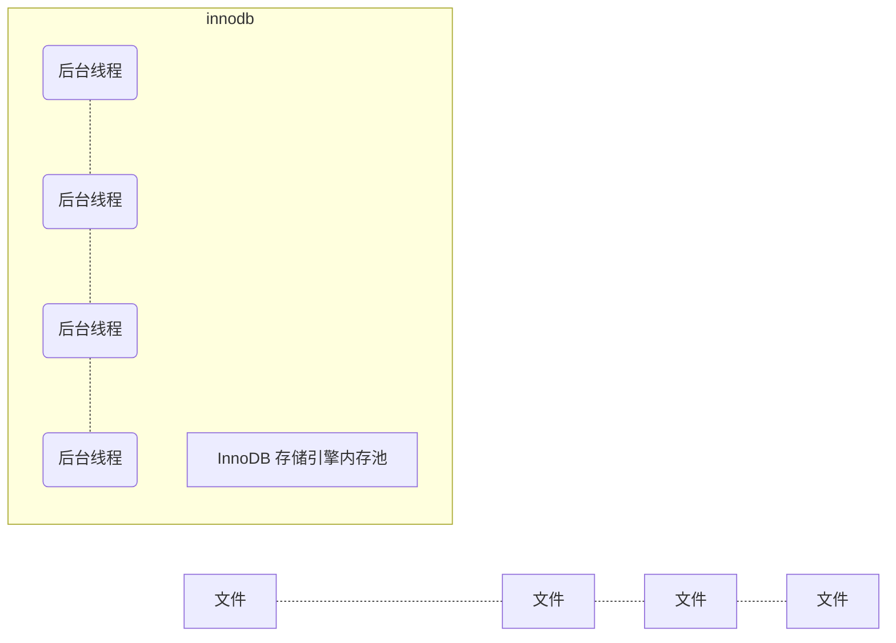
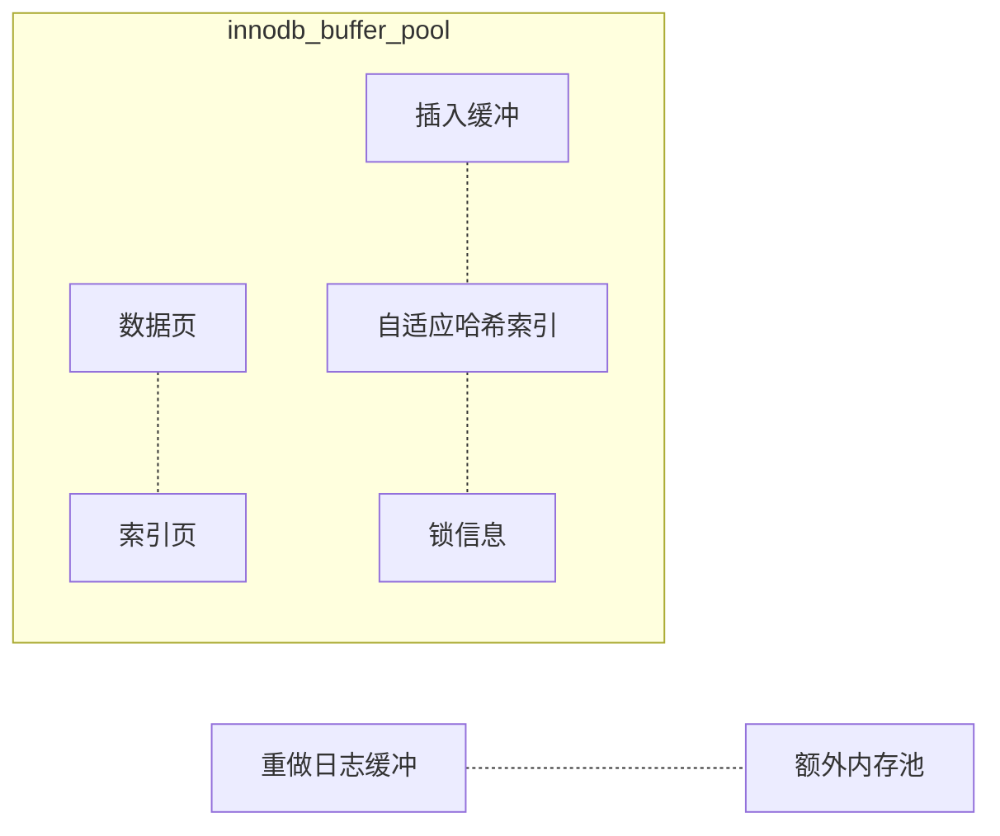

# MySQL 技术内幕

## MySQL 体系结构和存储引擎
- 数据库：物理操作系统文件或其他形式**文件**类型的集合
- 实例：MySQL 数据库由后台线程以及一个共享内存区组成，共享内存区可以被运行的后台线程所共享，数据库实例才是真正用于操作数据库文件的（**程序**）
- InnoDB 存储引擎
  - **行级锁、支持外键、非锁定读（默认读操作不加锁）**
  - 支持四种隔离级别，默认为 REPEATABLE，使用一种叫 `next-key locking` 策略来避免幻读
  - 提供插入缓冲、二次写、自适应哈希索引、预读
  - 采用聚集索引，每张表的存储都按主键的顺序进行存放
- MyISAM 存储引擎
  - 不支持事务、表级锁、支持全文索引
  - 缓冲池只缓冲索引文件，不缓冲数据文件
- NDB 存储引擎
  - 数据全部存放在内存中（v5.1 之后，可以将非索引文件放在磁盘上）
  - 连接操作在 Server 层完成，而不是存储引擎层
- Memory 存储引擎
  - 表中数据存放在内存中
  - 适合于存储临时表，默认使用哈希索引（而不是 B+ 树）
  - 只支持表锁，变长字段按照定长字段存储

## InnoDB 存储引擎
### InnoDB 体系结构：


InnoDB 存储引擎有多个内存块，这些内存块组成了一个大的内存池
- 维护所有进程/线程需要访问的多个内部数据结构
- 缓存磁盘上的数据，方便快速地读取，同时在对磁盘文件的数据修改之前在这里缓存
- 重做日志（redo log）缓冲

后台线程的主要作用是**负责刷新内存池中的数据，保证缓冲池中的内存缓冲的是最近的数据**。此外**将已修改的数据文件刷新到磁盘文件，同时保证在数据库发生异常的情况下 InnoDB 能恢复到正常运行状态**

#### 后台线程

- **Master Thread**：核心线程，主要负责**将缓冲池中的数据异步刷新到磁盘**，保证数据的一致性。包括**脏页的刷新、合并插入缓冲、undo 页的回收**等。
- IO Thread：负责 IO 请求的回调处理
  - write thread
  - read thread
  - insert buffer thread
  - log IO thread
- Purge Thread：事务被提交后，其所使用的 undo log 可能不再需要，因此需要该线程来**回收已经使用并分配的 undo 页**
- Page Cleaner Thread：负责脏页的刷新

#### 内存



- **缓冲池**：一块内存区域，通过内存的数据来弥补磁盘 IO 的速度。读取时，将页缓存在缓冲池中；修改时，先修改缓冲池中的页，然后再以一定的频率刷新到磁盘上

	- 缓冲池中缓存的页类型有：**索引页、数据页、undo 页、插入缓冲、自适应哈希索引、InnoDB 存储的锁信息、数据字典信息**等
	- 缓冲池通过 LRU 算法来管理，页的默认大小为 16KB。LRU 列表中还加入了 midpoint 位置，新读取到的页放入 midpoint 位置而不是首部(midpoint insertion strategy)，防止某些只用一次的页占据了首部的位置
	- 参数 `innodb_old_blocks_time` 限制页被加入到 mid 位置后至少需要多久才能被加入 LRU 的热端
	- InnoDB 1.0.x 版本开始支持压缩页的功能，通过 unzip_LRU 列表对不同压缩页的大小进行分别管理（伙伴算法）
  > 假设需要对缓冲池申请页为 4KB 的大小，过程：
  >
  > 1. 检查 4KB 的 unzip_LRU 列表，检查是否有可用的空闲页；
  > 2. 若有，直接使用；
  > 3. 否则，检查 8KB 的 unzip_LRU 列表
  > 4. 若有，将页分成 2 个 4KB 页，存放到 4KB 的 unzip_LRU 列表
  > 5. 否则，从 LRU 列表中申请一个 16KB 的页，将页分为 1 个 8KB 的页、2 个 4KB 的页，分别存放到对应的 unzip_LRU 列表中
- 脏页：LRU 列表中被修改后的页，即缓冲池中的页和磁盘上的页数据不一致。这时数据库会通过 CHECKPOINT 机制将脏页刷新回磁盘，而 Flush 列表中的页即为脏页列表（脏页既存在于 LRU 列表中，也存在于 Flush 列表中，LRU 列表用来管理缓冲池中页的可用性，Flush 列表用来管理将页刷新回磁盘）
- **<a id='redoLogBuffer'>重做日志缓冲（redo log buffer）</a>**：InnoDB 存储引擎首先将重做日志信息先放入到这个缓冲区，然后按一定频率刷新到重做日志文件（一般每秒刷入，因此用户只要保证这个缓冲区大小大于每秒产生的事务量）。
	
  - 刷新到日志文件的时机
    - Master Thread 每秒将其刷进
    - 每个事务提交时
    - 重做日志缓冲区剩余空间小于 1/2 时
- **额外的内存池**：在对一些**数据结构本身的内存**进行分配时，需要从额外的内存池中进行申请，当该区域的内存不够时，会从缓冲池中进行申请。

### CheckPoint 技术

- 为避免发生数据丢失的问题，当前事务数据库系统普遍都采用了 Write Ahead Log 策略：**即当事务提交时，先写重做日志，再修改页**。当由于发生宕机而导致数据丢失时，通过重做日志来完成数据的修复（事务的持久性）
- CheckPoint 技术的目的：
  - 缩短数据库的恢复时间
  - 缓冲池不够用时，将淘汰的脏页刷新到磁盘
  - 重做日志不可用时，刷新脏页（让缓冲池的页刷新到当前重做日志的位置，以便重做日志的覆盖重用）
- 当数据库发生宕机时，不用重做所有的日志，因为 CheckPoint 之前的页都已经刷新回磁盘，只需要对 CheckPoint 后的重做日志进行恢复
- **Sharp Checkpoint**：发生在数据库关闭时将所有的脏页都刷新回磁盘
- **Fuzzy Checkpoint**：只刷新一部分脏页，包括：
  - **Master Thread Checkpoint**：差不多以每秒或每十秒的速度从缓冲池的脏页列表中刷新一定比例的页回磁盘。这个过程是异步的，即此时 InnoDB 存储引擎可以进行其他的操作，用户查询线程不会阻塞。
  - **FLUSH_LRU_LIST Checkpoint**：需要保证 LRU 列表中有差不多 100 个空闲页可供使用，如果没有，则移除列表尾部的页，如果其中有脏页，则进行 Checkpoint（InnoDB 1.1.x 之前，检查 LRU 列表中是否有足够空间发生在用户查询线程中，会阻塞查询；1.2.x 开始，该检查被放在一个单独的 Page Cleaner 线程中进行）
  - <a id='asyncCheckpoint'>**Async/Sync Flush Checkpoint**</a>：重做日志不可用的情况，此时脏页是从脏页列表(Flush)中选取的（InnoDB 1.2.x 之前，会阻塞用户查询线程；1.2.x 开始，这部分的刷新操作被放入到了单独的 Page Cleaner 线程中进行）
  - **Dirty Page too much**：脏页数量太多，强制进行 Checkpoint

### Master Thread 工作方式
- 1.0.x 之前，内部循环：
  
  - **主循环**：
    - 每秒一次的操作：
      - 重做日志缓冲刷新到重做日志文件，即使这个事务还没有提交（必须）
      - 合并插入缓冲（可能，前一秒内 IO 次数小于 5 次）
      - 至多刷新 100 个 InnoDB 的缓冲池中的脏页到磁盘（可能，如果脏页过多）
      - 如果当前没有用户活动，则切换到后台循环
    - 十秒一次的操作：
      - 刷新 100 个脏页到磁盘（可能，过去十秒 IO 操作小于 200 次）
      - 合并至多 5 个插入缓冲（总是）
      - 将日志缓冲刷新到磁盘（日志文件）（总是）
      - 删除无用的 undo 页（最多尝试回收 20 个 undo 页），例如真正执行 update、delete（可能之前只是修改了版本号）
      - 刷新 100 个或者 10% 的脏页到磁盘（总是，超过 70%，则 100 个，否则 10%）
  - **后台循环**：当前没有用户活动（数据库空闲）或者数据库关闭时
    - 删除无用的 undo 页（总是）
    - 合并 20 个插入缓冲（总是）
    - 跳回到主循环（总是）
    - 不断刷新 100 个页直到符合条件（可能，跳转到刷新循环中完成）
  - **刷新循环**
    - 切换到暂停循环，将主循环挂起，等待事件的发生
  - **暂停循环**
  ```c
  void master_thread() {
      goto loop;
  loop:
      for (int i = 0; i < 10; i++) {
          thread_sleep(1)
          do log buffer flush to disk
          if (last_one_second_ios < 5) {
              do merge at most 5 insert buffer
          }
          if (buf_get_modified_ratio_pct > innodb_max_dirty_pages_pct) {
              do buffer pool flush 100 dirty pages
          }
          if (no user activity) {
              goto background loop
          }
      }
      if (last_ten_second_ios < 200) {
          do buffer pool flush 100 dirty pages
      } 
      do merge at most 5 insert buffer
      do log buffer flush to disk
      do full purge
      if (buf_get_modified_ratio_pct > 70%) {
          do buffer pool flush 100 dirty pages
      } else {
          buffer pool flush 10% dirty pages
      }
  
      goto loop
  
  background loop:
      do full purge
      do merge 20 insert buffer
      if (!idle) {
          goto loop
      } else {
          goto flush loop
      }
  
  flush loop:
      do buffer pool flush 100 dirty pages
      if (buf_get_modified_ratio_pct > innodb_max_dirty_pages_pct) {
          goto flush loop
      }
      goto suspend loop
  
  suspend loop:
      suspned_thread()
      waiting event
  
      goto loop
  }
  ```
  
- 1.0.x - 1.2.x 版本：在 1.0.x 之前，最多刷新 100 个脏页、合并 20 个插入缓存等硬编码，已不适合现在的硬件。
  
  - 1.2.x 之前通过参数 `innodb_io_capacity` 来表示磁盘的吞吐量，对于刷新到磁盘页的数量，会按照 `innodb_io_capacity` 的百分比来控制：合并插入缓存为 5%，从缓冲区刷新脏页为 100%
  - 脏页比例阈值 `innodb_max_dirty_pages_cnt` 从 90 改为 75，这样既能加快刷新脏页的频率，又能保证磁盘 IO 的负载
  - 自适应刷新参数 `innodb_adaptive_flushing`，通过判断产生重做日志的速度来决定最合适的刷新脏页数量
  - 通过参数 `innodb_purge_batch_size` 控制回收的 undo 页的数量
  
- 1.2.x 版本：
  
  ```c
    if (InnoDB is idle) {
        srv_master_do_idle_tasks(); // 10 秒的操作
    } else {
        srv_master_do_active_tasks(); // 每秒的操作
    }
  ```
  同时将刷新脏页的操作单独分配到 Page Cleaner 线程中


### 关键特性

- **插入缓冲（Insert Buffer）**：在缓冲池中，与数据页一样，也是物理页的一个组成部分。对于**非聚集索引**的插入或更新操作，不是每一次直接插入到索引页中，而是先判断插入的非聚集索引页是否在缓冲池中，若在，则直接插入；若不在，则先放入到一个 Insert Buffer 对象中，然后再以一定的频率和情况进行 Insert Buffer 和（非聚集的）辅助索引页子节点的合并操作，这时通常能将多个插入合并到一个操作中（因为在一个索引页中）

  需要同时满足两个条件：**索引是非聚集的辅助索引**（如果是聚集索引（主键索引），那么是按顺序插入的，不需要随机访问）；**索引不是唯一的**（因为在插入缓冲时，数据库并不去查找索引页来判断插入的记录的唯一性，如果又去查找则又必然会进行随机读取，导致插入缓冲失去意义。

  - Change Buffer：1.0.x 版本开始引入，可将其视为 Insert Buffer 的升级，它可以使得 DML 操作——Insert、Delete（Delete Buffer）、Update（Purge Buffer） 都进行缓冲。它的对象依然是非唯一的辅助索引。

  - Insert Buffer 内部原理：**所有表共享一棵 Insert Buffer B+ 树，存放在共享表空间中**。

      非叶节点：存放 search key：`|space(4B)|marker(1B)|offset(4B)|`，space 是每个表的 id，marker 用于兼容老版本 Insert Buffer，offset 表示页所在偏移量。

      叶子节点：

      ```
      |space(4B)|marker(1B)|offset(4B)|metadata(4B)|data..|
          																|
          																|
      |IBUF_REC_OFFSET_COUNT(用于记录插入顺序)|IBUF_REC_OFFSET_TYPE|IBUF_REC_OFFSET_FLAGS|
      ```

      Insert Buffer Bitmap：一个特殊的页，用于标记每个辅助索引页的可用空间，每个辅助索引页在其中占用 4 bit，存放在独立表空间中

      ```c
      IBUF_BITMAP_FREE(2b) // 表示可用空间数量 
      IBUF_BITMAP_BUFFERED(1b) // 表示该辅助索引页有记录被缓存在 Insert Buffer B+ 树中
      IBUF_BITMAP_IBUF(1b) // 表示该页为 Insert Buffer B+ 树的索引页
      ```

  - Merge Insert Buffer：

      操作发生的时间：
      - 辅助索引页被读取到缓冲池时；
      - Insert Buffer Bitmap 页追踪到该辅助索引页已无可用空间时；
      - Master Thread：随机选择 Insert Buffer B+ 树的一个页，读取该页中的 space 及之后所需要数量的页（该算法在复杂情况下有更好的公平性）


- **<a id='doubleWrite'>两次写（Double Write）</a>**：内存中有 doublewrite buffer（2MB），物理磁盘上共享表空间中有 2 个区（2MB）的 doublewrite。

    - 缓冲池刷新脏页时，将脏页复制到 doublewrite buffer 中（而不是直接写入磁盘）
    - 之后通过 doublewrite buffer 再分两次，每次 1MB 顺序地写入 doublewrite，然后马上调用 fsync 函数，同步磁盘，避免缓冲写带来的问题
    - 完成 doublewrite 页的写入后，再将 doublewrite buffer 中的页离散地写入各个表空间文件中

  ```mermaid
  graph LR;
  subgraph memory;
  	A[page]-.copy.->B[doublewrite buffer 2MB];
    C[page]-.copy.->B;
  end;
  subgraph shared_table;
  	D[doublewrite 1MB]-.-E[doublewrite 1MB]
  end;
  B-.write.->D
  B-.write.->F
  subgraph data;
  F(data)-.-G(data)-.-H(data)
  end;
  E-.recovery.->F
  ```

    - 好处在于写入磁盘崩溃时，可以通过共享表空间中的 doublewrite 副本恢复


- **自适应哈希索引（Adaptive Hash Index）**：InnoDB 存储引擎会监控对表上各索引页的查询，如果观察到建立哈希索引可以带来速度提升，则建立哈希索引。其通过缓冲池的 B+ 树页构造而来，建立速度很快，不需要对整张表构建哈希索引。InnoDB 会根据访问的频率和模式自动地为某些热点页建立哈希索引。

    - 要求：对这个页的连续访问模式（查询条件）必须一样；以该模式访问了 100 次；页通过该模式访问了 N 次，其中 N = 页中记录 * 1/16
    - 哈希索引只能用来搜索**等值查询**

- 异步 IO（Async IO）

    - 用户可以在发送一个 IO 请求后立即发送另一个，当全部 IO 请求发送完毕后，等待所有 IO 操作的完成
    - 另一个优势是可以进行 IO Merge 操作，将多个 IO 合并为一个

- 刷新邻接页（Flush Neighbor Page）：当刷新一个脏页时，InnoDB 会检测该页所在区的所有页，如果是脏页，则一起刷新（可以结合 AIO 将多个 IO 写入操作合并为一个）

## 文件

### 参数文件

- 可以通过命令 `mysql --help | grep my.cnf` 来查看启动时读取的配置文件及其顺序

- 动态参数可以在实例运行中修改，通过 `SET` 命令：

    ```sql
    SET 
    [global|session] system_var_name = expr
    [global.|session.] system_var_name = expr
    ```

    全局修改也只是在本次实例生命周期内有效，若想下次启动实例时仍有效，需要去修改参数文件

- 静态参数在整个实例生命周期内都不能修改（只读）

### 日志文件

- **错误日志（error log）**：对 MySQL 的启动、运行、关闭过程进行了记录，不仅包括错误信息，也记录一些警告信息或正确的信息（例如重做日志文件太小）

- **二进制日志（binlog）**：记录了对 MySQL 数据库执行**更改**的所有操作，但是不包括 `SELECT` 和 `SHOW`，因为这类操作没有修改数据本身；但是如果操作没有导致数据发生变化，也可能被写入二进制日志（例如 `UPDATE` 影响了 0 行）

    作用：

    - 恢复
    - 复制：通过执行二进制日志，使远程数据库与本地进行实时同步
    - 审计

    二进制日志默认为缓冲写，通过设置参数 `sync_binlog=1` 可改为同步写；

    如果设置了同步写，但事务未提交时发生了宕机，由于已经写入了二进制日志，无法回滚，可以通过设置参数 `innodb_support_xa=1` 来解决，确保二进制日志和 InnoDB 存储引擎数据文件的同步

    `binlog_format` 参数：

    - `STATEMENT`：记录的是 SQL 语句，复制时直接执行即可

        优点：日志量小，节约磁盘 IO

        缺点：容易主从不同步（例如使用了随机函数，本机自己定义的函数等）

        > 隔离级别带来的问题：==也是 MySQL 默认使用 `REPEATABLE READ` 的隔离级别的原因==
        >
        > 现在有两个：事务 1（删），事务 2（插），隔离级别为 **READ COMMITTED**，`binlog_format` 参数为 `STATEMENT`
        >
        > - 在 master 上执行顺序为先删后插，由于使用了 `STATEMENT` 参数，事务在提交前，二进制日志先缓存，事务提交后才写入记录，**可能在二进制日志中的顺序变为了先插后删**
        > - 在 slave 上执行顺序为先插后删，导致主从不一致
        >
        > 解决方法：
        >
        > 1. 采用 `REPEATABLE READ` 的隔离级别，由于会引入**间隙锁**，在 master 中执行删除时，插入操作会被锁阻塞，从而必然先完成删除事务并先被记录，可以保证 slave 上先删后插
        > 2. 将 `binlog_format` 格式改为 `ROW`，记录的是表中行的更改情况，直接基于行进行复制

    - `ROW`：记录表的行更改情况

        优点：可以使得隔离级别能被安全设置为 `REAP COMMITTED`，获得更好的并发性

        缺点：日志记录量大

    - `MIXED`：混合模式

- **慢查询日志（slow query log）**：帮助定位可能存在问题的 SQL 语句

    - `long_query_time`：慢查询时间阈值（运行时间大于其的语句都将被记录）
    - `long_query_io`：逻辑 IO 次数阈值（逻辑读取包括磁盘和缓冲区的读取）
    - `log_queries_not_using_indexes`：没有使用索引的语句
    - `log_thr-ottle_queries_not_using_indexes`：每分钟允许记录到慢查询日志的且未使用索引的 SQL 语句次数
    - `mysqldumpslow xxxx.log`：分析慢查询日志命令

- **查询日志（log）**：记录了所有对 MySQL 数据库请求的信息，无论这些请求是否得到了正确的执行

### 套接字文件

- 用于 UNIX 系统下本地连接 MySQL 采用 UNIX 域套接字方式

###  pid 文件

- MySQL 实例启动时，会将自己的进程 id 写入文件中

### 表结构定义文件

- 每个表都有 `.frm` 为后缀名的文件，记录了该表的表结构定义（还可以用来存放视图的定义）

### InnoDB 存储引擎文件

InnoDB 存储引擎独有的文件

- 表空间文件：InnoDB 将存储的数据按表空间进行存放
    - `innodb_data_file_path` 设置共享表空间文件路径（可以是多个文件）
    - `innodb_file_per_table` 可以将每个基于 InnoDB 存储引擎的表产生一个独立表空间，后缀名为 `.ibd`，这些单独的表空间文件仅存储该表的**数据、索引和插入缓冲 BITMAP** 等信息，其他信息还是存放在默认的共享表空间中
    
- 重做日志文件：用于实例/介质失败时的复制，保证数据的完整性（**保证了 InnoDB 可以提供可靠的事务**）
    - 每个 InnoDB 存储引擎至少有 1 个重做日志文件组（group），每个文件组下至少有 2 个重做日志文件
    - 在日志组中每个重做日志文件的大小一致，并以**循环写入**的方式运行（先写重做日志文件 1，写到文件的最后时，切换至重做日志文件 2，以此往复循环）
    - 重做日志文件不能太大，会导致恢复时间长；也不能太小，会频繁切换重做日志文件，并且频繁发生 <a href='#asyncCheckpoint'>async checkpoint</a>
    - 重做日志文件的写入也是 <a href='#redoLogBuffer'>缓冲写</a>，但不需要像刷新脏页那样采用 <a href='#doubleWrite'>两次写</a>，因为从重做日志缓冲向磁盘写入时，按 512 字节（一个扇区）的大小进行写入，必定成功
    
    > 二进制日志和重做日志的区别：
    >
    > - 二进制日志会记录所有存储引擎的事务日志，InnoDB 存储引擎的重做日志只记录它自身的事务日志
    > - 二进制日志是**逻辑**日志，记录的是关于一个事务的具体操作内容；重做日志文件记录的是关于每个页的更改（**物理**情况）
    > - 写入时间不同：二进制日志文件仅在每个事务提交前进行提交，即只写磁盘一次，不论这时事务有多大；而对于重做日志文件来说，一个事务进行的过程中，可能在不断地向其中写入重做日志条目

## 表

### 索引组织表

- 在 InnoDB 存储引擎中，表是根据**主键顺序**组织存放的，这种存储方式称为**索引组织表**

- 如果创建表时没有定义主键，则默认会按如下方式选择或创建主键

    - 表中如果有**非空的唯一索引**，则该列为主键
    - 否则，自动创建一个 6 字节大小的指针（rowid 列）

    当表中有多个非空唯一索引时，默认选择建表时第一个定义的非空唯一索引为主键（**定义索引的顺序**，而不是建表时列的顺序）

    > 可以通过 `SELECT _rowid` 来查看单个列为主键时的表主键

### InnoDB 逻辑存储结构

- 所有数据被逻辑地存放在一个空间，称之为表空间，**表空间由段、区、页（块）组成**。

    


- 表空间：独立表空间只存储**数据、索引、插入缓冲的 Bitmap 页**，共享表空间存储其他所有数据，如**回滚（undo）信息、插入缓冲索引页、系统事务信息、二次写缓冲**等。

    > Rollback 后，InnoDB 存储引擎不会收缩共享表空间，但会标记这些 undo 信息为可用空间，下次 undo 可以覆盖


- 段：包括**数据段、索引段、回滚段**等。数据段就是 B+ 树的叶子节点，索引段就是非叶子节点。段的管理由引擎自身完成，用户不能控制。


- 区：**区是由连续的页组成的空间**，任何情况下区大小都为 1MB。为了保证区中页的连续性，InnoDB 一次从磁盘申请 4～5 个区，默认情况下，InnoDB 的页大小为 16KB，所以一个区有 64 个连续的页。

    - 1.0.x 版本后引入压缩页，每个页可以被设置为 2K、4K、8K，对应区中页的数量为 512、256、128。
    - 1.2.x 版本提供参数 `innodb_page_size` 直接修改默认页大小（非压缩页）

    用户启用参数 `innodb_file_per_table` 后，创建的表默认大小为 96 KB，不足 1M，这是因为**在每个段开始时，先用 32 个页大小的碎片页来存放数据**，用完后才开始申请 64 个连续页。这样做的目的是，对于一些小表，或者是 undo 这类的段，开始时申请较少的空间，节省磁盘的容量。


- 页：是 InnoDB 磁盘管理的**最小单位**，默认大小为 16KB。常见的页类型有：数据页、undo 页、系统页、事务数据页、插入缓冲位图页、插入缓冲空闲列表页、未压缩的二进制大对象页（Uncompressed BLOB Page）、压缩的二进制大对象页


- 行：每个页最多存放 16KB/2-200 = 7992 行记录，每个页至少应该有两行记录，否则 B+ 树会退化成链表。如果页中只能存放下一条记录，那么会自动将行数据存放到溢出页中。

### InnoDB 行记录格式

- Compact

  ```
    变长字段长度列表 ｜ NULL 标志位(1B) ｜ 记录头信息(5B) ｜ 列 1 数据 ｜ 列 2 数据 ｜ ...... 
        																							|
    未知(1b) | 未知(1b) | deleted_tag | min_rec_flag | n_owned | heap_no | record_type | next_record
        
  deleted_tag(1b): 该行是否已经被删除
  min_rec_flag(1b): 该记录是否被预先定义为最小的记录
  n_owned(4b): 该记录拥有的记录数
  heap_no(13b): 索引堆中该条记录的排序记录
  record_type(3b): 记录类型，000 表示普通，001 表示 B+ 树节点指针，010 表示 infinum，011 表示 Supremum，1xx 表示保留
  next_record(16b): 页中下一条记录的相对位置
  ```

    - 首部记录变长字段，按照列的顺序**逆序**放置

      - 列的长度小于 255 字节，用 1 字节表示
      - 列的长度大于 255 字节，用 2 字节表示（VARCHAR 最大长度限制为 65535）

      例如：`03 02 01`，代表第一列长度 1，第二列长度 2，第三列长度 3

    - NULL 标志位指示数据中 NULL 值的位置，NULL 除了该标志位，实际存储不占有任何空间

    - 还存在两个隐藏列：**事务 ID 列（6B）和回滚指针列（7B）**，若没有定义主键，还会增加一个 rowid 列（6B）

    - 固定字长 CHAR 字段在未能完全占用其长度空间时，会用 `0x20` 来填充


- Redundant：用于兼容之前版本

  ```
    字段长度偏移列表 ｜ 记录头信息(6B) ｜ 列 1 数据 ｜ 列 2 数据 ｜ 列 3 数据 ｜ ...... 
    										｜
    未知(1b) | 未知(1b) | deleted_tag | min_rec_flag | n_owned | heap_no | n_fields | 1byte_offs_flag | next_record
    
  n_fields(10b): 记录中列的数量，一行最多 1023 列
  1byte_offs_flag(1): 偏移列表为 1 字节还是 2 字节
  ```
  
  - 字段长度偏移列表，同样按照列的顺序**逆序**放置
  - 对于 VARCHAR 类型的 NULL 值，Redundant 行记录格式不占用任何存储空间，而 CHAR 类型的 NULL 值需要占用空间
  - 同样有隐藏列


- 行溢出数据：定义中表示 VARCHAR 列长度最多为 65535，实际上达不到（65532），因为还有别的开销。而且这个 65535 是指字节数（采用 UTF-8 的话实际允许的长度更小），同时是一张表中所有 VARCHAR 列总的字节数。

  - 一页最多 16KB，存放不了 65532 字节，会导致行溢出。数据默认存放在页类型为 B-tree node 中，行溢出时，数据存放在页类型为 Uncompress BLOB 页中，在原始页中，只存放前 768 字节的前缀数据。
  - 如果一个页中至少可以放入两行数据，那 VARCHAR 类型的行数据就不会存放到 BLOB 页中。（长度阈值为 8098）对于 TEXT / BLOB 数据的存放位置，也是如此。


- 1.0.x 开始引入了 file format（新的页格式），以前的 Compact 和 Redundant 称为 Antelope 文件格式，新的文件格式称为 Barracuda 文件格式，其拥有两种新的行记录格式：Compressed 和 Dynamic。
    - 新的两种记录格式对于 BLOB 数据采用了完全的行溢出方式，在数据页中只存放 20 字节的指针，实际的数据都存放在 Off Page 中（Compact 和 Redundant 中会存放前 768 个前缀字节）
    - Compressed 行数据会以 zlib 算法进行压缩


- CHAR(N) 中的 N 是字符个数，而不是字节长度，因此对于不同编码来说长度不固定。对于多字节字符编码（如 UTF-8）的 CHAR 数据类型的存储，InnoDB 存储引擎在内部将其视为变长字符类型，这也就意味着在变长长度列表中会记录 CHAR 数据类型的长度（对于未能占满长度的字符还是填充 `0x20`）。

    > 因此，可以认为在多字节字符集的情况下，CHAR 和 VARCHAR 的实际行存储基本没有区别

### InnoDB 数据页结构

- File Header（文件头）：38 字节
- Page Header（页头）：56 字节
- Infimun 和 Supremum Records：每个数据页都有两个虚拟的行记录，用来限定记录的边界，Infimum 记录比该页中任何主键值都小的值，Supremum 记录比任何可能大的值还要大的值。这两个值在页创建时被建立，并且在任何情况下不会被删除。
- User Records（用户记录，即行记录）
- Free Space（空闲空间）
- Page Directory（页目录）：存放记录的相对位置，记录指针（槽）可能包含多个记录。用户通过 B+ 数索引找到记录所在的页，再通过在 Page Directory 中进行二分查找，找到具体的记录。
- File Trailer（文件结尾信息）：8 字节，用于检测页的完整性

### Named File Formats 机制

用于解决不同版本下页结构兼容性的问题

### 约束

- Innodb 提供：Primary Key、Unique Key、Foreign Key、Default、NOT NULL

- 约束与索引的区别：当用户创建了一个唯一索引，就也创建了一个唯一的约束。但约束更是一个逻辑的概念，用来保证数据的完整性，而索引是一个数据结构，既有逻辑上的概念，在数据库中还代表着物理存储的方式。

- 默认情况下，MySQL 数据库允许非法的或不正确的数据的插入或更新，又或者可以在数据库内部将其转化为一个合法的值，可以通过设置参数 `sql_mode='STRICT_TRANS_TABLES'` 来严格审核输入的参数。

- MySQL 数据库不支持传统的 CHECK 约束，但是通过 ENUM 和 SET 类型可以解决部分这样的约束需求（仅限于离散值）。

- MyISAM 存储引擎本身不支持外键（仅起到注释作用），InnoDB 则完整支持。对参照表的操作定义有：CASCADE、SET NULL、NO ACTION、RESTRICT（默认）。在 InnoDB 中，建立外键会自动地对该列加上一个索引，可以很好地避免外键列上无索引而导致的死锁问题。

    > MySQL 中 NO ACTION、RESTRICT 都是抛出错误，不允许操作发生。这是因为 MySQL 中是即时检查而不是运行完成后的延时检查。

### 视图

- 是基于基表的一个虚拟表，在更新时可以通过 `WITH CHECK OPTION` 选项防止不满足视图定义的更新。
- 物化视图：是一种预先计算后存储好的实体表，例如保存多表连接或聚集等耗时的结果。MySQL 中不支持，Oracle 支持。

### 分区表

- 分区功能不是在存储引擎层完成的，MyISAM、NDB、InnoDB 都支持，CSV、FEDORATED、MEGRE 等就不支持。

- 分区的过程是将一个表或索引分解为多个更小、更可管理的部分。从逻辑上讲，只有一个表或一个索引，但是在物理上这个表或索引可能由数十个物理分区组成，每个分区都是独立的对象，可以独自处理，也可以作为一个更大的对象的一部分进行处理。

- MySQL 只支持水平分区，并不支持垂直分区。

- MySQL 数据库的分区是局部分区索引，一个分区中既存放了数据又存放了索引；全局分区是指，数据存放在各个分区中，但是所有数据的索引放在一个对象中

- MySQL 支持的分区类型：RANGE、LIST、HASH、KEY、COLUMNS。不论创建何种类型的分区，如果表中存在主键或唯一索引时，分区列必须是唯一索引的一个组成部分

    - RANGE：范围

    - LIST：离散范围

    - HASH：指定 Hash 函数

    - KEY：使用 MySQL 数据库提供的函数

    - COLUMNS：可以对非整型的数据进行分区

        RANGE/LIST COLUMNS：可以使用多个列进行分区

- 子分区（复合分区）在分区的基础上再进行分区。MySQL 允许在 RANGE 和 LIST 的分区上再进行 HASH 或 KEY 的子分区。

- MySQL 允许对 NULL 值做分区，对于不同的分区类型，处理方式也不同。MySQL 视 NULL 值小于任何一个非 NULL 值

    - RANGE：放入最左边分区
    - LIST：必须显式指定在哪个分区中存放 NULL 值
    - HASH/KEY：任何 NULL 值记录返回 0

## 索引与算法

### InnoDB 存储引擎索引概述

- B+ 树索引：并不能找到一个给定键值的具体行，只能查找数据行所在的页，然后把页读入到内存，再在内存中进行查找，最后得到要查找的数据
- 哈希索引：InnoDB 中是自适应的，会根据表的情况自动为表生成哈希索引
- 全文索引

### B+ 树

B+ 树是为磁盘或其他直接存取辅助设备设计的一种平衡查找树。在 B+ 树中，所有记录节点都是按键值的大小**顺序存放**在**同一层**的**叶子节点**上，由各叶子节点**指针**进行连接。

#### 插入操作

| Leaf Page 满 | Index Page 满 | 操作                                                         |
| :----------: | :-----------: | :----------------------------------------------------------- |
|      No      |      No       | 直接将记录插入到叶子节点                                     |
|     Yes      |      No       | 1）拆分 Leaf Page<br />2）将中间的节点放入到 Index Page 中<br />3）小于中间节点的记录放左边<br />4）大于或等于中间节点的记录放右边 |
|     Yes      |      Yes      | 1）拆分 Leaf Page<br />2）小于中间节点的记录放左边<br />3）大于或等于中间节点的记录放右边<br />4）拆分 Index Page<br />5）小于中间节点的记录放左边<br />6）大于中间节点的记录放右边<br />7）中间节点放入上一层 |

旋转：发生在 Leaf Page 已经满，但是其左右兄弟节点没有满的情况下

#### 删除操作

B+ 树使用填充因子来控制树的变化，50% 是填充因子可设的最小值

| 叶子节点小于填充因子 | 中间节点小于填充因子 | 操作                                                         |
| :------------------: | :------------------: | ------------------------------------------------------------ |
|          No          |          No          | 直接将记录从叶子节点删除，如果该节点还是 Index Page 的节点，用该节点的右节点代替 |
|         Yes          |          No          | 合并叶子节点和它的兄弟节点，同时更新 Index Page              |
|         Yes          |         Yes          | 1）合并叶子节点和它的兄弟节点<br />2）更新 Index Page<br />3）合并 Index Page 和它的兄弟节点 |

### B+ 树索引

- B+ 索引在数据库中的一个特点是**高扇出性**，在数据库中 B+ 树的高度一般都在 2～4 层层，因此查找一个键值的行记录最多需要 2～4 次 IO。

- **聚集索引**：**按主键构造的 B+ 树，叶子节点（数据页）中存放的为整张表的行记录数据。**由于实际的数据页只能按照一棵 B+ 树进行排序，因此每张表只能拥有一个聚集索引。

    在多数情况下，查询优化器倾向于采用聚集索引。因为聚集索引能够在 B+ 树索引的叶子节点上直接找到数据。此外，由于定于了数据的逻辑顺序，**聚集索引能够特别快地访问针对范围值的查询，和对主键的排序查找**。查询优化器能够快速发现某一段范围的数据页需要扫描。

    聚集索引的存储并不是物理上连续的，而是逻辑上连续的。

- **辅助索引（非聚集索引）**：**叶子节点并不包含行记录的全部数据。**叶子节点除了包含键值以外，每个叶子节点中的索引行中还包含了一个书签，该书签用来告诉 InnoDB 哪里可以找到与索引相对应的行数据。由于 InnoDB 存储引擎表是索引组织表，因此其辅助索引的书签就是相应行数据的聚集索引键。

    辅助索引的存在并不影响数据在聚集索引中的组织，因此每张表上可以有多个辅助索引。当通过辅助索引来寻找数据时，InnoDB 存储引擎会遍历辅助索引并通过叶级别的指针获得指向主键索引的主键，然后再通过主键索引来找到一个完整的行记录。

    > 举例来说，如果在一棵高度为 3 的辅助索引树中查找数据，那需要对这棵辅助索引树遍历 3 次找到指定主键，如果聚集索引树的高度同样为 3，那么还需要对聚集索引树进行 3 次查找，最终找到一个完整的行数据所在的页，因此一共需要 6 次逻辑 IO 访问以得到最终的一个数据页。

### Cardinality 值

- 在访问表中很少一部分时使用 B+ 树索引才有意义，Cardinality 值表示索引中不重复记录数量的预估值，在实际使用中，`Cardinality / n_rows_in_table` 应尽可能接近 `1`

- 对 Cardinality 的统计是放在存储引擎层进行的，通过采样的方法来完成。

- Cardinality 统计信息的更新发生在两个操作中：INSERT 和 UPDATE，策略为：

    - 表中 1/16 的数据已发生过变化
    - `stat_modified_counter > 2000000000`，发生变化的次数

    采样是对随机的 8 个叶子节点进行统计

### 使用索引

- 联合索引
  - 对多个列创建索引
  - 可以优化联合查询，或者单列查询（如果在 B+ 树是有序存储的话）
- 覆盖索引
  - 覆盖索引是从辅助索引中就可以得到查询的记录，而不需要查询聚集索引中的记录。使用覆盖索引的一个好处是辅助索引不包含整行记录的所有信息，故其大小要远小于聚集索引，因此可以减少大量的IO操作。
- 优化器不使用索引的情况：大多为范围查找、JOIN 链接操作等

### 哈希索引

- InnoDB 的哈希算法采用链表作为冲突机制，哈希函数采用除法散列方式
- 自适应哈希索引经哈希函数映射到一个哈希表中，因此**对于字典类型的查找非常快速，但对于范围查找就无能为力**

###全文检索

- B+ 树索引支持通过索引字段的前缀进行查找

- 倒排索引：在**辅助表**中存储了单词与单词自身在一个或多个文档中所在位置之间的映射，通过关联数组实现

    - `inverted file index`：{单词，单词所在文档的 ID}
    - `full inverted index`：{单词，（单词所在文档的 ID，在具体文档中的位置）}

- InnoDB 的全文检索是采用 `full inverted index`，在辅助表的单词字段上设有索引，每张表只能有一个全文检索的索引

- Auxiliary Table 辅助表是一个持久的表，存放于磁盘上；FTS Index Cache（全文检索索引缓存）是一个红黑树结构，根据（word, ilist）进行排序，缓存对辅助表的更新，在全文检索之前合并更新（类似插入缓存）

- 对于 InnoDB 存储引擎而言，其总是在事务提交时将分词写入到 FTS Index Cache，然后再通过批量更新写入到磁盘。虽然 InnoDB 存储引擎通过一种延时的、批量的写入方式来提高数据库的性能，但是上述操作仅在事务提交时发生。对于删除操作，其在事务提交时，不删除磁盘 Auxiliary Table 中的记录，而只是删除 FTS Cache Index 中的记录。

- 全文检索查询语法：

    ```mysql
    MATCH(col1,col2,...)
    AGAINST(expr[search_modifier])
    
    search_modifier: {
      IN NATURAL LANGUAGE MODE
    | IN NATURAL LANGUAGE MODE WITH QUERY EXPANSION
    | IN BOOLEAN MODE -- 是否使用修饰符
    | WITH QUERY EXPANSION
    }
    ```

## 锁