# Redis 设计与实现

## 数据结构与对象

五种提供的数据结构底层的实现：

- Key、String：SDS、整数值、`embstr` 编码的 SDS
- List：ziplist（节点较少时）、list
- Set：dict、intset（全整数时）
- Hash：ziplist（键值对长度较短、数量较少时）、dict
- Zset：ziplist、skiplist + dict（存储 `value-score` 映射）

### 简单动态字符串

- Redis 使用的是自己构建的一种名为简单动态字符串（simple dynamic string，SDS）的抽象类型作为默认的字符串表示（字符串字面量还是使用的 C 字符串）

- 除了用于保存数据库中的字符串值外，SDS 还被用作缓冲区（buffer）：AOF 模块中的 AOF 缓冲区、客户端状态中的输入缓冲区等

- SDS 数据结构定义

    ```c
    struct sdshdr {
      // 记录 buf 数组中已使用字节的数量
      // 等于 SDS 所保存字符串的长度
      int len;
      
      // 记录 buf 数组中未使用字节的数量
      int free;
      
      // 字节数组，用于保存字符串
      char buf[];
    };
    ```

    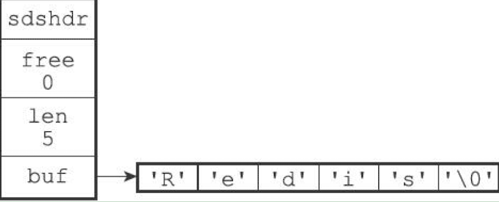

    保存空字符 `'\0'` 的 1 字节空间不计算在 SDS 的 `len` 中，会为其自动分配额外的 1 字节空间（在字符数组的末尾）

    > 遵循这样的设计是为了兼容部分 C 字符串函数

- 与 C 字符串的区别（为什么要用 SDS？）

    - **获取字符串长度的复杂度**为 $O(1)$

    - **杜绝缓冲区溢出**：

        C 字符串在拼接时 `char *strcat(char *dest, const char *src)` 容易出现缓冲区溢出，因为其不记录自身的长度；

        SDS 在进行修改时，API 会先检查空间是否满足修改需求，如果不满足，API 会**自动**将 SDS 的空间扩展至执行修改所需的大小，再执行实际的修改操作

    - **减少修改字符串时带来的内存重分配次数**：

        C 字符串只保存 `N+1` 个字符长的数组，修改 `N` 次长度必定执行 `N` 次内存重分配；

        SDS 通过未使用空间（`free`）进行内存分配优化：

        - **空间预分配**：空间扩展时会额外分配未使用空间

            - 修改后 `len < 1MB`，那么程序分配和 `len` 同样大小的 `free`
            - 修改后 `len >= 1MB`，程序分配 `1MB free` 

            在扩展 SDS 之前，先检查 `free` 是否足够，如果足够，则直接使用，不再执行内存分配

        - **惰性空间释放**：用于优化 SDS 的字符串缩短操作

            当需要缩短 SDS 中保存的字符串时，程序并不立即使用内存重分配来回收缩短后多出来的字节，而是用 `free` 存储这些字节数量，以便将来使用

            > SDS 还提供相应的 API，用于真正地释放其未使用的空间

    - **二进制安全**：

        C 字符串中不能存储 `'\0'`，因为会被程序误认为是字符串结尾

        SDS API 不会对 `buf` 中的数据做任何限制、过滤或者假设，因为其通过 `len` 来判断字符串是否结束

    - 兼容部分 C 字符串函数

### 链表（list）

- 列表键（List，单键多值）、发布与订阅、慢查询、监视器、保存多个客户端的状态信息、客户端输出缓冲区等都使用了链表

- 数据结构

    ```c
    typedef struct listNode {
      struct listNode *prev;
      struct listNode *next;
      void *value;
    } listNode;
    ```

    ```c
    typedef struct list {
      listNode *head;
      listNode *tail;
      
      unsigned long len; // 节点数量
      
      void *(*dup)(void *ptr); // 节点值复制函数
      void (*free)(void *ptr); // 节点值释放函数
      int (*match)(void *ptr, void *key); // 节点值对比函数
    } list;
    ```

    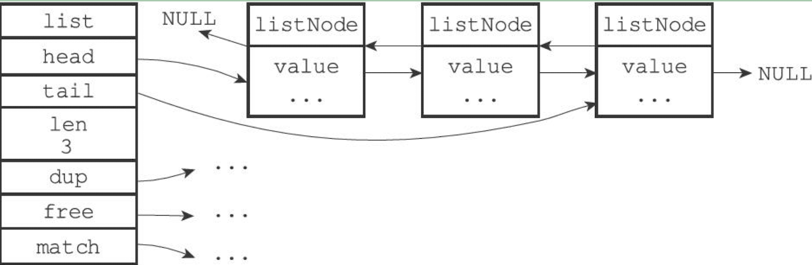

- 特点：

    - 双端
    - 无环
    - 带表头指针 `head` 和表尾指针 `tail`
    - 带链表长度计数器 `len`
    - 多态：链表节点使用 `void*` 指针来保存节点值，并且可以用过 `dup free match` 三个属性为节点值设置类型特定的函数，所以链表可以用于保存各种不同类型的值

### 字典（dict）

- Redis 的数据库就是使用字典作为底层实现，对数据库的增删改查也是构建在对字典的操作之上

- 字典也是哈希键（Hash）的底层实现之一，当一个哈希键包含的键值对比较多、或者键值对中的元素都是比较长的字符串时

- 数据结构

    ```c
    // 哈希表
    typedef struct dictht {
      dictEntry **table; // 哈希表数据
      
      unsigned long size; // 哈希表大小
      
      unsigned long sizemask; // 哈希表大小掩码，用于计算索引值，始终等于 size - 1
      
      unsigned long used; // 该哈希表已有的节点数量
    } dictht;
    ```

    `table` 是一个数组，数组中每个元素都指向一个 `dictEntry` 结构的指针，每个 `dictEntry` 结构保存着一个键值对

    `sizemask` 和哈希值一起决定一个键应该被放到 `table` 数组的哪个索引上

    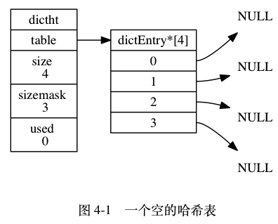

    ```c
    // 哈希表节点
    typedef struct dictEntry {
      void *key;
      
      union {
        void *val;
        uint64_t u64;
        int64_t s64;
      } v;
      
      // 指向下一个哈希表节点，形成链表
      struct dictEntry *next; 
    } dictEntry;
    ```

    `next` 用于解决键冲突（链地址法）：因为 `dictEntry` 中不记录链表尾节点，所以使用的是头插法

    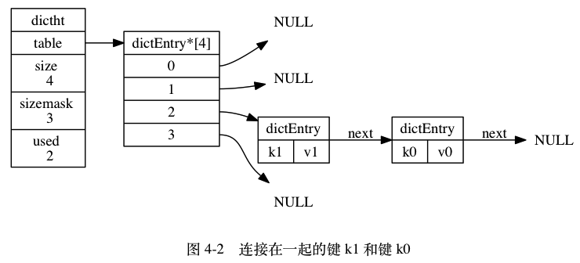

    ```c
    // 字典
    typedef struct dict {
      dictType *type; // 类型特定函数
      void *privdata; // 私有数据
      dictht ht[2]; // 哈希表
      
      // rehash 索引，当其不在进行时，值为 -1
      int rehashidx;
    } dict;
    ```

    `ht` 包含了两个 `dictht` 哈希表，一般情况下只使用 `ht[0]`，`ht[1]` 只在 rehash 时使用；`rehashidx` 记录了目前 rehash 的进度。

    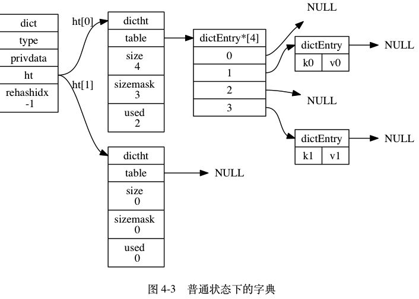

    `type` 和 `privdata` 是针对不同类型的键值对，为创建多态字典而设置的

    - `type` 是一个指向 `dictType` 结构的指针，每个 `dictType` 结构保存了一簇用于操作特定类型键值对的函数，Redis 会为用途不同的字典设置不同的类型特定函数
    - `privdata` 保存了需要传给那些类型特定函数的可选参数

    ```c
    typedef struct dictType {
      // 计算哈希值的函数
      unsigned int (*hashFunction)(const void *key);
      
      // 复制键的函数
      void *(*keyDup)(void *privdata, const void *obj);
      
      // 复制值的函数
      void *(*valDup)(void *privdata, const void *obj);
      
      // 对比键的函数
      int (*keyCompare)(void *privdata, const void *key1, const void *key2);
      
      // 销毁键的函数
      void (*keyDestructor)(void *privdata, void *key);
      
      // 销毁值的函数
      void (*valDestructor)(void *privdata, void *obj);
    } dictType;
    ```

- 哈希算法

    ```c
    // 计算键 key 的哈希值
    hash = dict->type->hashFunction(key);
    
    // 使用 sizemask 和哈希值，计算出索引值
    // 根据情况不同，ht[x] 可以是 h[0] 或者 h[1]
    index = hash & dict->ht[x].sizemask;
    ```

    当字典被用作数据库的底层实现，或者哈希键的底层实现时，Redis 使用 MurmurHash2 算法来计算键的哈希值，它的优点在于，即使输入的键是有规律的，算法仍然能给出一个很好的随机分布性，并且算法的计算速度也非常快。
    
- rehash

    - 为 `ht[1]` 分配空间，这个空间取决于要执行的操作以及 `ht[0].used`
        - 如果执行扩展操作，`ht[1]` 的大小等于第一个 `>= ht[0].used * 2` 的 $2^n$
        - 如果执行收缩操作，`ht[1]` 的大小等于第一个 `>= ht[0].used` 的 $2^n$
    - 重新计算 `ht[0]` 中所有键的哈希值和索引值，然后将键值对放置到 `ht[1]` 的指定位置上
    - 当迁移完成后（`ht[0]` 变为空表），释放 `ht[0]`，并将 `ht[1]` 设置为 `ht[0]`，在 `ht[1]` 处新创建一个空白哈希表，为下一次 rehash 作准备

    哈希表的自动扩展：

    - 服务器没有在执行 `BGSAVE` 或者 `BGREWRITEAOF` 命令，并且哈希表的负载因子 `>= 1`
    - 服务器正在执行 `BGSAVE` 或者 `BGREWRITEAOF` 命令，并且哈希表的负载因子 `> 5`

    ```c
    // 负载因子 = 哈希表已保存的节点数量 / 哈希表大小
    load_factor = ht[0].used / ht[0].size;
    ```

    > 根据 `BGSAVE` 或 `BGREWRITEAOF` 命令是否正在执行，服务器执行扩展操作所需的负载因子并不相同，这是因为在执行 `BGSAVE` 或 `BGREWRITEAOF` 命令的过程中，Redis 需要创建当前服务器进程的子进程，而**大多数操作系统都采用写时复制（copy-on-write）技术来优化子进程的使用效率，所以在子进程存在期间，服务器会提高执行扩展操作所需的负载因子，从而尽可能地避免在子进程存在期间进行哈希表扩展操作，这可以避免不必要的内存写入操作，最大限度地节约内存**。

    哈希表的自动收缩：负载因子 `< 0.1` 时
    
- 渐进式 rehash：将 `ht[0]` 中的键值对转移到 `ht[1]` 的过程不是一次性、集中性的，而是分多次、渐进式地完成的

    - 为 `ht[1]` 分配空间
    - 在字典中维持一个索引计数器变量 `rehashidx`，并将它的值设置为 0，表示 rehash 工作正式开始
    - 在 rehash 进行期间，每次对字典执行增删改查时，程序除了执行指定的操作以外，还会顺带将 `ht[0]` 在 `rehashidx` 索引上的所有键值对 rehash 到 `ht[1]`，当 rehash 工作完成之后，程序将 `rehashidx` 属性的值 `+ 1`（操作时迁移）
    - 当 `ht[0]` 的所有键值对都迁移完成后，将 `rehashidx` 设为 -1，表示 rehash 已完成

    > 渐进式 rehash 的好处是它采取分而治之的方式，将 rehash 键值对所需的计算工作均摊到对字典的增删改查上，从而避免了集中式 rehash 带来的庞大计算量

    在进行渐进式 rehash 的过程中，查找键时字典会先在 `ht[0]` 中查找，新添加的键值对一律会被保存到 `ht[1]` 中，保证 `ht[0]` 中键值对的数量只增不减。

### 跳表（skiplist）

- 跳表是一种有序数据结构，它通过在每个节点中维持多个指向其他节点的指针，从而达到快速访问节点的目的

- 跳表支持平均 $O(\log N)$，最坏 $O(N)$ 复杂度的节点查找，还可以通过顺序性操作来批量处理节点

- 大部分情况下，跳表效率可以和平衡树相媲美，并且实现更为简单

- Redis 中使用跳表作为有序集合键（Zset）的底层实现之一，如果一个有序集合包含的元素数量比较多，又或者成员是比较长的字符串时，Redis 就会使用跳表作为其底层实现。

- Redis 只在有序集合键、集群节点内部数据结构中使用跳表

- 数据结构

    ```c
    // 跳跃表节点
    typedef struct zskiplistNode {
      // 后退指针
      struct zskiplistNode *backward;
      
      // 分值
      double score;
      
      // 成员对象，指向一个字符串对象
      robj *obj;
      
      // 层
      struct zskiplistLevel {
        // 前进指针
        struct zskiplistNode *forward;
        // 跨度
        unsigned int span;
      } level[];
    } zskiplistNode;
    ```

    - `level` 层：包括两个属性，前进**指针和跨度**。前进指针用于访问表尾方向的其他节点，而跨度则记录了前进指针所指向节点和当前节点的距离。

        程序可以通过这些层来加快访问其他节点的速度，层的数量越多，访问其他节点的速度就越快。

        每次创建一个新节点的时候，都根据幂次定律随机生成一个介于 1 和 32 之间的值作为 `level` 数据的大小（层的高度）

        **跨度是用来计算排位（rank）的：在查找某个节点的过程中，将沿途访问过的所有层的跨度累计起来，得到的结果就是目标节点在跳跃表中的排位**

    - `backward` 指针：指向位于当前节点的前一个节点，后退指针在程序从表尾向表头遍历时使用

    - `score`：跳表中节点按分值从小到大排列。

        在同一个跳表中，**各个节点保存的对象必须是唯一的，但是多个节点保存的分值却可以是相同的**：分值相同的节点将按照成员对象在字典序中的大小来进行排序（小的在前）

    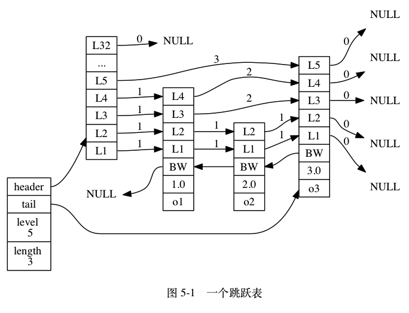

    ```c
    // 跳表
    typedef struct zskiplist {
      // 表头节点和表尾节点
      struct zskiplistNode *header, *tail;
      
      // 表中节点的数量
      unsigned long length;
      
      // 表中层数最大的节点的层数（表头节点的层高不算在内）
      int level;
    } zskiplist;
    ```

    表头节点和其他节点的构造是一样的：也有后退指针、分值和成员对象，只不过这些属性不会被用到。

### 整数集合（intset）

- 整数集合（intset）是集合键（Set）的底层实现之一，当一个集合**只包含整数值元素**，并且这个**集合的元素数量不多时**，Redis 就会使用整数集合作为集合键的底层实现（否则使用字典）。

- 数据结构

    ```c
    typedef struct intset {
      // 编码方式
      uint32_t encoding;
      
      // 集合包含的元素数量
      uint32_t length;
      
      // 保存元素的数组
      int8_t contents[];
    } intset;
    ```

    `contents` 数组是整数集合的底层实现：整数集合的每个元素都是 `contents` 数组的一个数组项（item），**各个项在数组中按值的大小从小到大有序地排列，并且不重复**。

    `contents` 的真正类型取决于 `encoding` 属性的值：

    - `encoding = INTSET_ENC_INT16, contents(int16_t)`
    - `encoding = INTSET_ENC_INT32, contents(int32_t)`
    - `encoding = INTSET_ENC_INT64, contents(int64_t)`

- 升级：当新元素的类型比集合中现有元素的类型都要长时，整数集合需要先进行升级（upgrade），然后才能将新元素添加到整数集合中。

    1. 根据新元素的类型，扩展整数集合底层数组的空间大小，并为新元素分配空间
    2. 将底层数组现有的所有元素都转换成与新元素相同的类型，并将类型转换后的元素放置到正确的位置上，在放置元素的过程中，需要继续维持底层数组的有序性
    3. 将新元素添加到底层数组中

    所以向整数集合添加新元素的时间复杂度为 $O(N)$（升级时）

    > 因为引发升级的新元素的长度总是比整数集合现有所有元素的长度都大，所以这个新元素的值要么就大于所有现有元素，要么就小于所有现有元素：
    >
    > - 在新元素小于所有现有元素的情况下，新元素会被放置在底层数组的最开头（索引 0）
    > - 在新元素大于所有现有元素的情况下，新元素会被放置在底层数组的最末尾（索引 `length - 1`）

    升级的好处：

    - 提高整数集合的灵活性：可以随意地添加 `int16_t int32_t int64_t` 类型的整数，而不必担心类型错误
    - 尽可能地节约内存

- 降级：不支持降级，一旦升级，编码就会一直保持升级后的状态（即使所有大类型整数都已被删除）

### 压缩列表（ziplist）

- 是列表键（List）和哈希键（Hash）的底层实现之一。

    当一个列表键只包含少量列表项，并且每个列表项要么就是小整数值、要么就是长度比较短的字符串时，Redis 就会使用压缩列表作为其底层实现。

    当一个哈希键只包含少量键值对，并且每个键值对的键和值要么是小整数、要么是长度比较短的字符串时，Redis 就会使用压缩列表作为其底层实现。

- 压缩列表是为了节约内存而开发的，**是由一系列特殊编码的连续内存块组成的顺序型（sequential）数据结构**。一个压缩列表可以包含任意多个节点（entry），每个节点可以保存一个字节数组或者一个整数值。

    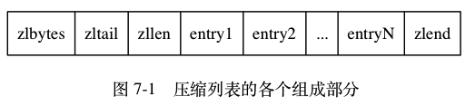

    | 属性      | 类型       | 长度     | 用途                                                         |
    | :-------- | :--------- | :------- | :----------------------------------------------------------- |
    | `zlbytes` | `uint32_t` | `4` 字节 | 记录整个压缩列表占用的内存字节数：在对压缩列表进行内存重分配，或者计算 `zlend` 的位置时使用。 |
    | `zltail`  | `uint32_t` | `4` 字节 | 记录压缩列表表尾节点距离压缩列表的起始地址有多少字节：通过这个偏移量，程序无须遍历整个压缩列表就可以确定表尾节点的地址。 |
    | `zllen`   | `uint16_t` | `2` 字节 | 记录了压缩列表包含的节点数量： 当这个属性的值小于 `UINT16_MAX` （`65535`）时， 这个属性的值就是压缩列表包含节点的数量； 当这个值等于 `UINT16_MAX` 时， 节点的真实数量需要遍历整个压缩列表才能计算得出。 |
    | `entryX`  | 列表节点   | 不定     | 压缩列表包含的各个节点，节点的长度由节点保存的内容决定。     |
    | `zlend`   | `uint8_t`  | `1` 字节 | 特殊值 `0xFF` （十进制 `255` ），用于标记压缩列表的末端。    |

    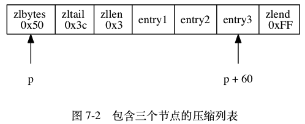

- 压缩列表节点可以保存一个字节数组或者一个整数值

    字节数组可以是下面三种长度之一：

    - 63（$2^6-1$）
    - 16383（$2^{14}-1$）
    - 4294967295（$2^{32}-1$）

    整数值可以是下面六种长度之一：

    - 4 位长，介于 0 至 12 之间的无符号整数
    - 1 字节长的有符号整数
    - 3 字节长的有符号整数
    - `int16_t` 类型整数
    - `int32_t` 类型整数
    - `int64_t` 类型整数

- 压缩列表节点的构成

    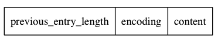

    - `previous_entry_length`：以字节为单位，记录了前一个节点的长度，用于计算出前一个节点的起始地址（从表尾向表头遍历时使用）
        - 如果前一节点的长度的小于 254 字节，那么 `previoud_entry_length` 属性的长度为 1 字节
        - 如果前一节点的长度的大于 254 字节，那么 `previoud_entry_length` 属性的长度为 5 字节，其中第一个字节被设置为 `0xFE`（254）
    - `encoding`：记录了节点的 `content` 属性所保存数据的类型及长度

        - 一、二、五字节长，值的最高位为 00、01 或 10 的是字节数组编码：这种编码表示节点的 `content` 属性保存着字节数组，数组的擦黄狗难度由编码除去最高两位之后的其他位记录
        - 一字节长，值的最高位以 11 开头的是整数编码：这种编码表示节点的 `content` 属性保存着整数值，整数值的类型和长度由编码除去最高两位之后的其他位记录
    - `content`：负责保存节点的值，节点值可以是一个字节数组或者整数
    
- 连锁更新：每个节点的 `previous_entry_length` 记录了前一个节点的长度，并且该属性的大小也与前一个节点的长度有关，所以当前一个节点长度产生变化时，可能需要对压缩列表执行**空间重分配**操作，以使得当前节点的 `previous_entry_length` 属性可以记录下前一个节点的长度。

    但是，当当前节点的 `previoud_entry_length` 属性大小产生变化时，可能会连带到其后面的节点，这就是**连锁更新**。

    添加、删除、修改节点都有可能导致连锁更新，在最坏情况下需要对压缩列表执行 $N$ 次空间重分配操作，而每次空间重分配的最坏复杂度为 $O(N)$，因此连锁更新的最坏复杂度为 $O(N^2)$。

    > 虽然连锁更新的复杂度很高，但出现的概率较低
    >
    > - 压缩列表中恰好有多个连续的、长度介于 250 字节至 253 字节之间的节点，这种情况很少见
    > - 即使出现连锁更新，只要被更新的节点数量不多，就不会对性能造成任何影响
    >
    > 因此，对于压缩列表增删等命令的平均复杂度仅为 $O(N)$

### 对象

- Redis 没有直接使用上述数据结构来实现键值对数据库，而是基于这些数据结构创建了一个对象系统，包含**字符串对象、列表对象、哈希对象、集合对象和有序集合对象**这五种类型

- 在数据库中创建新键值对时，至少会创建两个对象，键对象和值对象

- 优点：

    - Redis 可以在执行命令之前，**根据对象的类型来判断一个对象是否可以执行给定的命令**；
    - 可以针对不同的使用场景，为对象设置多种不同的数据结构实现，从而**优化对象在不同场景下的使用效率**；
    - Redis 实现了基于引用计数的内存回收机制来回收对象的内存，还通过该技术实现了对象共享机制，在适当的条件下，多个数据库可以**共享同一个对象**来节约内存；
    - Redis 的对象带有**访问时间记录**信息，该信息可以用于计算数据键的空转时长，在服务器启用了 `maxmemory` 功能的情况下，空转时长较大的那些键可能会优先被服务器删除

- 数据结构

    ```c
    typedef struct redisObject {
      // 类型
      unsigned type:4;
      
      // 编码
      unsigned encoding:4;
      
      // 指向底层实现数据结构的指针
      void *ptr;
      
      // 引用计数
      int refcount;
      
      // 记录对象最后一次被命令程序访问的时间
      unsigned lru:22;
      
      // ...
    } robj;
    ```
    
    `type` 取值：

    - `REDIS_STRING`：字符串对象
    - `REDIS_LIST`：列表对象
    - `REDIS_HASH`：哈希对象
    - `REDIS_SET`：集合对象
    - `REDIS_ZSET`：有序集合对象
    
    键总是一个字符串对象，值可以是这五个类型之一，`TYPE key` 命令返回的是 `key` 对应的 `value` 的类型
    
    `encoding` 取值：
    
    - `REDIS_ENCODING_INT`：`long` 类型的整数
    - `REDIS_ENCODING_EMBSTR`：`embstr` 编码的简单动态字符串
    - `REDIS_ENCODING_RAW`：简单动态字符串
    - `REDIS_ENCODING_HT`：字典
    - `REDIS_ENCODING_LINKEDLIST`：双端链表
    - `REDIS_ENCODING_ZIPLIST`：压缩列表
    - `REDIS_ENCODING_INTSET`：整数集合
    - `REDIS_ENCODING_SKIPLIST`：跳表 + 字典

####字符串对象（String）

- 编码方式：`int`、`raw` 和 `embstr`

- `int`：一个字符串对象保存的是可以用 `long` 类型表示的整数值

- `raw`：字符串值的长度大于 32 字节

- `embstr`：字符串值的长度小于等于 32 字节

- `raw` 编码会调用**两次**内存分配函数来分别创建 `redisObject` 结构 `sdshdr` 结构，释放也是两次；

    `embstr` 编码则通过**一次**内存分配函数来分配一块**连续**的空间，依次包含 `redisObject` 结构和 `sdshdr` 结构，释放也是一次，并且**连续的空间能够更好地利用缓存带来的优势**

- `long double` 类型的浮点数的存储也是通过字符串值。程序会先将浮点数转换成字符串，在有需要的时候，程序会将保存在字符串对象里的字符串值转换回浮点数，执行某些操作后，再转换回去，继续保存在字符串对象里

    ```shell
    redis> SET pi 3.14
    OK
    redis> OBJECT ENCODING pi
    "embstr"
    redis> INCRBYFLOAT pi 2.0 # 此处 字符串 -> 浮点数 -> 字符串
    "5.14"
    redis> OBJECT ENCODING pi
    "embstr"
    ```

- 对于 `int` 编码的字符串对象来说，如果向对象执行了一些命令，使得这个对象保存的不再是整数值，而是一个字符串值，那么字符串对象的编码将从 `int` 变为 `raw`

    ```shell
    redis> SET number 10086
    OK
    redis> OBJECT ENCODING number
    "int"
    redis> APPEND number " is a good number!"
    (integer) 23
    redis> GET number
    "10086 is a good number!"
    redis> OBJECT ENCODING number
    "raw"
    ```

- `embstr` 编码的字符串对象实际上是**只读**的，当需要修改时，程序会先将其从 `embstr` 转换成 `raw`，然后再修改

    ```shell
    redis> SET msg "hello world"
    OK
    redis> OBJECT ENCODING msg
    "embstr"
    redis> APPEND msg " again!"
    (integer) 18
    redis> OBJECT ENCODING msg
    "raw"
    ```

#### 列表对象（List）

- 编码方式：`ziplist` 或者 `linkedlist`

- `ziplist` 的每个节点（entry）保存一个列表元素

    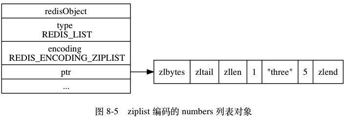

    两个条件：

    - 列表对象中的所有字符串元素的长度都小于 64 字节
    - 列表对象中保存的元素数量小于 512

- `linkedlist` 会在底层包含多个**字符串对象**

    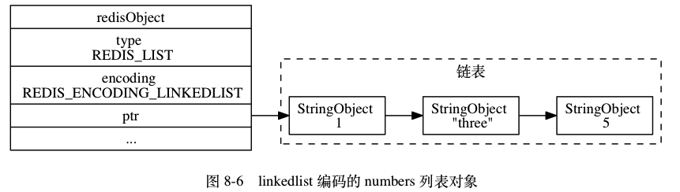

    > 字符串对象是 Redis 五种类型中唯一会被其他四种类型嵌套的对象

- 当使用 ziplist 编码所需的两个条件的任意一个不能被满足时，对象的编码转换操作就会被执行

    ```shell
    # 所有元素的长度都小于 64 字节
    redis> RPUSH blah "hello" "world" "again"
    (integer) 3
    
    redis> OBJECT ENCODING blah
    "ziplist"
    
    # 将一个 65 字节长的元素推入列表对象中
    redis> RPUSH blah "wwwwwwwwwwwwwwwwwwwwwwwwwwwwwwwwwwwww"
    (integer) 4
    
    # 编码已改变
    redis> OBJECT ENCODING blah
    "linkedlist"
    ```

#### 哈希对象（Hash）

- 编码方式：`ziplist` 或者 `hashtable`

- 使用 `ziplist` 实现时，每当有新的键值对加入，程序会先将保存了键的压缩列表节点推入到压缩列表表尾，然后再将保存了值的压缩列表节点推入到压缩列表表尾

    - 保存了同一键值对的两个节点总是紧挨在一起，键节点在前、值节点在后
    - 先添加的键值对再表头方向、后添加的键值对在表尾方向

    两个条件：

    - 哈希对象保存的所有键值对的键和值的字符串长度都小于 64 字节
    - 哈希对象保存的键值对数量小于 512 个

- 使用 `hashtable` 实现时，哈希对象中的每个键值对都是用一个**字典键值**来保存，该字典的每个键、值都是字符串对象

#### 集合对象（Set）

- 编码方式：`intset` 或者 `hashtable`

- 使用 `intset` 实现时，集合对象包含的所有元素都被保存在整数集合里面

    两个条件：

    - 集合对象保存的所有元素都是整数值
    - 集合对象保存的元素数量不超过 512 个

- 使用 `hashtable` 实现时，使用字典作为底层实现，字典的每一个键都是一个字符串对象，每个字符串对象包含了一个集合元素，**字典的值都是 `NULL`**

#### 有序集合对象（Zset）

- 编码方式：`ziplist` 或者 `skiplist`

- 元素成员都是字符串对象，分值是 `double` 类型的浮点数

- 使用 `ziplist` 实现时，每个集合元素使用两个紧挨在一起的压缩列表节点来保存，第一个节点保存元素的成员（member），第二个元素保存元素的分值（score）

    - 元素按分值从小到大排序

    两个条件：

    - 有序集合保存的所有元素成员的长度都小于 64 字节
    - 有序集合保存的元素个数小于 128 个

- 使用 `skiplist` 实现时，底层使用 `zset` 结构，包含一个字典和一个跳表

    ```c
    typedef struct zset {
      zskiplist *zsl;
      dict *dict;
    } zset;
    ```

    - `zsl` 跳表按分值从小打到保存所有集合元素，`object` 保存元素成员，`score` 属性保存元素分值，`ZRANK ZRANGE` 等命令基于此实现；
    - `dict` 为有序结合创建了一个从成员到分值的映射，可以实现 $O(1)$ 查找给定成员的分值，`ZSCORE` 命令基于此实现
    - 虽然 `zset` 内部使用两种数据结构，但它们都会通过指针来共享同一元素的成员和分值，不会浪费额外的内存

#### 类型检查和命令多态

- 任何类型的键都可以执行的命令：`DEL EXPIRE RENAME TYPE OBJECT` 等
- 特定类型的键才能执行的命令：
    - `SET GET APPEND STRLEN` 等：字符串键
    - `HDEL HSET HGET HLEN` 等：哈希键
    - `RPUSH LPOP LINSERT LLEN` 等：列表键
    - `SADD SPOP SINTER SCARD` 等：集合键
    - `ZADD ZCARD ZRANK ZSCORE` 等：有序集合键
- 类型检查的实现是通过检查值的 `redisObject` 的 `type` 属性来实现
- 多态命令：
    - 基于类型的多态：一个命令可以同时使用于多种不同类型的键
    - 基于编码的多态：根据值对象使用的编码来选择正确的命令实现

#### 内存回收

- 通过引用计数技术：对象的引用计数值变为 0 时，对象所占用的内存会被释放

#### 对象共享

- Redis 会共享值为 0 到 9999 的字符串对象
- 让多个键共享同一个值的步骤：
    - 将数据库键的值指针指向一个现有的值对象
    - 将被共享的值对象的引用计数加一
- 共享对象不单单只有字符串键可以使用，那些在数据结构中嵌套了字符串对象的对象也可以使用
- 包含字符串的那些对象（四种类型）不会被共享
    - 因为共享之前要先检查共享对象和目标对象是否完全相同，如果对象的值太复杂，那么验证的复杂度太高
    - 整数值对象 $O(1)$，字符串值对象 $O(N)$，多个值的对象 $O(N^2)$

#### 对象的空转时长

- 如果服务器打开了 `maxmemory` 选项，并且服务器用于回收内存的算法为 `volatile-lru` 或者 `allkeys-lru`，那么当服务器占用的内存数超过了 `maxmemory` 选项所设置的上限值时，空转时长较高的那部分键会优先被服务器释放，从而回收内存。

## 单机数据库的实现

### 数据库

- 服务器中的数据库的数据结构

    ```c
    typedef struct redisServer {
      // ...
      redisDB *db; // 一个数组，保存着服务器中所有的数据库
      int dbnum; // 服务器中数据库的数量，默认为 16
      // ...
    } redisServer;
    ```

- 客户端中的数据库的数据结构

    ```c
    typedef struct redisClient {
      // ...
      redisDB *db; // 记录客户端当前正在使用的数据库
      // ...
    } redisClient;
    ```

    使用 `SELECT id` 切换数据库

- 数据库键空间：Redis 是一个键值对数据库服务器，`redisDB` 结构的 `dict` 字典保存了数据库中的所有键值对，这个字典被称为键空间

    ```c
    typedef struct redisDb {
      // ...
      dict *dict; // 键空间
      // ...
    } redisDb;
    ```

    - 键空间的键是字符串对象，值是五大类型之一的对象

    - 所有对于数据库的操作（增删改查）实际上都是通过对键空间字典进行操作来实现的

    - 还有很多针对数据库本身的 Redis 命令，也是通过对键空间进行处理来完成的

        例如：`FLUSHDB RANDOMKEY DBSIZE EXISTS RENAME KEYS`

    - 读写键空间时的额外的维护操作：

        - 更新服务器的键空间命中次数（hit）和不命中次数（miss）
        - 更新键的 LRU 时间
        - 如果服务器在读取一个键时发现该键已经过期，那么服务器会先删除这个过期键，然后才执行余下的其他操作
        - 如果有客户端使用 `WATCH` 命令监视了某个键，那么服务器会将该键标记为脏（dirty）
        - 服务器每次修改一个键之后，都会对脏键计数器的值增一，这个计数器会触发服务器的持久化以及复制操作
        - 如果服务器开启了数据库通知功能，那么在对键进行修改之后，服务器将按配置发送相应的数据库通知

- 设置键的过期时间

    - 一共有四个命令 `EXPIRE PEXPIRE EXPIREAT PEXPIREAT`，底层都是使用 `PEXPIREAT` 命令实现的

        ```python
        def EXPIRE(key, ttl_in_sec):
          ttl_in_ms = sec_to_ms(ttl_in_sec)
          PEXPIRE(key, ttl_in_ms)
          
        def PEXPIRE(key, ttl_in_ms):
          now_ms = get_current_unix_timestamp_in_ms()
          PEXPIREAT(key, now_ms + ttl_in_ms)
          
        def EXPIREAT(key, expire_time_in_sec):
          expire_time_in_ms = sec_to_ms(expire_time_in_sec)
          PEXPIREAT(key, expire_time_in_ms)
          
        def PEXPIREAT(key, expire_time_in_ms):
          if key not in redisDb.dict:
            return 0
          
          redisDb.expires[key] = expire_time_in_ms
          return 1
        ```

    - 保存过期时间：通过 `redisDb` 结构的 `expires` 字典，键为对象指针（指向/复用 `dict` 的对象），值为 `long long` 类型的毫秒级别的 UNIX 时间戳

        ```c
        typedef struct redisDb {
          // ...
          dict *expires;
          // ...
        } redisDb;
        ```

- 移除过期时间：`PERSIST` 命令，是 `PEXPIREAT` 命令的反操作，解除键和过期时间在过期字典中的关联

    ```python
    def PERSIST(key):
      if key not in redisDb.expires:
        return 0
      
      redisDb.expires.remove(key)
      return 1
    ```

- 计算并返回剩余生存时间：`TTL PTTL` 命令

    ```python
    def PTTL(key):
      if key not in redisDb.dict:
        return -2
      
      expire_time_in_ms = redisDb.expires.get(key)
      if expire_time_in_ms is None:
        return -1
      
      now_ms = get_current_unix_timestamp_in_ms()
      return (expire_time_in_ms - now_ms)
    
    def TTL(key):
      ttl_in_ms = PTTL(key)
      if ttl_in_ms < 0:
        return ttl_in_ms # -1 or -2
      else:
        return ms_to_sec(ttl_in_ms)
    ```

- 过期键的判定：比较键的过期时间与当前 UNIX 时间戳

    ```python
    def is_expired(key):
      expire_time_in_ms = redisDb.expires.get(key)
      
      if expire_time_in_ms is None:
        return False
      
      now_ms = get_current_unix_timestamp_in_ms()
      if now_ms > expire_time_in_ms:
        return True
      else:
        return False
    ```

    > 也可以使用 `TTL PTTL` 命令检查返回值是否 `>= 0`

- 过期键删除策略

    - **定时删除**：在设置键的过期时间的同时，创建一个定时器（Timer），让定时器在键的过期时间来临时，立即执行对键的删除操作

        优点：对内存最友好，保证过期键尽可能快地被删除从而释放内存

        缺点：**对 CPU 不友好**，过期键较多时，删除操作占用 CPU；定时器的创建需要用到时间事件，其实现方式为无序链表，查找一个事件的复杂度为 $O(N)$

    - **惰性删除**：放任键过期不管，每次从键空间中获取键时，先检查取得的键是否过期，如果过期就删除；否则返回该键

        优点：对 CPU 最友好，只在非做不可的情况下执行删除操作

        缺点：**对内存不友好**，会造成垃圾堆积

    - **定期删除**：每隔一段时间，程序就对数据库进行一次检查，删除里面的过期键

        - 优点：对上面两个方式的折中，每隔一段时间删除，通过限制删除操作执行的时长和频率来减少删除操作对 CPU 的影响；通过定期删除也减少了过期键带来的内存浪费
        - 缺点：难以确定删除操作执行的时长和频率

    Redis 中配合使用**惰性删除**和**定期删除**两种策略

    - 惰性删除：`expireIfNeeded()`，所有读写数据库的 Redis 命令在执行前都会调用该函数对输入键进行检查

    - 定期删除：`activeExpireCycle()`，在规定时间内，分多次遍历服务器中的各个数据库，从数据库的 `expires` 字典中**随机检查一部分**键的过期时间，并删除其中的过期键

        ```python
        # 默认每次检查的数据库数量
        DEFAULT_DB_NUMBERS = 16
        # 默认每个数据库检查的键数量
        DEFAULT_KEY_NUMBERS = 20
        # 全局变量，记录检查进度
        # 下次执行 activeExpireCycle() 函数时继承上次的进度
        current_db = 0
        
        def activeExpireCycle():
          db_numbers = min(server.dbnum, DEFAULT_DB_NUMBERS)
          for i in range(db_numbers):
            # 如果相等，表明检查程序已经遍历了服务器的所有数据库一次
            # 将 current_db 重置为 0，开始新一轮的遍历
            if current_db == server.dbnum:
              current_db = 0
              
            redisDb = server.db[current_db]
            current_db += 1
            
            for j in range(DEFAULT_KEY_NUMBERS):
              # 数据库中没有键带有过期时间
              if redisDb.expires.size() == 0:
                break
              
              key_with_ttl = redisDb.expires.get_random_key()
              if is_expired(key_with_ttl):
                delete_key(key_with_ttl)
              
              # 达到时间上限
              if reach_time_limit():
                return
        ```

- AOF、RDB 和复制功能对过期键的处理

    - 生成 RDB 文件（`SAVE BGSAVE`）：程序会对数据库中的键进行检查，已过期的键不会被保存到新创建的 RDB 文件中

    - 载入 RDB 文件：

        - 服务器是主服务器模式：过期键会被忽略

        - 服务器是从服务器模式：保存所有键

            > 因为主从服务器在进行数据同步（全量同步）的时候，从服务器的数据库就会被清空，所以一般来讲，过期键对载入 RDB 文件的从服务器也不会造成影响。

    - AOF 文件写入：

        - 某个键已过期，但没有被惰性删除或定期删除，那么 AOF 文件不会因为这个过期键有任何影响
        - 如果过期键已被删除，程序会向 AOF 文件追加一条 `DEL` 命令，显式记录该键已被删除

    - AOF 重写：已过期的键不会被保存到重写后的 AOF 文件中

    - 复制：**从服务器的过期键删除动作由主服务器控制**

        - 主服务器删除一个过期键后，会显式地向所有从服务器发送一个 `DEL` 命令，告知从服务器删除这个过期键

        - 从服务器在执行客户端发送的读命令时，即使碰到过期键也不会删除，而是继续像处理未过期的键一样来处理过期键

            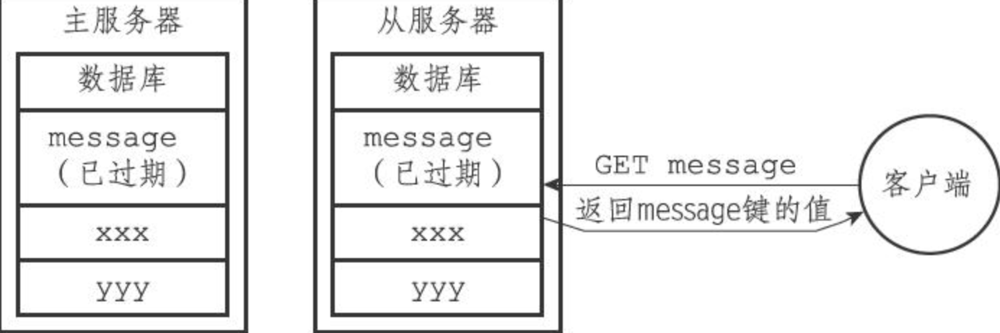

        - 从服务器只有在接到主服务器发来的 `DEL` 命令之后，才会删除过期键

        > 这种统一、中心化的过期键删除策略可以保证主从服务器数据的一致性

- 数据库通知：客户端通过订阅给定的频道或者模式，可以获知数据库中键的变化和数据库中命令的执行情况

    - **键空间通知**：关注“某个键执行了什么命令”

    - **键事件通知**：关注“某个命令被什么键执行了”

    - 服务器配置 `notify-keyspace-events` 决定发送通知的类型：

        - `AKE`：所有类型的键空间通知和键事件通知
        - `AK`：所有类型的键空间通知
        - `AE`：所有类型的键事件通知
        - `K$`：只发送和字符串键有关的键空间通知
        - `El`：只发送和列表键有关的键事件通知
        - `...`

    - 发送通知

        ```c
        void notifyKeyspaceEvent(int type, char *event, robj *key, int dbid);
        ```

        ```c
        void saddCommand(redisClient *c) {
          // ...
          if (added) {
            // ...
            // 发送事件通知
            notifyKeyspaceEvent(REDIS_NOTIFY_SET, "sadd", c->argv[1], c->db->id);
          }
          // ...
        }
        
        void delCommand(redisClient *c) {
          int deleted = 0, j;
          
          // 遍历所有输入键
          for (j = 1; j < c->args; j++) {
            // ...
            // 删除键成功，发送通知
            notifyKeyspaceEvent(REDIS_NOTIFY_GENERIC, "del", c->argv[j], c->db->id);
            // ...
          }
          // ...
        }
        ```

        发送通知的伪代码实现：

        ```python
        def notifyKeyspaceEvent(type, event, key, dbid):
          # 如果给定的通知不是服务器允许发送的通知，那么直接返回
          if not(server.notify_keyspace_events & type):
            return
          
          # 发送键空间通知
          if server.notify_keyspace_events & REDIS_NOTIFY_KEYSPACE:
            # 频道：__keyspace@<dbid>__:<key>
            chan = "__keyspace@{dbid}__:{key}".format(dbid=dbid, key=key)
            pubsubPublishMessage(chan, event)
          
          # 发送键事件通知
          if server.notify_keyspace_events & REDIS_NOTIFY_KEYEVENT:
            chan = "__keyevent@{dbid}__:{event}".format(dbid=dbid, event=event)
            pubsubPublishMessage(chan, key)
        ```

### RDB 持久化

- RDB 持久化功能所生成的 RDB 文件是一个经过压缩的二进制文件，通过该文件可以还原生成 RDB 文件时的数据库状态

- `SAVE` 命令会**阻塞** Redis 服务器进程，直到 RDB 文件创建完毕为止，在此期间服务器不能处理任何命令请求

    ```python
    def SAVE():
      rdbSave()
      
    def BGSAVE():
      pid = fork()
      if pid == 0:
        rdbSave()
        # 完成后向父进程发送信号
        signal_parent()
      elif pid > 0:
        # 父进程继续处理命令请求，并通过轮询等待子进程的信号
        handle_request_and_wait_signal()
      else:
        # 处理出错情况
        handle_fork_error()
    ```

    `BGSAVE` 命令会派生出一个**子进程**，然后由子进程负责创建 RDB 文件，父进程继续处理命令请求

    - 在 `BGSAVE` 命令执行期间，服务器处理 `SAVE BGSAVE BGREWRITEAOF` 三个命令的方式会和平时不同
    - `SAVE` 命令会被拒绝，避免父进程和子进程同时执行两个 `rdbSave()` 调用，产生竞争条件
    - `BGSAVE` 命令会被拒绝，防止两个子进程产生竞争条件
    - `BGREWRITEAOF` 也不能和 `BGSAVE` 同时执行，这样是为了性能考虑——避免并发出两个子进程，同时执行大量的磁盘写入操作
        - 如果 `BGSAVE` 正在执行，那么 `BGREWRITEAOF` 会被延迟到其结束后再执行
        - 如果 `BGWRITEAOF` 正在执行，那么 `BGSAVE` 会被拒绝

- RDB 文件的载入工作是**在服务器启动时自动执行**的，所以 Redis 并没有专门用于载入 RDB 文件的命令，只要 Redis 服务器在启动时检测到 RDB 文件存在，它就会自动载入 RDB 文件。

    RDB 文件载入期间，服务器会一致处于阻塞状态。

- 因为 AOF 文件的更新频率高于 RDB 文件，所以只有在 AOF 关闭时，服务器才会使用 RDB 来还原数据库状态，否则优先使用 AOF 文件

- Redis 允许用户通过设置服务器配置的 `save` 选项，让服务器每隔一段时间自动执行 `BGSAVE` 命令：

    ```
    save [sec] [num]
    ```

    服务器在 `sec` 秒内，对数据库进行了至少 `num` 次修改，`BGSAVE` 命令就会被执行。

    可以通过 `save` 选项设置多个保存条件，满足其一就会执行。

    ```c
    struct redisServer {
      // ...
      // 记录了保存条件的数组
      struct saveparam *saveparams;
      // ...
      // 修改计数器
      long long dirty;
      // 上一次执行保存的时间
      time_t lastsave;
      // ...
    };
    
    struct saveparams {
      time_t seconds;
      int changes;
    }
    ```

    Redis 的服务器周期性操作函数 `serverCron()` 每隔 100ms 就会执行一次，会对 `save` 选项的条件进行检查：

    ```python
    def serverCron():
      # ...
      # 遍历所有保存条件
      for saveparam in server.saveparams:
        # 计算距离上次执行保存操作经过了多少秒
        save_interval = unixtime_now() - server.lastsave
        if server.dirty >= saveparam.changes and \
        	save_interval > saveparam.seconds:
            BGSAVE()
            server.dirty = 0
            server.lastsave = unixtime.now()
      # ...
    ```

- RDB 文件结构：一个经过压缩的二进制文件

    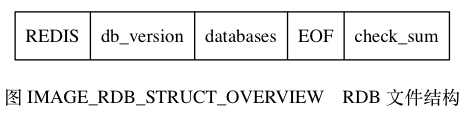

    - `REDIS` 部分，5 字节，程序可以在载入文件时，快速检查所载入的文件是否是 RDB 文件

    - `db_version` 部分，4 字节，字符串表示的整数，记录了 RDB 文件的版本号

    - `databases` 部分，包含零个或任意多个数据库，以及各个数据库中的键值对数据

        每个非空数据库保存为 `SELECTDB | db_number | key_value_pairs` 三个部分

        - `SELECTDB`：1 字节，指示之后的数据库号码

        - `db_number`：1/2/5 字节，数据库号码，程序读入后，服务器会自动调用 `SELECT` 命令切换至该数据库

        - `key_value_pairs`：键值对和过期时间

            `TYPE | key | value` 或 `EXPIRETIME_MS | ms | TYPE | key |  value` 格式

    - `EOF` 部分，1 字节，表示所有键值对的结束

    - `check_sum` 部分，8 字节的无符号整数，保存校验和

    `value` 的保存结构：

    - 字符串对象：

        - int 编码：`ENCODING | integer`

        - raw 编码：

            - `<= 20` 字节，原样保存

                `len | string`

            - `> 20` 字节，压缩保存

                `REDIS_RDB_ENC_LZF | compressed_len | origin_len | compressed_string`

    - 列表对象：

        `list_length | item1 | item2 | ... | itemN`

        每个 `item` 都以字符串对象的处理方式来存储

    - 集合对象：

        `set_size | elem1 | elem2 | ... | elemN`

        每个 `elem` 都以字符串对象的处理方式来存储

    - 哈希表对象：

        `hash_size | key_value_pair1 | key_value_pair2 | ... | key_value_pairN`

        展开来看：

        `hash_size | key1 | value1 | key2 | value2 | ... | keyN | valueN`

        每个 `key/value` 都以字符串对象的处理方式来存储

    - 有序集合对象：

        `sorted_set_size | element1 | element2 | ... | elementN`

        展开来看：

        `sorted_set_size | member1 | score1 | member2 | score2 | ... | memberN | scoreN`

        每个 `member/score` 都以字符串对象的处理方式来存储（`score` 被转换为字符串）

    - INTSET 编码的集合对象：`value` 保存的就是一个整数集合对象，会先将整数集合转换为字符串对象再保存

    - ZIPLIST 编码的列表、哈希表或有序集合对象：先将压缩列表转换成一个字符串对象再保存

        由于 TYPE 的存在，即使列表、哈希表和有序集合三种类型都使用压缩列表来保存，RDB 读入程序也总可以将读入并转换之后得出的压缩列表设置成原来的类型

### AOF 持久化

- 通过保存 Redis 服务器所执行的写命令来记录数据库状态

- 被写入 AOF 文件的所有命令都是以 Redis 的命令请求协议格式保存的

- AOF 持久化功能的实现可以分为**命令追加（缓冲区）、文件写入、文件同步**三个步骤

    - 命令追加：追加到缓冲区中，之后再定期写入并同步到 AOF 文件

        ```c
        struct redisServer {
          // ...
          // AOF 缓冲区
          sds aof_buf;
          // ...
        };
        ```

    - 文件写入与同步：Redis 服务器进程就是一个事件循环，接受命令->执行->发送回复，在服务器每次结束一个事件循环之前，它都会调用 `flushAppendOnlyFile()` 函数，考虑是否需要将 `aof_buf` 缓冲区中的内容写入和保存到 AOF 文件里面

        ```python
        def eventLoop():
          while True:
            # 处理文件事件，接受命令请求以及发送命令回复
            # 处理命令请求时可能会有新内容被追加到 aof_buf 缓冲区中
            processFileEvents()
            # 处理时间事件
            processTimeEvents()
            # 考虑是否要将 aof_buf 中的内容写入和保存到 AOF 文件里
            flushAppendOnlyFile()
        ```

        `appendfsync` 选项：

        - `always`：效率最慢、最安全
        - `everysec`：最多丢失一秒的数据
        - `no`：服务器在每个事件循环都要将 `aof_buf` 缓冲区中的所有内容写入到 AOF 文件，**至于何时对 AOF 文件进行同步，则由操作系统控制**。写 AOF 文件速度最快，但单词同步时长最长（因为会积累一段时间的写入数据）

        > 为了提高文件的写入效率，在现代操作系统中，当用户调用 `write()` 函数，将一些数据写入到文件的时候，操作系统通常会将写入数据暂时保存在一个**内存缓冲区**里面，等到缓冲区的空间被填满、或者超过了指定的时限之后，才真正地将缓冲区中的数据写入到磁盘里面。
        > 这种做法虽然提高了效率，但也为写入数据带来了安全问题，因为如果计算机发生停机，那么保存在内存缓冲区里面的写入数据将会丢失。
        > 为此，系统提供了 `fsync()` 和 `fdatasync()` 两个同步函数，它们可以**强制让操作系统立即将缓冲区中的数据写入到硬盘**里面，从而确保写入数据的安全性。

- 读取 AOF 文件并还原数据库

    - 创建一个不带网络连接的**伪客户端**（fake client）：因为 Redis 的命令只能在客户端上下文中执行，而载入 AOF 文件时所使用的命令直接来源于 AOF 文件而不是网络连接，所以服务器使用了一个没有网络连接的伪客户端来执行 AOF 文件保存的写命令，伪客户端执行命令的效果和带网络连接的客户端执行命令的效果完全一样。
    - 从 AOF 文件中分析并读取出一条写命令
    - 使用伪客户端执行被读出的写命令
    - 重复执行 2、3 步，直到 AOF 文件中的所有写命令都被处理完毕为止

- AOF 重写：通过该功能，Redis 服务器可以创建一个新的 AOF 文件来替代现有的 AOF 文件，新旧两个 AOF 文件所保存的数据库状态相同，但新 AOF 文件不会包含任何浪费空间的冗余命令，所以新 AOF 文件的体积通常会比旧 AOF 文件的体积要小得多。

    AOF 重写**不需要**对现有的 AOF 文件进行读取、分析、写入操作，该功能是通过**读取服务器当前的数据库状态来实现的**。

    > 首先从数据库中读取键现在的值，然后用一条命令去记录键值对，代替之前记录这个键值对的多条命令，这就是 AOF 重写功能的实现原理

    ```python
    def aof_rewrite(new_aof_file_name):
      f = create_file(new_aof_file_name)
      
      for db in redisServer.db:
        if db.is_empty():
          continue
        f.write_command("SELECT" + db.id)
        for key in db:
          if key.is_expired():
            continue
          if key.type == String:
            rewrite_string(key)
          elif key.type == List:
            rewrite_list(key)
          elif key.type == Hash:
            rewrite_hash(key)
          elif key.type == Set:
            rewrite_set(key)
          elif key.type == SortedSet:
            rewrite_sorted_set(key)
          
          # 过期时间也要被重写
          if key.have_expire_time():
            rewrite_expire_time(key)
            
        f.close()
        
    def rewrite_string(key):
      value = GET(key)
      f.write_command("SET", key, value)
      
    def rewrite_list(key):
      item1, item2, ..., itemN = LRANGE(key, 0, -1)
      f.write_command("RPUSH", key, item1, item2, ..., itemN)
      
    def rewrite_hash(key):
      field1, value1, field2, value2, ..., fieldN, valueN = HGETALL(key)
      f.write_command("HMSET", key, field1, value1, field2, value2, ..., fieldN, valueN)
      
    def rewrite_set(key):
      elem1, elem2, ..., elemN = SMEMBERS(key)
      f.write_command("SADD", key, elem1, elem2, ..., elemN)
      
    def rewrite_sorted_set(key):
      member1, score1, member2, score2, ..., memberN, scoreN = ZRANGE(key, 0, -1, "WITHSCORES")
      f.write_command("ZADD", key, score1, member1, score2, member2, ..., scoreN, memberN)
      
    def rewrite_expire_time(key):
      timestamp = get_expire_time_in_unixstamp(key)
      f.write_command(PEXPIREAT, key, timestamp)
    ```

    在实际中，为了避免在执行命令时造成客户端输入缓冲区溢出，重写程序在处理非字符串对象时，会先检查元素数量，如果超过 `REDIS_AOF_REWRITE_ITEMS_PER_CMD`（默认为 64），则使用多条命令来记录键的值

- AOF 后台重写：子进程与父进程可能会出现不一致（父进程还在接收修改数据库的命令），Redis 通过设置了一个 **AOF 重写缓冲区**解决这个问题。

    **当主进程执行完一个命令后，它会同时将这个写命令发送给 AOF 缓冲区和 AOF 重写缓冲区**

    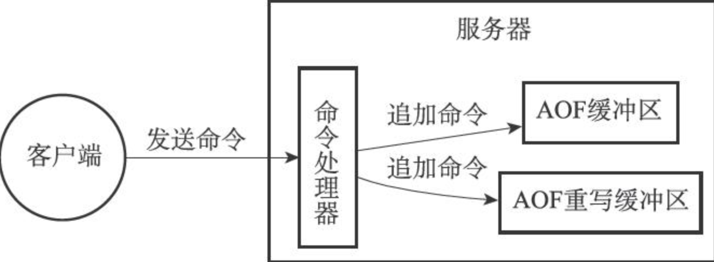

    这样可以保证：

    - AOF 缓冲区的内容会定期被写入和同步到 AOF 文件，对现有 AOF 文件的处理工作会如常进行。
    - 从创建子进程开始，服务器执行的所有写命令都会被记录到 AOF 重写缓冲区里面。

    当子进程完成重写后，会向父进程发送一个信号，父进程在接到该信号后，会调用一个信号处理函数：

    1. **将 AOF 重写缓冲区中的所有内容写入到新 AOF 文件中**，这时新 AOF 文件所保存的数据库状态将和服务器当前的数据库状态一致
    2. 对新的 AOF 文件进行**原子性**改名，完成新旧更替

    信号处理函数执行完成之后，父进程才可以继续接受命令（执行过程中会被阻塞）。

### 事件

- Redis 服务器是一个==事件驱动==程序，主要处理两类事件

    - **文件事件**：Redis 服务器通过套接字与客户端（或其他 Redis 服务器）进行连接，而**文件事件就是服务器对套接字操作的抽象**。**服务器与客户端的通信**会产生相应的文件事件，而服务器则通过监听并处理这些事件来完成一系列网络通信操作
    - **时间事件**：Redis 服务器中的一些**操作需要在给定的时间点执行**，而时间事件就是服务器对这类定时操作的抽象

- 文件事件：Redis 基于 Reactor 模式开发了自己的网络事件处理器，这个处理器被称为**文件事件处理器**（file event handler）：

    - 其使用 ==I/O 多路复用==程序来同时监听多个套接字，并根据套接字目前执行的任务来为套接字**关联**不同的事件处理器
    - 当被监听的套接字准备好执行连接应答（accept）、读取（read）、写入（write）、关闭（close）等操作时，与操作相对应的文件事件就会产生，这时文件事件处理器就会调用套接字之前关联好的事件处理器来**处理**这些事件

    文件事件处理器以==单线程==方式运行，但通过使用 ==I/O多路复用==程序来监听多个套接字。文件事件处理器既实现了高性能的网络通信模型，又可以很好地与 Redis 服务器中其他同样以单向成方式运行的模块进行对接，这保持了 Redis 内部单线程设计的简单性。

    - 文件事件处理器的构成

        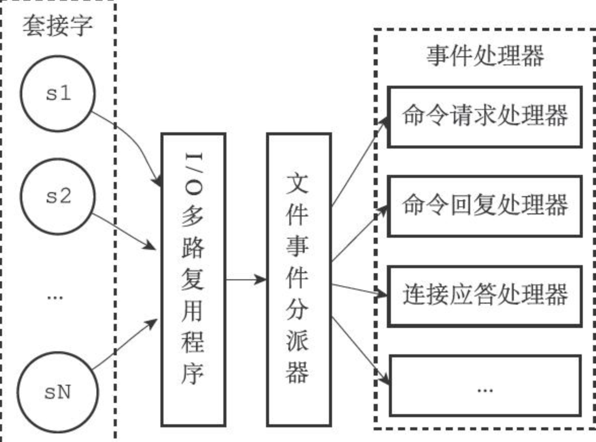

        - **套接字**

        - **I/O 多路复用程序**：多个文件事件可能会并发地出现，但 I/O 多路复用程序总是会将所有产生事件的套接字都放到一个**队列**里面，然后通过这个队列，以==有序、同步、每次一个套接字==的方式向文件事件分派器发送套接字。

            底层实现是通过包装常见的 `select epoll evport kqueue` 这些 I/O 多路复用函数库来实现的，程序会在编译时自动选择系统中性能最高的函数库作为 Redis I/O 多路复用程序的底层实现。

            ```c
            # ifdef HAVE_EVPORT
            # include "ae_evport.c"
            # else
            	# ifdef HAVE_EPOLL
            	# include "ae_epoll.c"
            	# else
            		# ifdef HAVE_KQUEUE
            		# include "ae_kqueue.c"
            		# else
            		# include "ae_select.c"
            		# endif
            	# endif
            # endif
            ```

            > I/O 多路复用程序可以监听多个套接字的 AE_READABLE 事件和AE_WRITABLE 事件，这两类事件和套接字操作之间的对应关系如下：
            >
            > - 当套接字变得可读时（客户端对套接字执行 `write` 操作，或者执行 `close` 操作），或者有新的可应答（acceptable）套接字出现时（客户端对服务器的监听套接字执行 `connect` 操作），套接字产生 AE_READABLE 事件。
            > - 当套接字变得可写时（客户端对套接字执行 `read` 操作），套接字产生 AE_WRITABLE 事件。
            >
            > I/O 多路复用程序允许服务器同时监听套接字的 AE_READABLE 事件和 AE_WRITABLE 事件，如果一个套接字同时产生了这两种事件，那么文件事件分派器会**优先处理 AE_READABLE 事件**，等到 AE_READABLE 事件处理完之后，才处理 AE_WRITABLE 事件。
            > 这也就是说，如果一个套接字又可读又可写的话，那么服务器将**先读套接字，后写套接字**。

        - **文件事件分派器**（dispatcher）：接收 I/O 多路复用程序传来的套接字，并根据套接字产生的事件的类型，调用相应的事件处理器

        - **事件处理器**：是一个个函数，定义了某个事件发生时，服务器应该执行的动作

            - 对连接服务器的客户端进行应答：**连接应答处理器**

            - 接收客户端的命令请求：**命令请求处理器**

                在客户端连接服务器的整个过程中，服务器都会一直为客户端套接字的 AE_READABLE 事件关联命令请求处理器

            - 向客户端返回结果：**命令回复处理器**

                当命令回复发送完毕之后，服务器就会解除命令回复处理器与客户端套接字的 AE_WRITABLE 事件之间的关联

            - 主服务器和从服务器进行复制操作时，主从服务器都需要关联复制处理器

            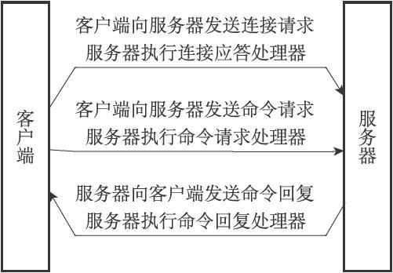

- 时间事件：

    - 定时事件：指定的时间时执行一次
    - 周期性事件：每隔一段时间执行一次

    每个时间事件的构成：

    - `id`：新事件 ID 大于旧事件 ID，按 ID 从小到大顺序递增

    - `when`：ms 精度的 UNIX 时间戳，记录了时间事件到达时间

    - `timeProc`：时间事件处理器，一个函数。当时间事件到达时，服务器就会调用相应的处理器来处理事件

        如果时间事件处理器返回 `AE_NOMORE`，则为定时事件，到达一次后就会被删除；如果返回一个非 `AE_NOMORE` 的整数值，则为周期性事件，到达后服务器会对 `when` 属性进行更新

    实现：服务器将所有时间事件都放在一个**无序链表**（不按 `when` 排序）中，每当时间事件执行器运行时，它就遍历整个链表，查找所有已到达的时间事件，并调用相应的事件处理器

    > 正常模式下的 Redis 服务器只使用 serverCron 一个时间事件，而在 benchmark 模式下，服务器也只使用两个时间事件。在这种情况下，服务器几乎是将无序链表退化成一个指针来使用，所以使用无序链表来保存时间事件，并不影响事件执行的性能。

    ```python
    # 时间事件执行器
    def processTimeEvents():
      for time_event in all_time_event():
        if time_event.when <= unix.ts_now():
          retval = time.event.timeProc()
          if retval == AE_NOMORE: # 定时事件
            delete_time_event_from_server(time_event)
          else:
            update_when(time_event, retval)
    ```

    `serverCron` 函数的主要工作：

    - 更新服务器的各类统计信息，比如时间、内存占用、数据库占用情况等
    - 清理数据库中的过期键值对
    - 关闭和清理连接失效的客户端
    - 尝试进行 AOF 或 RDB 持久化操作
    - 如果服务器是主服务器，那么对从服务器进行定期同步
    - 如果处于集群模式，对集群进行定期同步和连接测试

- 事件的调度与执行

    ```python
    def aeProcessEvents():
      # 获取到达时间离当前时间最近的时间事件
      time_event = aeSearchNearestTimer()
      # 计算最接近的时间事件距离到达还有多少 ms
      remained_ms = time_event.when - unix_ts_now()
      # 如果事件已到达，则 remained_ms 可能为负数，将其设为 0
      if remained_ms < 0:
        remained_ms = 0
      # 根据 remained_ms，创建 timeval 结构
      timeval = create_timeval_with_ms(remained_ms)
      # 阻塞并等待文件事件产生，最大阻塞事件由传入的 timeval 结构决定
      # 如果 remained_ms == 0，那么 aeApiPoll 调用后马上返回，不阻塞
      # aeApiPoll() 函数在至少有一个文件事件产生，或者超时后，返回
      aeApiPoll(timeval)
      # 处理所有已产生的文件事件
      processFileEvents()
      # 处理所有已到达的时间事件
      processTimeEvents()
    ```

    Redis 服务器的主函数：

    ```python
    def main():
      init_server()
      
      while server_is_not_shutdown():
        aeProcessEvents()
        
      clean_server()
    ```

    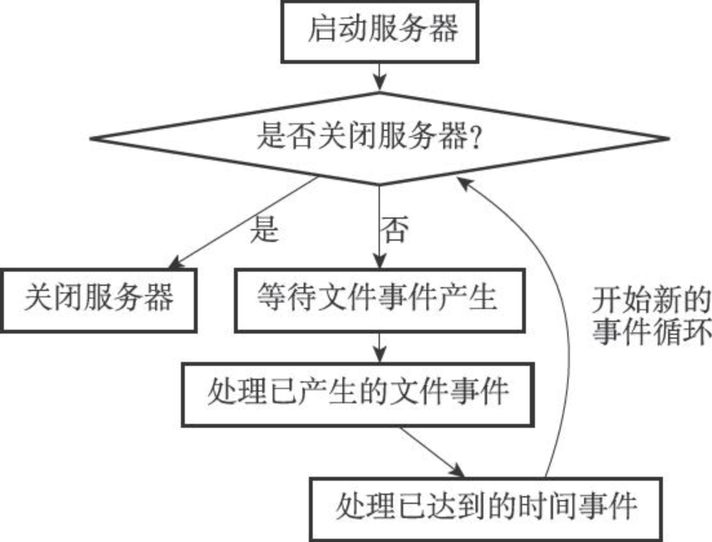

    调度和执行的规则：

    1. `aeApiPoll()` 函数的**最大阻塞时间由到达时间最接近当前时间的时间事件决定**，这个方法既可以避免服务器对时间事件进行频繁的轮询（忙等待），也可以确保 `aeApiPoll()` 函数不会阻塞过长时间

    2. 因为文件事件是随机出现的，如果等待并处理完一次文件事件之后，仍未有任何时间事件到达，那么服务器将再次等待并处理文件事件。随着文件事件的不断执行，时间会逐渐向时间事件所设置的到达时间逼近，并最终来到到达时间，这时服务器就可以开始处理到达的时间事件了。

    3. 对文件事件和时间事件的处理都是**同步、有序、原子**地执行的，**服务器不会中途中断事件处理，也不会对事件进行抢占**，因此，不管是文件事件的处理器，还是时间事件的处理器，它们都会尽可地减少程序的阻塞时间，并在有需要时主动让出执行权，从而降低造成事件饥饿的可能性。

        > 比如说，在命令回复处理器将一个命令回复写入到客户端套接字时，如果写入字节数超过了一个预设常量的话，命令回复处理器就会主动用 `break` 跳出写入循环，将余下的数据留到下次再写；另外，时间事件也会将非常耗时的持久化操作放到子线程或者子进程执行。

    4. 因为**时间事件在文件事件之后执行，并且事件之间不会出现抢占**，所以时间事件的实际处理时间，**通常会比时间事件设定的到达时间稍晚一些**。

### 客户端

- 对于每个与服务器进行连接的客户端，服务器都为这些客户端建立了相应的 `redisClient` 结构（客户端状态），以及执行相关功能时需要用到的数据结构

- Redis 服务器状态结构的 `clients` 属性是一个链表，这个链表保存了所有与服务器连接的客户端的状态结构

    ```c
    struct redisServer {
      // ...
      list *clients;
      // ...
    }
    ```

- 客户端属性

    - 通用属性：无论执行什么工作，都要用到这些属性
    - 与特定功能相关的属性

    ```c
    typedef struct redisClient {
      // ...
      int fd; // 套接字描述符
      
      robj *name; // 名字
      
      int flags; // 标志
      
      sds querybuf; // 输入缓冲区
      
      robj **argv; // 命令参数
      int argc; // 命令参数的个数
      
      struct redisCommand *cmd; // 命令的实现函数
      
      char buf[REDIS_REPLY_CHUNK_BYTES]; // 固定大小缓冲区
      int bufpos; // 已使用的字节数量
      list *reply; // 可变大小缓冲区
      
      int authenticated; // 身份验证
      
      time_t ctime; // 客户端创建时间
      time_t lastinteraction; // 最后一次与服务器交互的时间
      time_t obuf_sort_limit_reached_time; // 输出缓冲区第一次到达软性限制的时间
      // ...
    } redisClient;
    ```

    **套接字描述符**：记录了客户端正在使用的套接字描述符

    - 伪客户端：`fd = -1`（AOF 文件或 Lua 脚本）
    - 普通客户端：`fd > -1`

    **名字**：可以使用 `CLIENT setname` 为客户端设置一个名字（默认没有名字）

    **标志**：`flags` 属性记录了客户端的角色（role），以及客户端目前所处的状态。

    - 单个标志：`flags = <flag>`
    - 多个标志：`flags = <flag1> | <flag2> | ...`

    **输入缓冲区**：用于保存客户端发送的命令请求，输入缓冲区的大小会根据输入内容动态地缩小或者扩大，但它的最大大小不能超过 1GB，否则服务器将关闭这个客户端。

    **命令与命令参数**：`argv[0]` 是命令，之后的其他项是传给该命令的参数

    **命令的实现函数**：程序在命令表中找到 `argv[0]` 对应的 `redisCommand` 结构后，会讲客户端状态的 `cmd` 指针指向该结构

    **输出缓冲区**：执行命令所得的命令回复会被保存在客户端状态的输出缓冲区里面，每个客户端都有两个输出缓冲区可用，一个缓冲区的大小是固定的，另一个缓冲区的大小是可变的

    - 固定大小的缓冲区用于保存长度较小的回复
    - 可变大小的缓冲区用于保存长度较大的回复

    **身份验证**：用于记录客户端是否通过了身份验证

    - `authenticated == 0` 时，说明未通过身份验证，客户端只能发送 `AUTH` 命令
    - `authenticated` 属性仅在服务器启用了身份验证功能时使用。如果服务器没有启用身份验证功能的话，那么即使 `authenticated` 属性的值为 0（这是默认值），服务器也不会拒绝执行客户端发送的命令请求。

    **时间**：`ctime` 可以用于计算客户端已经连接了多久；`lastinteraction` 可以用于计算距离客户端与服务器的最后一次交互已经过去了多久

- 普通客户端的创建：客户端使用 `connect` 函数连接到服务器时，服务器就会调用连接事件处理器，为客户端创建相应的客户端状态，并将这个新的客户端状态添加到服务器状态结构 `clients` 链表的**末尾**。

- 普通客户端的关闭：

    - 客户端进程退出或者被杀死
    - 客户端向服务器发送了带有不符合协议格式的命令请求
    - 客户端成为了 `CLIENT KILL` 命令的目标
    - 用户为服务器设置了 `timeout` 配置选项，当客户端的空转时间超过 `timeout` 时
    - 客户端发送的命令请求大小超过了输入缓冲区的限制大小
    - 要发送给客户端的命令回复大小超过了输出缓冲区的限制大小
        - 硬性限制：超过硬性限制所设置的大小，服务器理解关闭客户端
        - 软性限制：如果输出缓冲区的大小超过了软性限制所设置的大小，但还没超过硬性限制，那么服务器将使用客户端状态结构的 `obuf_soft_limit_reached_time` 属性记录下客户端到达软性限制的起始时间；之后服务器会继续监视客户端，**如果输出缓冲区的大小一直超出软性限制，并且持续时间超过服务器设定的时长，那么服务器将关闭客户端**；相反地，**如果输出缓冲区的大小在指定时间之内，不再超出软性限制，那么客户端就不会被关闭，并且 `obuf_soft_limit_reached_time`属性的值也会被清零**。

- Lua 脚本的伪客户端：在服务器运行的**整个生命周期一直存在**，只有服务器被关闭时，这个客户端才会被关闭

    ```c
    struct redisServer {
      // ...
      redisClient *lua_client;
      // ...
    };
    ```

- AOF 文件的伪客户端：服务器在载入 AOF 文件时，会创建用于执行 AOF 文件包含的 Redis 命令的伪客户端，并在载入完成之后，关闭这个伪客户端。

### 服务器

- 命令请求的执行过程

    > ```shell
    > redis> SET KEY VALUE
    > OK
    > ```
    >
    > 客户端与服务器的操作：
    >
    > 1. 客户端向服务器发送命令请求 `SET KEY VALUE`
    > 2. 服务器接收并处理客户端发来的命令请求 `SET KEY VALUE`，在数据库中进行设置操作，并产生命令回复 `OK`
    > 3. 服务器将命令回复 `OK` 发送给客户端
    > 4. 客户端接收服务器返回的命令回复 `OK`，并将这个回复打印给用户

    **发送命令请求**：客户端先将命令请求转换成协议格式，然后通过连接到服务器的套接字，将协议格式的命令请求发送给服务器

    **读取命令请求**：当客户端与服务器之间的连接套接字因为客户端的写入而变得可读时，服务器将调用**命令请求处理器**来执行以下操作：

    1. 读取套接字中协议格式的命令请求，并将其保存到客户端状态的输入缓冲区里

    2. 对输入缓冲区的命令请求进行分析，提取出命令请求中包含的命令参数，以及命令参数的个数，然后分别保存到客户端状态的 `argv` 和 `argc` 属性中

        - 命令执行器（1）：查找命令

            根据 `argv[0]` 在命令表（字典）中查找相应的命令 `redisCommand`，然后保存到客户端状态的 `cmd` 属性里

        - 命令执行器（2）：执行预备操作

            - 检查 `cmd` 是否指向 `NULL`（客户端的命令没有找到相应的实现）
            - 检查参数个数是否正确
            - 检查客户端是否已通过身份验证
            - 检查内存占用情况，必要时进行内存回收，或者不执行、返回错误
            - 如果服务器上一次执行 `BGSAVE` 失败，并且打开了 `stop-writes-on-bgsave-error` 功能，且要执行的命令是写命令，则拒绝执行，并返回错误
            - 如果客户端正在用 `SUBSCRIBE` 订阅频道 / `PSUBSCRIBE` 命令订阅模式，那么服务器只会执行 `SUBSCRIBE PSUBSCRIBE UNSUBSCRIBE PUNSUBSCRIBE`，其他都会拒绝
            - 如果服务器正在进行数据载入，那么客户端发送的命令必须带有 `l` 标识（`INFO SHUTDOWN PUBLISH` 等）才会执行，其他都会拒绝
            - 如果服务器因为执行 Lua 脚本而超时并进入阻塞状态，那么服务器只会执行客户端发来的 `SHUTDOWN nosave` 命令和` SCRIPT KILL` 命令，其他都会拒绝
            - 如果客户端正在执行事务，那么服务器只会执行客户端发来的 `EXEC DISCARD MULTI WATCH` 四个命令，其他命令都会被放进事务队列中
            - 如果服务器打开了监视器功能，那么服务器会将要执行的命令和参数等信息发送给监视器
            - ...

    3. 调用命令执行器，执行客户端指定的命令

        - 命令执行器（3）：调用命令的实现函数

            ```c
            client->cmd->proc(client)
            ```

        - 命令执行器（4）：执行后续操作

            - 检查、添加慢查询日志
            - 更新 `redisCommand` 的 `milliseconds` 属性，并将其 `calls` 计数器加一
            - 如果开启了 AOF，则会将命令写入到 AOF 缓冲区里
            - 如果有从服务器正在复制，则会传播给所有从服务器

    **将命令回复发送给客户端**：命令实现函数会将命令回复保存到客户端的输出缓冲区里，并为客户端的套接字关联命令回复处理器，当客户端套接字变为可写状态时，服务器就会执行命令回复处理器，将保存在客户端输出缓冲区中的命令回复发送给客户端。

    当命令回复发送完毕之后，回复处理器会清空客户端状态的输出缓冲区，为处理下一个命令请求做好准备。

    **客户端接收并打印命令回复**：当客户端接收到协议格式的命令回复之后，它会将这些回复转换成人类可读的格式，并打印给用户观看

- `serverCron` 函数：默认每隔 100ms 执行一次，这个函数负责管理服务器的资源，并保持服务器自身的良好运转

    - **更新服务器时间缓存**：每次获取系统的当前时间都要执行系统调用，这样做可以减少系统调用次数

        ```c
        struct redisServer {
          // ...
          // 秒级时间戳
          time_t unixtime;
          // 毫秒级时间戳
          long long mstime;
          // ...
        }
        ```

        > - 服务器只会在打印日志、更新服务器的LRU时钟、决定是否执行持久化任务、计算服务器上线时间（uptime）这类对时间精确度要求不高的功能上。
        > - 对于**为键设置过期时间、添加慢查询日志**这种需要高精确度时间的功能来说，服务器还是会再次执行系统调用，从而获得最准确的系统当前时间。

    - **更新 LRU 时钟**

        ```c
        struct redisServer {
          // ...
          // 默认每 10s 更新一次时钟缓存
          // 用于计算键的空转（idle）时长
          unsigned lruclock:22;
          // ...
        }
        
        typedef struct redisObject {
          // ...
          unsigned lru:22; // 保存了对象最后一次被命令访问的时间
          // ...
        } robj;
        
        // 空转时间 = redisServer.lruclock - redisObject.lru
        ```

    - **更新服务器每秒执行的命令次数**：抽样计算，**估计**并记录服务器在最近一秒钟处理的命令请求数量

        ```c
        struct redisServer {
        	// ...    
          // 上一次进行抽样的时间    
          long long ops_sec_last_sample_time;
          // 上一次抽样时，服务器已执行命令的数量    
          long long ops_sec_last_sample_ops;    
          // REDIS_OPS_SEC_SAMPLES大小（默认值为 16）的环形数组 
          // 数组中的每个项都记录了一次抽样结果。
          long long ops_sec_samples[REDIS_OPS_SEC_SAMPLES];    
          // ops_sec_samples数组的索引值  
          // 每次抽样后将值自增一
          // 在值等于 16 时重置为 0
          // 让 ops_sec_samples 数组构成一个环形数组
          int ops_sec_idx;
          // ...
        };
        ```

        根据这次和上次的 `ops_sec_last_sample_ops` 计算服务器平均每一毫秒处理了多少个命令请求，然后乘以 1000，存放入 `ops_sec_samples`

        ```c
        long long getOperationsPerSecond(void) {
          int j;
          long long sum = 0;
          for (j = 0; j < REDIS_OPS_SEC_SAMPLES; j++) {
            sum += server.ops_sec_samples[j];
          }
          return sum / REDIS_OPS_SEC_SAMPLES:
        }
        ```

    - **更新服务器内存峰值记录**

        ```c
        struct redisServer {
          // ...    
          // 已使用内存峰值    
          size_t stat_peak_memory;    
          // ...
        };
        ```

    - **处理 SIGTERM 信号**：会为其关联处理器 `sigtermHandler()`，收到该信号时，会打开服务器状态的 `shutdown_asap` 标识

        ```c
        static void sigtermHandler(int sig) {
          // 打印日志
          redisLogFromHandler(REDIS_WARNING, "Received SIGTERM, scheduling shutdown...");
          // 打开关闭标识
          server.shutdown_asap = 1;
        }
        ```

        ```c
        struct redisServer {
          // ...
          int shutdown_asap; // serverCron() 检查到该值为 1 时，关闭服务器
          // ...
        };
        ```

        服务器在关闭自身之前会进行 RDB 持久化操作，这也是服务器拦截 SIGTERM 信号的原因

    - **管理客户端资源**：`serverCron()` 每次都会调用 `clientsCron()`

        - 如果连接超时，则释放这个客户端
        - 如果客户端在上一次执行命令请求之后，输入缓冲区的大小超过了一定的长度，那么程序会释放客户端当前的输入缓冲区，并重新创建一个默认大小的输入缓冲区，从而防止客户端的输入缓冲区耗费过多内存

    - **管理数据库资源**：`serverCron()` 每次都会调用 `databasesCron()`，会检查一部分数据库，删除其中的过期键；在有需要时，对字典进行收缩（rehash）

    - **执行被延迟的 `BGREWRITEAOF`**：在服务器执行 `BGSAVE` 期间，`BGREWRITEAOF` 命令会被延迟至 `BGSAVE` 命令执行完毕

        ```c
        struct redisServer {
          // ...
          int aof_rewrite_scheduled; // 如果该值为 1，代表命令被延迟了
          // ...
        };
        ```

    - **检查持久化操作的运行状态**：

        ```c
        struct redisServer {
          // ...
          // BGSAVE 子进程的 ID，如果没有在执行 BGSACE，则为 -1
          pid_t rdb_child_pid;
          // BGREWRITEAOF 子进程的 ID
          pid_t aof_child_pid;
          // ...
        };
        ```

        只要有其中一个属性不为 -1，程序就会执行一次 `wait()` 函数，检查子进程是否有信号发来服务器进程；

        如果两个属性都为 -1，则会进行三个检查

        1. 检查是否有 `BGREWRITEAOF` 被延迟了
        2. 如果 1 没有，检查服务器的自动保存条件是否已经被满足
        3. 如果 2 也没有，检查服务器设置的 AOF 重写条件是否满足

        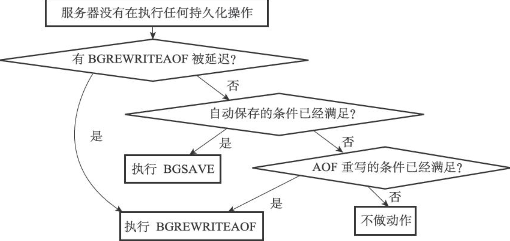

    - **将 AOF 缓冲区中的内容写入 AOF 文件**

    - **关闭异步客户端**：关闭那些缓冲区大小超出限制的客户端

    - **增加 `cronloops` 计数器的值**

        ```c
        struct redisServer {
          // ...
          int cronloops;
          // ...
        };
        ```

        `cronloops` 属性目前在服务器中的唯一作用，就是在**复制**模块中实现“每执行 `serverCron` 函数 N 次就执行一次指定代码”的功能

- 初始化服务器：**初始化服务器状态，接受用户指定的服务器配置，创建相应的数据结构和网络连接**等等

    - **初始化服务器状态**：创建一个 `redisServer` 实例

        ```c
        void initServerConfig(void) {
          // 设置服务器运行 id
          getRandomHexChars(server.runid, REDIS_RUN_ID_SIZE);
          // 为运行 id 加上结尾字符
          server.runid[REDIS_RUN_ID_SIZE] = '\0';
          // 设置默认配置文件路径
          server.configfile = NULL;
          // 设置默认服务器频率
          server.hz = REDIS_DEFAULT_HZ;
          // 设置服务器的运行架构
          server.arch_bits = (sizeof(long) == 8)? 64 : 32;
          // 设置默认服务端口号
          server.port = REDIS_SERVERPORT;
          // ...
          // 设置默认 RDB、AOF 条件
          // 初始化服务器的 LRU 时钟
          // 创建命令表
        }
        ```

        `initServerConfig` 函数没有创建服务器状态的其他数据结构，数据库、慢查询日志、Lua 环境、共享对象这些数据结构在之后的步骤才会被创建出来

    - **载入配置选项**：载入命令行参数和配置文件中的配置

    - **初始化服务器数据结构**：`iniServer()` 函数

        - `server.clients` 链表
        - `server.db` 数组
        - `server.pubsub_channels` 字典，用于保存频道订阅信息
        - `server.pubsub_patterns` 链表，用于保存模式订阅信息
        - `server.lua` 执行 Lua 脚本的环境
        - `server.slowlog` 属性，保存慢查询日志

        其他重要操作：

        - 为服务器设置进程信号处理器
        - 创建共享对象
        - 打开服务器的监听端口，并为监听套接字关联连接应答事件处理器，等待服务器正式运行时接受客户端的连接
        - 为 `serverCron` 函数创建时间事件，等待服务器正式运行时执行 `serverCron` 函数
        - 如果 AOF 持久化功能已打开，那么打开先有的 AOF 文件，如果 AOF 文件不存在，那么创建并打开一个新的 AOF 文件，为 AOF 写入做好准备
        - 初始化服务器的后台 I/O 模块（bio），为将来的 I/O 操作做好准备

    - **还原数据库状态**：服务器需要载入 RDB 文件或者 AOF 文件，并根据文件记录的内容来还原服务器的数据库状态。

    - **执行事件循环**：开始执行后，服务器可以正式接受客户端的连接请求，并处理客户端发来的命令请求