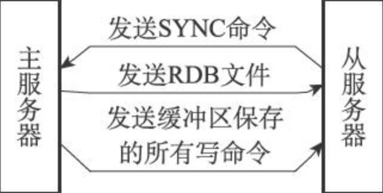
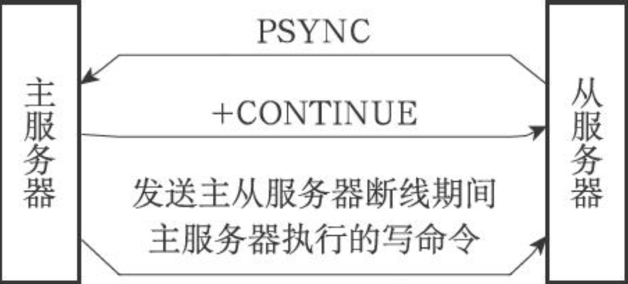
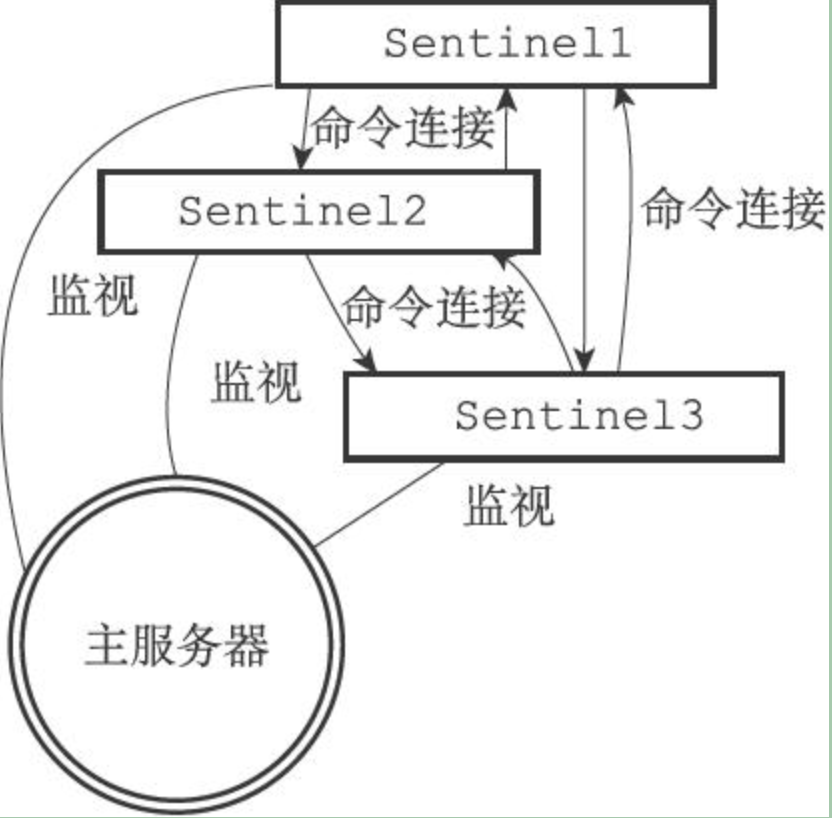
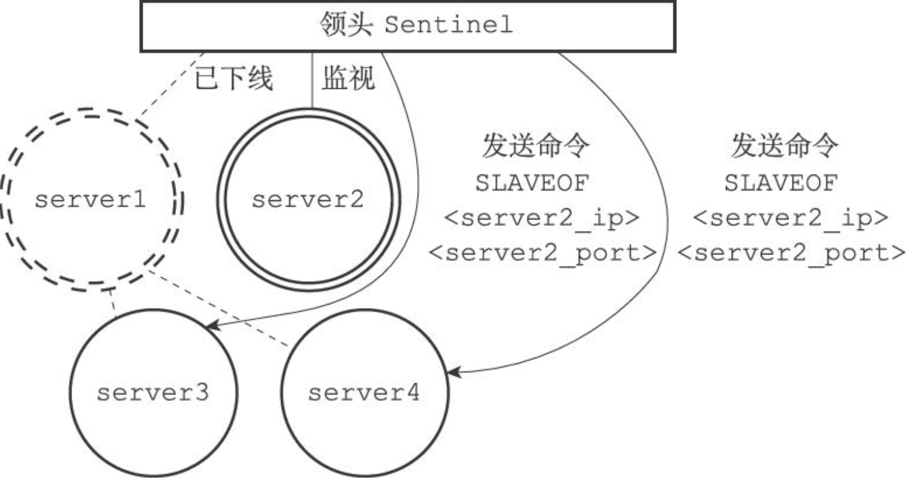
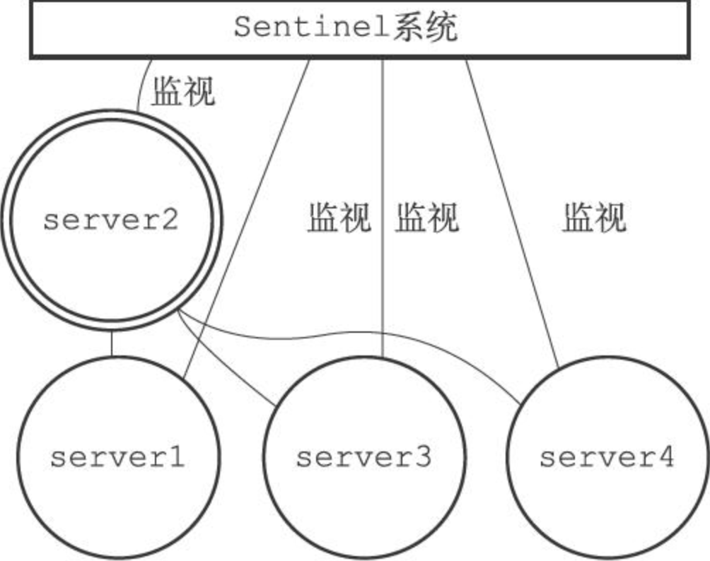
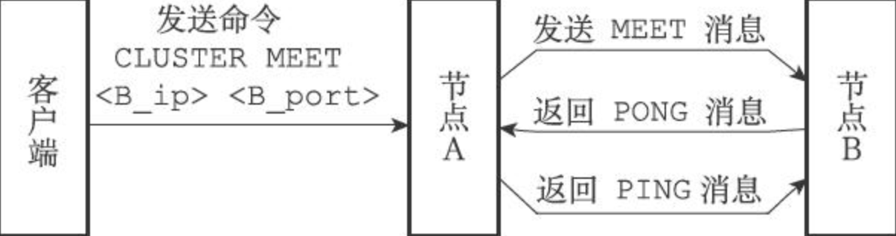
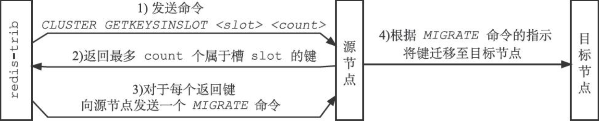
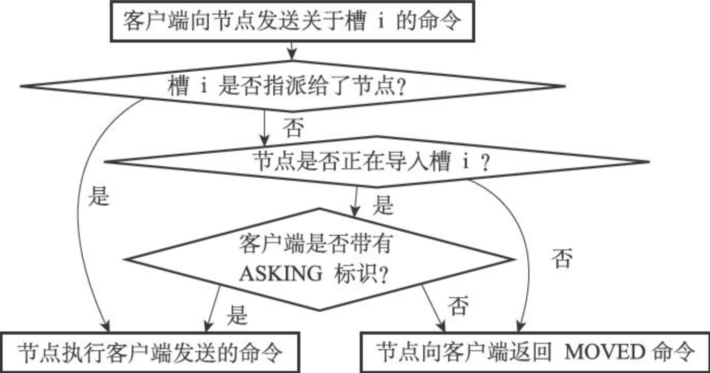
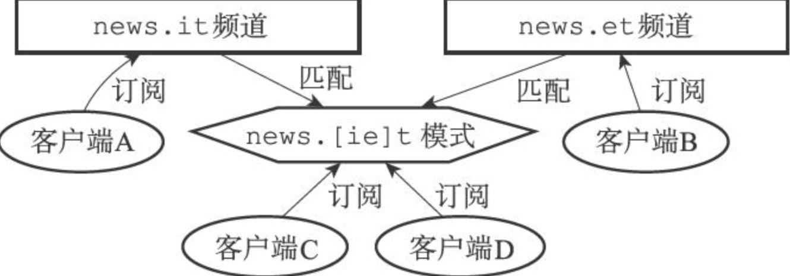
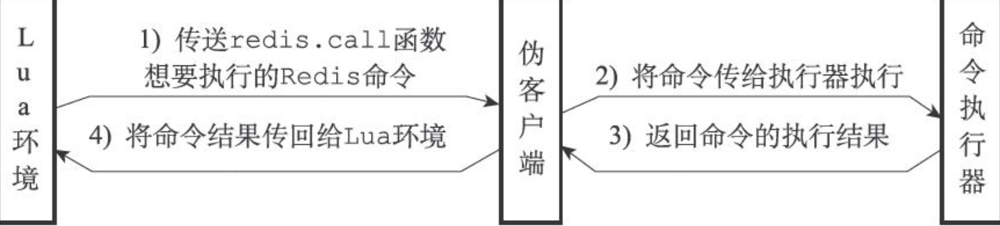

# Redis 设计与实现

## 多机数据库的实现

### 复制

- 旧版（`< 2.8`）复制功能的实现：分为**同步**（sync）和**命令传播**（command propagate）两个操作：

    - 同步操作用于将从服务器的数据库状态更新至主服务器当前所处的数据库状态
    - 命令传播操作则用于在主服务器的数据库状态被修改，导致主从服务器的数据库状态出现不一致时，让主从服务器的数据库状态重新回到一致

    **同步：通过向主服务器发送 `SYNC` 命令来完成**

    1. 从服务器向主服务器发送 `SYNC` 命令

    2. 收到 `SYNC` 命令的主服务器执行 `BGSAVE` 命令，在后台生成一个 RDB 文件，**并使用一个缓冲区记录从现在开始执行的所有写命令**

    3. `BGSAVE` 执行完毕后，主服务器将 RDB 文件发送给从服务器，从服务器接收并载入，将自己的数据库状态更新至主服务器执行 `BGSAVE` 命令时的数据库状态

    4. 主服务器将记录在缓冲区里面的所有写命令发送给从服务器，从服务器执行这些写命令，将自己的数据库状态更新至主服务器数据库当前所处的状态

        

    **命令传播：主服务器会将自己执行的写命令，发送给从服务器执行**

- 旧版复制功能的缺陷：对于**断线后重复制**效率很低，需要重新通过 `SYNC、BGSAVE` 进行复制（每次都要生成、发送、载入 RDB），但断线时间短的话，新写入的数据量不多。

- 新版（`>= 2.8`）复制功能的实现：使用 `PSYNC` 命令来替代 `SYNC` 命令来执行复制时的同步操作。

    `PSYNC` 命令具有**完整重同步**和**部分重同步**两种模式：

    - 完整重同步：用于初次复制，与 `SYNC` 步骤基本一样

    - 部分重同步：用于处理断线后重复制情况：如果条件允许，主服务器可以将主从服务器连接断开期间执行的写命令发送给从服务器

        

- 部分重同步的实现：

    - 主服务器的复制偏移量和从服务器的复制偏移量
    - 主服务器的复制积压缓冲区
    - 服务器的运行 ID

    **复制偏移量：主从服务器会分别维护自己的复制偏移量**

    - 主服务器每次向从服务器传播 N 个字节的数据时，就将自己的复制偏移量加 N
    - 从服务器每次收到 N 个字节的数据时，就将自己的复制偏移量加 N
    - 通过检查主从服务器复制偏移量是否相同，就可以判断是否一致

    **复制积压缓冲区：主服务器维护的一个固定长度的先进先出队列，默认大小为 1MB**

    - 当主服务器进行命令传播时，它不仅会将写命令发送给所有从服务器，还会将写命令入队到复制积压缓冲区里
    - 因此，主服务器的复制积压缓冲区里面会**保存着一部分最近传播的写命令**，并且复制积压缓冲区会**为队列中的每个字节记录相应的复制偏移量**
    - 当从服务器重新连上主服务器时，会通过 `PSYNC` 将自己的偏移量发送给主服务器
        - 如果偏移量之后的数据仍然存在于复制积压缓冲区里，则执行部分重同步
        - 否则，执行完整重同步
    - 复制积压缓冲区的最小大小可以通过 `second * write_size_per_second` 来估算

    **服务器运行 ID：初次复制时，主服务器会将自己的 ID 发给从服务器，从服务器保存；断线重连时，从服务器将之前保存的 ID 发给主服务器**

    - 如果从服务器保存的 ID 和当前连接的主服务器的 ID 相同，则继续尝试执行部分重同步
    - 否则，执行完整重同步

- `PSYNC` 命令的实现

    从服务器调用 `PSYNC`：

    - 如果从服务器从来没复制过任何主服务器，则发送 `PSYNC ? -1`
    - 如果从服务器已经复制过某个主服务器，则发送 `PSYNC <runid> <offset>`

    主服务器响应 `PSYNC`：

    - 完整重同步：`+FULLRESYNC <runid> <offset>`
    - 部分重同步：`+CONTINUE`，之后再发送具体的数据
    - 主服务器版本低于 2.8：`-ERR`，表示无法识别，需要接收 `SYNC` 命令

- 复制的实现

    `SLAVEOF <master_ip> <master_port>`

    1. **设置主服务器的地址和端口**

        ```c
        struct redisServer {
          // ...
          char *masterhost;
          int masterport;
          // ...
        };
        ```

        `SLAVEOF` 命令是一个**异步**命令，在完成两个属性的设置之后，从服务器向发送 `SLAVEOF` 命令的客户端返回 OK，表示复制指令已经被接收，而实际的复制工作将在 OK 返回之后才真正开始执行

    2. **建立套接字连接**：从服务器根据命令的 IP 和端口，创建连向主服务器的套接字连接

        - 如果从服务器创建的套接字能成功连接（connect）到主服务器，那么从服务器将为这个套接字关联一个**专门用于处理复制工作的文件事件处理器**，这个处理器将负责执行后续的复制工作，比如接收 RDB 文件，以及接收主服务器传播来的写命令等
        - 而主服务器在接受（accept）从服务器的套接字连接之后，将为该套接字创建相应的客户端状态，并将从服务器看作是一个连接到主服务器的客户端来对待，**这时从服务器将同时具有服务器（server）和客户端（client）两个身份**：从服务器可以向主服务器发送命令请求，而主服务器则会向从服务器返回命令回复
        - 复制工作接下来的步骤都是以从服务器向主服务器发送命令请求的形式来进行

    3. **发送 `PING` 命令**

        作用：

        - 检查套接字的读写状态是否正常
        - 检查主服务器能否正常处理命令请求：

        三种情况：

        - timeout：从服务器断开并重新创建连向主服务器的套接字
        - 主服务器返回错误：表示主服务器暂时无法处理命令请求，从服务器断开并重新创建连向主服务器的套接字
        - `PONG` 回复：正常执行复制

    4. **身份验证**：如果从服务器设置了 `masterauth`，则进行身份验证

        在需要进行身份验证的情况下，从服务器将向主服务器发送一条 `AUTH` 命令，命令的参数为从服务器 `masterauth` 选项的值

        五种情况：

        - 主服务器没有设置 `requirepass`，从服务器没有设置 `masterauth`，那么主服务器将继续执行从服务器发送的命令，复制工作正常进行
        - 主服务器设置了 `requirepass`，从服务器没有设置 `masterauth`，主服务器返回一个 `NOAUTH` 错误
        - 主服务器没有设置 `requirepass`，从服务器设置了 `masterauth`，主服务器返回一个 `no password is set` 错误
        - `AUTH` 的密码和 `requirepass` 的密码相同，复制工作正常进行
        - `AUTH` 的密码和 `requirepass` 的密码不同，主服务器返回 `invalid password` 错误

        所有错误情况都会令从服务器中止目前的复制工作，并从创建套接字开始重新执行复制，直到身份验证通过，或者从服务器放弃执行复制为止。

    5. **发送端口信息**：从服务器通过命令 `REPLCONF listening-port <port_number>` 向主服务器发送从服务器的监听端口号

        主服务器会记录在从服务器对应客户端状态的 `slave_listening_port` 属性中。

        > `slave_listening_port` 属性目前唯一的作用就是在主服务器执行 `INFO replication` 命令时打印出从服务器的端口号。

    6. **同步**：从服务器向主服务器发送 `PSYNC` 命令，执行同步操作。

        在同步操作执行之前，只有从服务器是主服务器的客户端，但是在执行同步操作之后，**主服务器也会成为从服务器的客户端**（主服务器需要将缓冲区/复制积压缓冲区中的写命令发送给从服务器，也是为了后续的命令传播）。

    7. **命令传播**

- 心跳检测：在命令传播阶段，从服务器默认会以每秒一次的频率，向主服务器发送命令

    ```shell
    REPLCONF ACK <replication_offset>
    ```

    作用：

    - **检测主从服务器的网络连接状态**：如果主服务器超过一秒钟没收到，则主服务器就知道连接出现了问题

    - **辅助实现 `min-slaves` 选项**：防止主服务器在不安全的情况下执行写命令

        ```
        min-slaves-to-write 3
        min-slaves-max-lag 10
        ```

        在从服务器的数量少于 3 个，或者三个从服务器的延迟（lag）值都大于或等于 10 秒时，主服务器将拒绝执行写命令

    - **检测命令丢失**：通过 `<replication_offset>` 参数，主服务器可以检查之前的命令传播是否成功，如果没有成功则补发

        > 补发缺失数据操作在主从服务器没有断线的情况下执行，而部分重同步操作则在主从服务器断线并重连之后执行

### Sentinel（哨兵）

- 由一个或多个 Sentinel 实例（instance）组成的 Sentinel 系统（system）可以**监视任意多个主服务器，以及这些主服务器属下的所有从服务器**，并在被监视的主服务器进入下线状态时，**自动将下线主服务器属下的某个从服务器升级为新的主服务器**，然后由新的主服务器代替已下线的主服务器继续处理命令请求。

- 启动并初始化 Sentinel

    1. **初始化服务器**：Sentinel 本质是一个运行在特殊模式下的 Redis 服务器

        与启动普通服务器的步骤类似，但是不需要载入 RDB 或 AOF（因为不使用数据库）

    2. **使用 Sentinel 专用代码**

    3. **初始化 Sentinel 状态**：`sentinelState` 结构保存了所有与 Sentinel 功能有关的结构

        ```c
        struct sentinelState {
          // 当前纪元，用于实现故障转移
          uint64_t current_epoch;
          // 保存了所有被这个 sentinel 监视的主服务器
          dict *masters; // 字典：主服务器名字-sentinelRedisInstance 指针
          // 是否进入了 TILT 模式
          int tilt;
          // 目前正在执行的脚本数量
          int running_scripts;
          // 进入 TILT 模式的时间
          mstime_t tilt_start_time;
          // 最后一次执行时间处理器的时间
          mstime_t previous_time;
          // FIFO 队列，包含了所有需要执行的用户脚本
          list *scripts_queue;
        } sentinel;
        ```

    4. **初始化 `masters` 属性**：

        ```c
        typedef struct sentinelRedisInstance {
          // 标识值，记录了实例的类型，以及该实例的当前状态
          int flags;
          // 实例的名字
          char *name;
          // 实例的运行 ID
          char *runid;
          // 配置纪元，用于实现故障转移
          uint64_t config_epoch;
          // 实例地址
          sentinelAddr *addr;
          // SENTINEL down-after-milliseconds 选项的值
          // 实例无响应多少 ms 后会被判断为主观下线
          mstime_t down_after_period;
          // SENTINEL monitor <master-name> <IP> <port> <quorum> 中的额 quorum 参数
          // 判断这个实例为客观下线的投票数量
          int quorum;
          // SENTINEL parallel-syncs <master-name> <number> 选项的值
          // 在执行故障转移操作时，可以同时对新的主服务器进行同步的从服务器数量
          int parallel_syncs;
          // SENTINEL failover-timeout <master-name> <ms> 选项的值
          // 刷新故障转移状态的最大时限
          mstime_t failover_timeout;
          // ...
          // slaves 从服务器字典
          // sentinels 监视这个主服务器的 sentinel 字典
        } sentinelRedisInstance;
        ```

    5. **创建连向主服务器的网络连接**：Sentinel 将成为主服务器的客户端，可以向主服务器发送命令

        Sentinel 会创建两个连向主服务器的**异步**网络连接：

        - ==命令连接==：发送命令并接收回复

        - ==订阅连接==：专门用于订阅主服务器的 `__sentinel__:hello` 频道，用于和其他订阅了该主服务器的 Sentinel 进行交互

            > 在 Redis 目前的发布与订阅功能中，被发送的信息都不会保存在 Redis 服务器里面，如果在信息发送时，想要接收信息的客户端不在线或者断线，那么这个客户端就会丢失这条信息。因此，为了不丢失 `__sentinel__:hello` 频道的任何信息，Sentinel 必须专门用一个订阅连接来接收该频道的信息。

- **获取主服务器信息**：默认 10s 一次，通过发送 `INFO` 命令获取主服务器的当前信息

    可以获取到主服务器自身的信息及其属下的所有从服务器的信息

- **获取从服务器信息**：当 Sentinel 发现主服务器有新的从服务器出现时，Sentinel 除了会为这个新的从服务器创建相应的实例结构之外，Sentinel 还会创建连接到从服务器的命令连接和订阅连接。

    也是 10s 一次，通过发送 `INFO` 命令获取从服务器的当前信息

- **向主服务器和从服务器发送信息**：默认 2s 一次，通过命令连接向所有被监视的主、从服务器发送以下命令：

    ```c
    PUBLISH __sentinel__:hello "<s_ip>,<s_port>,<s_runid>,<s_epoch>,<m_name>,<m_ip>,<m_port>,<m_epoch>"
    ```

    - `s_` 开头记录的是 Sentinel 本身的信息
    - `m_` 开头记录的是主服务器的信息：如果 Sentinel 正在监视的是从服务器，那么这些参数记录的就是从服务器正在复制的主服务器的信息。

- **接收来自主服务器和从服务器的频道信息**：建立连接之后，会通过 `SUBSCRIBE __sentinel__:hello` 来发送命令订阅频道，订阅会持续到 Sentinel 与服务器的连接断开。

    对于监视同一个服务器的多个 Sentinel 来说，一个 Sentinel 发送的信息会被其他 Sentinel 接收到，**这些信息会被用于更新其他 Sentinel 对发送信息 Sentinel 的认知，也会被用于更新其他 Sentinel 对被监视服务器的认知**。

    - **更新 sentinels 字典**：用于保存其他同样监视这个主服务器的 Sentinel 的资料

        > 因为一个 Sentinel 可以通过分析接收到的频道信息来获知其他 Sentinel 的存在，并通过发送频道信息来让其他 Sentinel 知道自己的存在，所以用户在使用 Sentinel 的时候并不需要提供各个 Sentinel 的地址信息，监视同一个主服务器的多个 Sentinel 可以自动发现对方。

    - **创建连向其他 sentinel 的命令连接**：对方 sentinel 也会连向本方 sentinel

        

        使用命令连接相连的各个 Sentinel 可以通过向其他 Sentinel 发送命令请求来进行信息交换，用于实现**主观下线**和**客观下线**。

        > Sentinel 之间不会创建订阅连接

- **检测主观下线状态**：默认 1s 一次，向所有与它创建了命令连接的实例（主、从服务器，其他 Sentinel）发送 `PING` 命令，来判断对方是否在线

    - 如果一个实例在 `down-after-milliseconds` 毫秒内，连续向 Sentinel 返回无效回复，那么 Sentinel 会修改这个实例所对应的实例结构，在结构的 `flags` 属性中打开 `SRI_S_DOWN` 标识，以此来表示这个实例已经进入主观下线状态。

        > 多个 Sentinel 设置的主观下线时长可能不同

- **检测客观下线状态**：当 Sentinel 将一个主服务器判断为**主观下线**之后，为了确认这个主服务器是否真的下线了，它会向同样监视这一主服务器的其他 Sentinel 进行询问，看它们是否也认为主服务器已经进入了下线状态（**可以是主观下线或者客观下线**）。**当 Sentinel 从其他 Sentinel 那里接收到足够数量的已下线判断之后，Sentinel 就会将从服务器判定为客观下线，并对主服务器执行故障转移操作。**

    **发送命令**：

    ```
    SENTINEL is-master-down-by-addr <ip> <port> <current_epoch> <runid>
    ```

    来询问其他 Sentinel 是否同意该主服务器已下线

    - `current_epoch`：Sentinel 当前的配置纪元，用于选举领头 Sentinel
    - `runid`：可以是 `*` 符号或者 Sentinel 的运行 ID：`*` 符号代表命令仅仅用于检测主服务器的客观下线状态，而运行 ID 则用于选举领头 Sentinel

    **接收命令**：解析后检查其中的主服务器是否已下线，并返回三个参数的 `Multi Bulk` 回复：

    ```shell
    1) <down_state> # 检查结果
    2) <leader_runid> # * 或者目标 Sentinel 的局部领头 Sentinel 的运行 ID
    3) <leader_epoch> # 目标 Sentinel 的局部领头 Sentinel 的配置纪元
    ```

    **接收回复**：统计其他 Sentinel 同意主服务器已下线的数量，达到阈值时，修改主服务器实例结构的 `flags` 属性的 `SRI_O_DOWN` 标识，表示主服务器已经进入客观下线状态

    > 不同 Sentinel 判断客观下线的条件可能不同

- **选举领头 Sentinel**：当一个主服务器被判断为客观下线时，监视这个下线主服务器的各个 Sentinel 会进行协商，选举出一个领头 Sentinel，并**由领头 Sentinel 对下线主服务器执行故障转移操作**。

    规则：

    - 所有在线的 Sentinel 都有被选为领头 Sentinel 的资格

    - 每次进行领头 Sentinel 选举之后，不论选举是否成功，所有 Sentinel 的配置纪元（configuration epoch）的值都会自增一次。配置纪元实际上就是一个计数器，并没有什么特别的

    - 在一个配置纪元里面，所有 Sentinel 都有**一次**将某个 Sentinel 设置为**局部领头** Sentinel 的机会，并且**局部领头一旦设置，在这个配置纪元里面就不能再更改**

    - 每个**发现**主服务器进入客观下线的 Sentinel 都会**要求**其他 Sentinel 将自己设置为局部领头

    - 当一个 Sentinel（源 Sentinel）向另一个 Sentinel（目标 Sentinel）发送 `SENTINEL is-master-down-by-addr` 命令，并且命令中的 `runid` 参数不是 `*` 符号而是源 Sentinel 的运行 ID 时，这表示源 Sentinel 要求目标 Sentinel 将前者设置为后者的局部领头

    - Sentinel 设置局部领头的规则是==先到先得==：最先向目标 Sentinel 发送设置要求的源 Sentinel 将成为目标 Sentinel 的局部领头 Sentinel，而之后接收到的所有设置要求都会被目标 Sentinel 拒绝

    - 目标 Sentinel 在接收到 `SENTINEL is-master-down-by-addr` 命令之后，将向源 Sentinel 返回一条命令回复，回复中的 `leader_runid` 参数和 `leader_epoch` 参数分别记录了目标 Sentinel 的局部领头 Sentinel 的运行 ID 和配置纪元

    - 源 Sentinel 在接收到目标 Sentinel 返回的命令回复之后，会检查回复中 `leader_epoch` 参数的值和自己的配置纪元是否相同，如果相同的话，那么源 Sentinel 继续取出回复中的 `leader_runid` 参数，如果 `leader_runid` 参数的值和源 Sentinel 的运行 ID 一致，那么表示目标 Sentinel 将源 Sentinel 设置成了局部领头

        接收到命令回复的 Sentinel 就可以根据这一回复，统计出有多少个 Sentinel 将自己设置成了局部领头 Sentinel

    - 如果有某个 Sentinel 被**半数以上**的 Sentinel 设置成了局部领头，那么这个 Sentinel成为领头 Sentinel

    - 因为领头 Sentinel 的产生需要半数以上 Sentinel 的支持，并且每个 Sentinel 在每个配置纪元里面只能设置一次局部领头 Sentinel，所以在一个配置纪元里面，只会出现一个领头 Sentinel

    - 如果在给定时限内，没有一个 Sentinel 被选举为领头 Sentinel，那么各个 Sentinel 将在一段时间之后再次进行选举，直到选出领头 Sentinel 为止

    > Sentinel 系统选举领头 Sentinel 的方法是对 Raft 算法的领头选举方法的实现

- **故障转移**：

    - **在已下线主服务器==属下==的所有从服务器里面，挑选出一个从服务器，并将其转换为主服务器**（向这个从服务器发送 `SLAVEOF no one` 命令）

        > 过滤规则：
        >
        > - 删除列表中所有处于下线或者断线状态的从服务器，这可以保证列表中剩余的从服务器都是正常在线的
        > - 删除列表中所有最近五秒内没有回复过领头 Sentinel 的 `INFO` 命令的从服务器，这可以保证列表中剩余的从服务器都是最近成功进行过通信的
        > - 删除所有与已下线主服务器连接断开超过 `down-after-milliseconds * 10` 毫秒的从服务器，==保证列表中剩余的从服务器保存的数据都是比较新的==
        >
        > 挑选规则：
        >
        > - 根据从服务器的==优先级==，对列表中剩余的从服务器进行排序，并选出其中优先级最高的从服务器
        > - 如果有多个具有相同最高优先级的从服务器，那么领头 Sentinel 将按照从服务器的复制偏移量，对具有相同最高优先级的所有从服务器进行排序，并选出其中==偏移量最大==的从服务器
        > - 如果有多个优先级最高、复制偏移量最大的从服务器，那么领头 Sentinel 将按照运行 ID 对这些从服务器进行排序，并选出其中==运行 ID 最小==的从服务器

        在发送 `SLAVEOF no one` 命令之后，领头 Sentinel 会以**每秒一次**的频率（平时是每十秒一次），向被升级的从服务器发送 `INFO` 命令，并观察命令回复中的角色（role）信息，当被升级服务器的 role 从原来的 slave 变为 master 时，领头 Sentinel 就知道被选中的从服务器已经顺利升级为主服务器了。

    - **让已下线主服务器属下的所有从服务器改为复制新的主服务器**

        领头 Sentinel 向已下线主服务器的从服务器发送 `SLAVEOF` 命令，让他们复制新的主服务器

        

    - **将已下线主服务器设置为新的主服务器的从服务器，当这个旧的主服务器重新上线时，它就会==成为新的主服务器的从服务器==**

        因为旧的主服务器已经下线，所以**这种设置是保存在其对应的实例结构里面的**，当它重新上线时，领头 Sentinel 就向它发送 `SLAVEOF` 命令，让它成为新的主服务器的从服务器

        

### 集群

集群通过**分片**（sharding）来进行数据共享，并提供复制和故障转移功能。

> 一致性哈希算法的缺点是可能会出现**数据倾斜**，所以集群采用哈希槽算法，**用哈希槽管理数据和节点之间的关系**。槽的数量是固定的，数据只去找槽，也很灵活。同时，redis 会根据节点数量将槽大致均等地分配给所有节点，减少数据倾斜的可能。
>
> 为什么使用 16384 个槽？设计的折衷，因为在心跳时会携带节点的完整配置，槽多数据多；而 redis 不建议超过 1000 台服务器，所以 16k 的槽数量足够

- **节点**：一个 Redis 集群通常由多个节点（node）组成，在刚开始的时候，每个节点都是相互独立的，它们都处于一个只包含自己的集群当中，要组建一个真正可工作的集群，我们必须将各个独立的节点连接起来，构成一个包含多个节点的集群。

    ```
    CLUSTER MEET <ip> <port>
    ```

    向一个节点 node 发送该命令，可以让该节点与指定 ip、port 的节点进行握手，握手成功后，node 就会将对方加入到其所在的集群中

- **一个节点就是一个运行在集群模式下的 Redis 服务器**，Redis 服务器在启动时会根据 `cluster-enabled` 配置选项是否为 `yes` 来决定是否开启服务器的集群模式。节点会继续使用所有在单机模式中使用的服务器组件。

- 集群数据结构

    ```c
    struct clusterNode {
      // 创建节点的时间
      mstime_t ctime;
      // 节点的名字
      char name[REDIS_CLUSTER_NAMELEN];
      // 节点标识（角色、状态）
      int flags;
      // 节点当前的配置纪元，用于实现故障转移
      uint64_t configEpoch;
      // 节点的 IP 地址
      char ip[REDIS_IP_STR_LEN];
      // 节点的端口号
      int port;
      // 保存连接节点所需的有关信息
      clusterLink *link;
      // ...
    };
    ```

    `clusterLink` 结构保存了套接字描述符、输入/输出缓冲区等连接节点所需的有关信息

    ```c
    typedef struct clusterLink {
      // 连接的创建时间
      mstime_t ctime;
      // TCP 套接字描述符
      int fd;
      // 输出缓冲区
      sds sndbuf;
      // 输入缓冲区
      sds rcvbuf;
      // 与这个连接相关联的节点
      struct clusterNode *node;
    } clusterLink;
    ```

    每个节点都保存着一个 `clusterState` 结构，这个结构记录了**在当前节点的视角下**，集群目前所处的状态，例如集群是在线还是下线，集群包含多少个节点，集群当前的配置纪元等

    ```c
    typedef struct clusterState {
      // 指向当前节点的指针
      clusterNode *myself;
      // 集群当前的配置纪元，用于实现故障转移
      uint64_t currentEpoch;
      // 集群当前的状态
      int state;
      // 集群中至少处理着一个槽的节点的数量
      int size;
      // 集群节点名单（包括 myself）
      dict *nodes; // 键为节点的名字，值为对应的 clusterNode 指针
      // ...
    } clusterState;
    ```

- `CLUSTER MEET` 命令的实现

    握手过程：

    - 节点 A 为节点 B 创建一个 `clusterNode` 结构，并添加到自己的 `clusterState.nodes` 字典中
    - 节点 A 根据 ip、port，向节点 B 发送一条 `MEET` 消息
    - 节点 B 接收到节点 A 发送的 `MEET` 消息，为节点 A 创建一个 `clusterNode` 结构，并添加到自己的 `clusterState.nodes` 字典中
    - 节点 B 向节点 A 返回一条 `PONG` 消息
    - 节点 A 接收到节点 B 返回的 `PONG` 消息，通过这条消息节点 A 可以知道节点 B 已经成功地接收到了自己发送的 `MEET` 消息
    - 节点 A 向节点 B 返回一条 `PING` 消息
    - 节点 A 接收到节点 B 返回的 `PING` 消息，通过这条消息节点 A 可以知道节点 B 已经成功地接收到了自己发送的 `PONG` 消息，握手完成

    

    之后，节点 A 会将节点 B 的信息通过 Gossip 协议**传播给集群中的其他节点**，让其他节点也与节点 B 进行握手，最终，经过一段时间之后，节点 B 会被集群中的所有节点认识。

- Redis 集群通过分片的方式来保存数据库中的键值对：集群的整个数据库被分为 16384 个槽（slot），数据库中的每个键都属于这 16384 个槽的其中一个，集群中的每个节点可以处理 0 个或最多 16384 个槽。

    当数据库中的 16384 个槽**都有**节点在处理时，集群处于上线状态（ok）；相反地，如果数据库中有任何一个槽没有得到处理，那么集群处于下线状态（fail）。

    **槽指派**：将一个或多个槽指派给节点负责

    ```
    CLUSTER ADDSLOTS <slot> [slot ...]
    ```

    **记录节点的槽指派信息**：

    ```c
    struct clusterNode {
      // ...
      unsigned char slots[16384/8];
      int numslots;
      // ...
    };
    ```

    因为取出和设置 `slots` 数组中的任意一个二进制位的值的复杂度仅为 $O(1)$，所以对于一个给定节点的 `slots` 数组来说，程序检查节点是否负责处理某个槽，又或者将某个槽指派给节点负责，这两个动作的复杂度都是 $O(1)$

    **传播节点的槽指派信息**：向集群中的其他节点发送消息（包含 `slots` 数组信息），当其他节点收到消息时，会在自己的 `clusterState.nodes` 字典中找到对应节点，对其结构的 `slots` 数组进行保存或更新。

    **记录集群中所有槽的指派信息**：

    ```c
    typedef struct clusterState {
      // ...
      clusterNode *slots[16384];
      // ...
    } clusterState;
    ```

    > 只用 `clusterNode.slots` 行不行？
    >
    > 如果节点只使用 `clusterNode.slots` 数组来记录槽的指派信息，那么为了知道槽 `i` 是否已经被指派，或者槽 `i` 被指派给了哪个节点，复杂度为 $O(N)$，其中 $N$ 为 `clusterState.nodes` 字典保存的 `clusterNode` 结构的数量。
    >
    > 只用 `clusterState.slots` 行不行？
    >
    > 当程序需要将某个节点的槽指派信息通过消息发送给其他节点时，程序只需要将相应节点的 `clusterNode.slots` 数组整个发送出去就可以了，否则需要遍历 `clusterState.slots`。

    **`CLUSTER ADDSLOTS` 命令的实现**：

    ```python
    def CLUSTER_ADDSLOTS(*all_input_slots):
      for i in all_input_slots:
        # 如果有槽已被指派
        if clusterState.slots[i] != NULL:
          reply_error()
          return
        
        for i in all_input_slots:
          clusterState.slots[i] = clusterState.myself
          setSlotBit(clusterState.myself.slots, i)
    
    # 该函数执行完毕后，节点会通过发送消息告知集群中的其他节点自己正在复杂处理哪些槽
    ```

- **在集群中执行命令**：在对数据库中的 16384 个槽都进行了指派之后，集群就会进入上线状态，这时客户端就可以向集群中的节点发送数据命令了。

    当客户端向节点发送与数据库键有关的命令时，接收命令的节点会计算出命令要处理的数据库键属于哪个槽，并检查这个槽是否指派给了自己：

    - 如果指派给了自己，直接执行

    - **如果没有，则该节点会向客户端返回一个 `MOVED` 错误，指引客户端转向（redirect）至正确的节点，并再次发送之前想要执行的命令**

        > 一个集群客户端通常会与集群中的多个节点创建套接字连接，所谓的节点转向实际上就是换一个套接字来发送命令。
        >
        > 如果客户端尚未与即将转向的节点创建套接字连接，那么客户端会先根据 `MOVED` 错误提供的 ip 和 port 来连接该节点，再进行转向。

    **计算键属于哪个槽**：

    ```python
    def slot_number(key):
      return CRC16(key) & 16383
    ```

    使用 `CLUSTER KEYSLOT <key>` 命令可以查看一个给定键属于哪个槽

    ```python
    def CLUSTER_KEYSLOT(key):
      slot = slot_number(key)
      reply_client(slot)
    ```

    **判断槽是否由当前节点负责处理**：检查 `clusterState.slots[i]` 是否等于 `clusterState.myself`，如果不是，则根据 `clusterState.slots[i]` 指向的 `clusterNode` 中记录的 ip 和 port，转给其进行处理。

    **`MOVED` 错误**：

    ```
    MOVED <slot> <ip>:<port>
    ```

    > 集群模式的 redis-cli 客户端在接收到 `MOVED` 错误时，不会打印错误，而是根据错误**自动**进行节点转向，并打印出转向信息。
    >
    > 单机模式的 redis-cli 会打印，因为其不清楚 `MOVED` 错误的作用。

- 节点数据库的实现：与单机服务器的区别是，节点只能使用 0 号数据库

    ```c
    typedef struct clusterState {
      // ...
      zskiplist *slots_to_keys; // 保存槽和键的关系
      // ...
    } clusterState;
    ```

    用**跳表**保存槽和键的关系，槽号是分值，键是成员。通过跳表来记录，节点可以很方便地对属于某个或某些槽的所有数据库键进行批量操作，例如命令 `CLUSTER GETKEYSINSLOT <slot> <count>`

- **重新分片**：可以将任意数量已经指派给某个节点（源节点）的槽改为指派给另一个节点（目标节点），并且相关槽的键值对也会被移动过去。

    重新分片可以**在线**进行，集群不需要下线，源节点和目标节点都可以继续处理命令请求

    原理：Redis 的集群管理软件 redis-trib 通过向源节点和目标节点发送命令来进行重新分片操作

    1. 对目标节点发送 `CLUSTER SETSLOT <slot> IMPORTING <source_id>` 命令，让目标节点准备好从源节点导入属于槽 `slot` 的键值对
    2. 对源节点发送 `CLUSTER SETSLOT <slot> MIGRATING <target_id>` 命令，让源节点准备好将属于槽 `slot` 的键值对迁移至目标节点
    3. 向源节点发送 `CLUSTER GETKEYSINSLOT <slot> <count>` 命令，获得最多 `count` 个属于槽 `slot` 的键值对的键名
    4. 对于步骤 3 获得的每一个键，都向源节点发送一个 `MIGRATE <target_ip> <target_port> <key_name> 0 <timeout>` 命令，将被选中的键**原子地**从源节点迁移至目标节点
    5. 重复执行步骤 3、4，直到源节点保存的所有属于槽 `slot` 的键值对都被迁移到目标节点为止
    6. redis-trib 向集群中的任意一个节点发送 `CLUSTER SETSLOT <slot> NODE <target_id>` 命令，将槽 `slot` 指派给目标节点，这一指派信息会通过消息发送至整个集群，最终集群中的所有节点都会知道槽 `slot` 已经被指派给了目标节点

    

    如果重新分片设计多个槽，那么 redis-trib 将对每个给定的槽分别执行这个步骤。

- **`ASK` 错误**：在进行重新分片期间，源节点向目标节点迁移一个槽的过程中，可能会出现这样一种情况：**属于被迁移槽的一部分键值对保存在源节点里面，而另一部分键值对则保存在目标节点里面**。当客户端向源节点发送一个与数据库键有关的命令，并且该键切好就属于正在被迁移的槽时：

    - 源节点会现在自己的数据库里找，如果找到，就直接执行命令

    - 否则，这个键可能已经被迁移到了目标节点，源节点就向客户端返回一个 ASK 错误，指引客户端转向正在导入槽的目标节点，并再次发送之前想要执行的命令

        > 与 `MOVED` 错误一样，集群模式的 redis-cli 不会打印 `ASK` 错误，而是自动转向目标节点；单机模式的 redis-cli 会打印 `ASK` 错误

    `CLUSTER SETSLOT IMPORTING` 命令的实现：

    ```c
    typedef struct clusterState {
      // ...
      // 记录了当前节点正在从其他节点导入的槽
      clusterNode *importing_slots_from[16384];
      // ...
    } clusterState;
    ```

    `CLUSTER SETSLOT MIGRATING` 命令的实现：

    ```c
    typedef struct clusterState {
      // ...   
      // 记录了当前节点正在迁移至其他节点的槽
      clusterNode *migrating_slots_to[16384];
      // ...
    } clusterState;
    ```

    `ASK` 错误的实现：

    - 源节点先在自己的数据库里找键 key
    - 如果没有找到，检查自己的 `clusterState.migrating_slots_to[i]`，查看键 key 所属的槽 `i` 是否正在进行迁移
    - 如果正在迁移，则向客户端发送 `ASK` 错误，引导客户端到正在导入槽 `i` 的节点 `clusterState.migrating_slots_to[i]` 去查找键 key
    - 接到 `ASK` 错误的客户端会根据错误提供的 IP 地址和端口号，转向至正在导入槽的目标节点，然后首先向目标节点发送一个 `ASKING` 命令，之后再重新发送原本想要执行的命令

    `ASKING` 命令的实现：唯一要做的就是打开发送该命令的客户端的 `REDIS_ASKING` 标识

    ```python
    def ASKING():
      client.flags |= REDIS_ASKING
      # 向客户端返回 OK 回复
      reply("OK")
    ```

    在一般情况下，如果客户端向节点发送一个关于槽 `i` 的命令，而槽 `i` 又没有指派给这个节点的话，那么节点将向客户端返回一个 `MOVED` 错误；但是，**如果节点的 `clusterState.importing_slots_from[i]` 显示节点正在导入槽 `i`，并且发送命令的客户端带有 `REDIS_ASKING` 标识，那么节点将破例执行这个关于槽 `i` 的命令一次**

    

    `REDIS_ASKING` 标识是**一次性标识**，当节点执行了一个带有 `REDIS_ASKING` 标识的客户端发送的命令之后，客户端的 `REDIS_ASKING` 标识就会被移除。

    > `ASK` 错误和 `MOVED` 错误的区别（都会导致客户端转向）：
    >
    > - `MOVED` 错误代表槽的负责权已经从一个节点转移到了另一个节点
    > - `ASK` 错误只是两个节点在迁移槽的过程中使用的一种**临时措施**：在客户端收到关于槽 `i` 的 `ASK` 错误之后，客户端只会在接下来的一次命令请求中将关于槽 `i` 的命令请求发送至 `ASK` 错误所指示的节点，但**这种转向不会对客户端今后发送关于槽i的命令请求产生任何影响**

- **复制与故障转移**：集群中的节点分为主节点（master）和从节点（slave），其中主节点用于处理槽，而从节点则用于复制某个主节点，并在被复制的主节点下线时，代替下线主节点继续处理命令请求。故障转移的过程与哨兵模式类似。

    **设置从节点**：`CLUSTER REPLICATE <node_id>` 让接收命令的节点成为 `node_id` 的从节点，并开始对朱节点进行复制

    - 接收到该命令的节点首先会在自己的 `clusterState.nodes` 字典中找到 `node_id` 所对应节点的 `clusterNode` 结构，并将自己的 `clusterState.myself.slaveof` 指针指向这个结构，以此来记录这个节点**正在复制**的主节点

        ```c
        struct clusterNode {
          // ...
          struct clusterNode *slaveof;
          // ...
        };
        ```

    - 然后节点会修改自己在 `clusterState.myself.flags` 中的属性，关闭原本的 `REDIS_NODE_MASTER` 标识，打开 `REDIS_NODE_SLAVE` 标识，表示这个节点已经由原来的主节点变成了从节点。

    - 最后，节点会调用复制代码，并根据 `clusterState.myself.slaveof` 指向的 `clusterNode` 结构所保存的 IP 地址和端口号，对主节点进行复制。因为**节点的复制功能和普通多机 Redis 服务器的复制功能使用了相同的代码，所以让从节点复制主节点相当于向从节点发送命令 `SLAVEOF`**。

    一个节点成为从节点，并开始复制某个主节点这一信息会通过消息发送给集群中的其他节点，最终集群中的所有节点都会知道某个从节点正在复制某个主节点。
    集群中的所有节点都会在代表主节点的 `clusterNode` 结构的 `slaves` 属性和 `numslaves` 属性中记录正在复制这个主节点的从节点名单

    ```c
    struct clusterNode {
      // ...
      int numslaves;
      struct clusterNode **slaves; // 数组
      // ...
    };
    ```

    **故障检测**：集群中的**每个**节点都会定期地向集群中的其他节点发送 `PING` 消息，以此来检测对方是否在线，如果接收 `PING` 消息的节点没有在规定的时间内，向发送 `PING` 消息的节点返回 `PONG` 消息，那么发送 `PING` 消息的节点就会将接收 `PING` 消息的节点标记为**疑似下线**（probable fail，PFAIL）

    - 集群中的各个节点会通过互相发送消息的方式来交换集群中各个节点的状态信息，当一个主节点 A 通过消息得知主节点 B 认为主节点 C 进入了疑似下线状态时，主节点 A 会在自己的 `clusterState.nodes` 字典中找到主节点 C 所对应的 `clusterNode` 结构，并将主节点 B 的下线报告（failure report）添加到 `clusterNode` 结构的 `fail_reports` 链表里面

        ```c
        struct clusterNode {
          // ...
          list *fail_reports; // 链表，记录了所有其他节点对该节点的下线报告
          // ...
        };
        ```

        ```c
        struct clusterNodeFailReport {
          // 报告目标节点已经下线的节点(B)
          struct clusterNode *node;
          // 最后一次从 node 节点收到下线报告的时间
          // 程序使用这个时间戳来检查下线报告是否过期
          // （与当前时间相差太久的下线报告会被删除）
          mstime_t time;
        } typedef clusterNodeFailReport;
        ```

    - 如果在一个集群里面，**半数以上负责处理槽的主节点**都将某个主节点 `x` 报告为疑似下线，那么这个主节点 `x` 将被标记为已下线（FAIL），将主节点 `x` 标记为已下线的节点会向集群广播一条关于主节点 `x` 的 `FAIL` 消息，所有收到这条 `FAIL` 消息的节点都会立即将主节点 `x` 标记为已下线。

    **故障转移**：当一个==从节点发现==自己正在复制的主节点进入了已下线状态时，从节点将开始对下线主节点进行故障转移

    1. 复制下线主节点的所有从节点中，会有一个从节点被选中
    2. 被选中的从节点会执行 `SLAVEOF no one` 命令，成为新的主节点
    3. **新的主节点会撤销所有对已下线主节点的槽指派，并将这些槽全部指派给自己**
    4. 新的主节点向集群广播一条 `PONG` 消息，这条 `PONG` 消息可以让集群中的其他节点立即知道这个节点已经由从节点变成了主节点，并且这个主节点已经接管了原本由已下线节点负责处理的槽
    5. 新的主节点开始接收和自己负责处理的槽有关的命令请求，故障转移完成

    **选举新的主节点**：

    1. 集群的配置纪元是一个自增计数器，它的初始值为 0
    2. 当集群里的某个节点开始一次故障转移操作时，集群配置纪元的值会被增一
    3. 对于每个配置纪元，集群里每个负责处理槽的**主节点**都有**一次**投票的机会，而**第一个向主节点要求投票的从节点将获得主节点的投票**
    4. 当从节点发现自己正在复制的主节点进入已下线状态时，从节点会向集群广播一条 `CLUSTERMSG_TYPE_FAILOVER_AUTH_REQUEST` 消息，要求所有收到这条消息、并且具有投票权的主节点向这个从节点投票。
    5. 如果一个主节点具有投票权（它正在负责处理槽），并且这个主节点尚未投票给其他从节点，那么主节点将向要求投票的从节点返回一条 `CLUSTERMSG_TYPE_FAILOVER_AUTH_ACK` 消息，表示这个主节点支持该从节点成为新的主节点
    6. 每个参与选举的从节点都会接收 `CLUSTERMSG_TYPE_FAILOVER_AUTH_ACK` 消息，并根据自己收到了多少条这种消息来**统计自己获得了多少主节点的支持**
    7. 如果集群里有 `N` 个具有投票权的主节点，那么当一个从节点收集到大于等于 `N/2+1` 张支持票（超过一半）时，这个从节点就会当选为新的主节点
    8. 因为在每一个配置纪元里面，每个具有投票权的主节点只能投一次票，所以如果有 `N` 个主节点进行投票，那么具有大于等于 `N/2+1` 张支持票的从节点只会有一个，这确保了新的主节点只会有一个
    9. 如果在一个配置纪元里面没有从节点能收集到足够多的支持票，那么集群进入一个新的配置纪元，并再次进行选举，直到选出新的主节点为止

    > 集群选举新主节点的方法和选举领头 Sentinel 的方法非常类似，都是基于 Raft 算法的领头选举方法来实现的

- **消息**：集群中的各个节点通过发送和接收消息（message）来进行通信

    发送的消息种类：

    - `MEET` 消息：**请求接收者加入到发送者所处的集群中**

    - `PING` 消息：集群里的每个节点默认**每隔一秒钟**就会从已知节点列表中随机选出**五**个节点，然后对这五个节点中**最长时间**没有发送过 `PING` 消息的节点发送 `PING` 消息，以此来**检测被选中的节点是否在线**

        除此之外，如果节点 A 最后一次收到节点 B 发送的 `PONG` 消息的时间，距离当前时间已经超过了节点 A 的 `cluster-node-timeout` 选项设置时长的**一半**，那么节点 A 也会向节点 B 发送 `PING` 消息，这可以**防止节点 A 因为长时间没有随机选中节点 B 作为 `PING` 消息的发送对象而导致对节点 B 的信息更新滞后**

    - `PONG` 消息：为了向发送者确认这条 `MEET` 消息或者 `PING` 消息已到达，接收者会向发送者返回一条 `PONG` 消息

        另外，一个节点也可以通过向集群广播自己的 `PONG` 消息来**让集群中的其他节点立即刷新关于这个节点的认识**（例如故障转移后新成为主节点时）

    - `FAIL` 消息：当一个主节点 A 判断另一个主节点 B 已经进入 `FAIL` 状态时，节点 A 会向集群广播一条关于节点 B 的 `FAIL` 消息，所有收到这条消息的节点都会立即将节点 B **标记为已下线**

    - `PUBLISH` 消息：当节点接收到一个 `PUBLISH` 命令时，节点会执行这个命令，并向集群广播一条 `PUBLISH` 消息，**所有接收到这条 `PUBLISH` 消息的节点都会执行相同的 `PUBLISH` 命令**。

    消息由**消息头**和**消息正文**组成。

    **消息头**：

    ```c
    typedef struct {
      // 消息的长度，包括消息头的长度和消息正文的长度
      uint32_t totlen;
      // 消息的类型
      uint32_t type;
      // 消息正文包含的节点信息数量
      // 只在发送 MEET PINT PONG 这三种 Gossip 协议消息时使用
      uint16_t count;
      // 发送者所处的配置纪元
      uint64_t currentEpoch;
      // 如果发送者是一个主节点，那么这里记录的是发送者的配置纪元
      // 如果发送者是一个从节点，那么这里记录的是发送者正在复制的主节点的配置纪元
      uint64_t configEpoch;
      // 发送者的名字（ID）
      char sender[REDIS_CLUSTER_NAMELEN];
      // 发送者目前的槽指派信息
      unsigned char myslots[REDIS_CLUSTER_SLOTS/8];
      // 如果发送者是一个从节点，那么这里记录的是发送者正在复制的主节点的名字
      // 如果发送者是一个主节点，那么这里记录的是 REDIS_NODE_NULL_NAME
      // (一个 40 字节长，值全为 0 的字节数组)
      char slaveof[REDIS_CLUSTER_NAMELEN];
      // 发送者的端口号
      uint16_t port;
      // 发送者的标识值
      uint16_t flags;
      // 发送者所处集群的状态
      unsigned char state;
      // 消息的正文（内容）
      union clusterMsgData data;
    } clusterMsg;
    ```

    **消息正文**：

    ```c
    union clusterMsgData {
      // MEET PING PONG 的正文
      struct {
        // 每条消息都包含两个 clusterMsgDataGossip 结构
        clusterMsgDataGossip gossip[1];
      } ping;
      // FAIL
      struct {
        clusterMsgDataFail about;
      } fail;
      // PUBLISH
      struct {
        clusterMsgDataPublish msg;
      } publish;
      // ... 其他消息的正文
    };
    ```

    通过对比消息中携带的信息（槽指派信息、标识值等），接收者可以同步发送者的状态。

- `MEET PING PONG` 消息的实现：通过 Gossip 协议来交换各自关于不同节点的状态信息

    因为 `MEET、PING、PONG` 三种消息都使用相同的消息正文，所以节点通过消息头的 `type` 属性来判断一条消息的类型。

    每次发送 `MEET、PING、PONG` 消息时，**发送者都从自己的已知节点列表中随机选出两个节点（可以是主节点或者从节点），并将这两个被选中节点的信息分别保存到两个 `clusterMsgDataGossip` 结构里面**。

    ```c
    typedef struct {
      // 节点名字
      char nodename[REDIS_CLUSTER_NAMELEN];
      // 最后一次向该节点发送 PING 消息的时间戳
      uint32_t ping_sent;
      // 最后一次从该节点接收到 PONG 消息的时间戳
      uint32_t pong_received;
      // 节点的 IP 地址
      char ip[16];
      // 节点的端口号
      uint16_t port;
      // 节点的标识值
      uint16_t flags;
    } clusterMsgDataGossip;
    ```

    接收者根据自己是否认识 `clusterMsgDataGossip` 结构中记录的被选中节点来选择进行哪种操作：

    - 如果被选中节点不存在于接收者的已知节点列表，那么说明接收者是第一次接触到被选中节点，接收者将根据结构中记录的 IP 地址和端口号等信息，**与被选中节点进行握手**
    - 如果被选中节点已经存在于接收者的已知节点列表，那么说明接收者之前已经与被选中节点进行过接触，接收者将根据 `clusterMsgDataGossip` 结构记录的信息，**对被选中节点所对应的 `clusterNode` 结构进行更新**。

- `FAIL` 消息的实现：**在集群的节点数量比较大的情况下，单纯使用 `Gossip` 协议来传播节点的已下线信息会给节点的信息更新带来一定延迟**，因为 `Gossip` 协议消息通常需要一段时间才能传播至整个集群，而发送 `FAIL` 消息**可以让集群里的==所有==节点立即知道某个主节点已下线**，从而尽快判断是否需要将集群标记为下线，又或者对下线主节点进行故障转移。

    ```c
    typedef struct {
      // 记录了已下线节点的名字
      char nodename[REDIS_CLUSTER_NAMELEN];
    } clusterMsgDataFail;
    ```

- `PUBLISH` 消息的实现：

    ```
    PUBLISH <channel> <message>
    ```

    接收到 `PUBLISH` 命令的节点不仅会向 `channel` 频道发送消息 `message`，**它还会向集群广播**一条 `PUBLISH` 消息，所有接收到这条 `PUBLISH` 消息的节点都会向 `channel` 频道发送 `message` 消息

    ```c
    typedef struct {
      uint32_t channel_len;
      uint32_t message_len;
      // 定义为 8 字节是为了对齐其他消息结构
      // 实际的长度由保存的内容决定
      unsigned char bulk_data[8];
    } clusterMsgDataPublish;
    ```

    > 为什么不直接向节点广播 `PUBLISH` 命令？
    >
    > 实际上，要让集群的所有节点都执行相同的 `PUBLISH` 命令，最简单的方法就是向所有节点广播相同的 `PUBLISH` 命令，这也是 Redis 在复制 `PUBLISH` 命令时所使用的方法，不过因为这种做法并**不符合 Redis 集群的“各个节点通过发送和接收消息来进行通信”这一规则**，所以节点没有采取广播 `PUBLISH` 命令的做法。

## 独立功能的实现

### 发布与订阅

- 相关命令：`PUBLISH SUBSCRIBE PSUBSCRIBE UNSUBSCRIBE PUNSUBSCRIBE`

- `PSUBSCRIBE` 用于订阅模式：每当有其他客户端向某个频道发送消息时，消息不仅会被发送给这个频道的所有订阅者，它还会被发送给所有与这个频道相匹配的模式的订阅者。

    

    

- 频道的订阅 `SUBSCRIBE`：所有频道的订阅关系都保存在服务器状态的 `pubsub_channels` 字典里，值是频道、键是链表（所有订阅这个频道的客户端）

    ```c
    struct redisServer {
      // ...
      dict *pubsub_channels;
      // ...
    };
    ```

    ```python
    def subscribe(client, *all_input_channels):
      for channel in all_input_channels:
        if channel not in server.pubsub_channels:
          server.pubsub_channels[channel] = [] # 初始化
        server.pubsub_channels[channel].append(client)
    ```

- 频道的退订 `UNSUBSCRIBE`

    ```python
    def unsubscribe(client, *all_input_channels):
      for channel in all_input_channels:
        server.pubsub_channels[channel].remove(client)
        if len(server.pubsub_channels[channel]) == 0:
          server.pubsub_channels.remove(channel) # 删除键
    ```

- 模式的订阅 `PSUBSCRIBE`：所有模式的订阅关系都保存在服务器状态的 `pubsub_patterns` 链表中

    ```c
    struct redisServer {
      // ...
      list *pubsub_patterns;
      // ...
    };
    ```

    ```c
    typedef struct pubsubPattern {
      // 订阅模式的客户端
      redisClient *client;
      // 被订阅的模式
      robj *pattern;
    } pubsubPattern;
    ```

    ```python
    def psubscribe(client, *all_input_patterns):
      for pattern in all_input_patterns:
        pubsubPattern = create_new_pubsubPattern()
        pubsubPattern.client = client
        pubsubPattern.pattern = pattern
        
        server.pubsub_patterns.append(pubsubPattern) # 尾插法
    ```

- 模式的退订 `PUNSUBSCRIBE`：遍历查找，复杂度 $O(MN)$

    ```python
    def punsubscribe(client, *all_input_patterns):
      for pattern in all_input_patterns:
        for pubsubPattern in server.pubsub_patterns:
          if client == pubsubPattern.client and \
          	pattern == pubsubPattern.pattern:
            server.pubsub_patterns.remove(pubsubPattern)
    ```

- 发送消息 `PUBLISH <channel> <message>`

    - 将消息 message 发送给 channel 频道的所有订阅者（链表）

        ```python
        def channel_publish(channel, message):
          if channel not in server.pubsub_channels:
            return
         	for subscriber in server.pubsub_channels[channel]:
            send_message(subscriber, message)
        ```

    - 如果有一个或多个模式 pattern 与频道 channel 匹配（遍历），那么将消息 message 发送给 pattern 模式的订阅者

        ```python
        def pattern_publish(channel, message):
          for pubsubPattern in server.pubsub_patterns:
            if match(channel, pubsubPattern.pattern):
              send_message(pubsubPattern.client, message)
        ```

- 查看订阅信息

    - `PUBSUB CHANNELS [pattern]` 返回服务器当前被订阅的频道：遍历字典的所有键，返回满足 `pattern` 的频道

        ```python
        def pubsub_channels(pattern=None):
          channel_list = []
          for channel in server.pubsub_channels:
            if (pattern is None) or match(channel, pattern):
              channel_list.append(channel)
              
          return channel_list
        ```

    - `PUBSUB NUMSUB [channel1 channel2 ... channelN]` 返回这些频道的订阅者数量

        ```python
        def pubsub_numsub(*all_input_channels):
          for channel in all_input_channels:
            if channel not in server.pubsub_channels:
              reply_channel_name(channel)
              reply_subscribe_count(0)
            else:
              reply_channel_name(channel)
              reply_subscribe_count(len(server.pubsub_channels[channel]))
        ```

    - `PUBSUB NUMPAT` 返回服务器当前被订阅模式的数量

        ```python
        def pubsub_numpat():
          reply_pattern_count(len(server.pubsub_patterns))
        ```

### 事务

- 相关命令：`MULTI DISCARD EXEC WATCH`

- 事务提供了一种将多个命令请求打包，然后**一次性、按顺序**地执行多个命令的机制，并且**在事务执行期间，服务器不会中断事务而改去执行其他客户端的命令请求，它会将事务中的所有命令都执行完毕，然后才去处理其他客户端的命令请求**。

- 事务的实现

    - **事务开始** `MULTI`：将执行该命令的客户端从非事务状态切换至事务状态

        ```python
        def MULTI():
          if client.flags & REDIS_MULTI: # 不允许嵌套事务
            replyError()
            return()
          client.flags |= REDIS_MULTI
          replyOK()
        ```

    - **命令入队**：

        - 如果是 `EXEC DISCARD WATCH MULTI` 之一，则立刻执行
        - 否则，将这个命令放入一个事务队列中，然后向客户端返回 `QUEUED` 回复

        ```c
        typedef struct redisClient {
          // ...
          multiState mstate;
          // ...
        } redisClient;
        ```

        ```c
        typedef struct multiState {
          multiCmd *commands; // FIFO 队列
          int count; // 已入队命令个数
        } multiState;
        ```

        ```c
        typedef struct multiCmd {
          // 参数
          robj **argv;
          // 参数数量
          int argc;
          // 命令指针
          struct redisCommand *cmd;
        } multiCmd;
        ```

    - **事务执行** `EXEC`：服务器会遍历这个客户端的事务队列，执行队列中保存的所有命令，最后将执行命令所得的结果全部返回给客户端

        ```python
        def EXEC():
          reply_queue = []
          for argv, argc, cmd in client.mstate.commands:
            reply = execute_command(cmd, argv, argc)
            reply_queue.append(reply)
          
          client.flags &= ~REDIS_MULTI # 转为非事务状态
          client.mstate.count = 0
          release_transaction_queue(client.mstate.commands) # 释放命令队列
          
          send_reply_to_client(client, reply_queue)
        ```

- `WATCH` 命令的实现：是一个==乐观锁==（optimistic locking），它可以在 `EXEC` 命令执行之前，监视任意数量的数据库键，并在 `EXEC` 命令执行时，检查被监视的键是否至少有一个已经被修改过了，如果是的话，服务器将拒**绝执行事务，并向客户端返回代表事务执行失败的空回复**。

    每个 Redis 数据库都保存着一个 `watched_keys` 字典，键是某个被 `WATCH` 命令监视的数据库键，值是一个链表，其中记录了所有监视相应键的客户端：

    ```c
    typedef struct redisDb {
      // ...
      dict *watched_keys;
      // ...
    } redisDb;
    ```

    **所有对数据库进行修改的命令，==在执行之后==都会对 `watched_keys` 字典进行检查，==查看是否有客户端正在监视刚刚被命令修改过的数据库键==，如果有的话，那么会将监视被修改键的客户端的 `REDIS_DIRTY_CAS` 标识打开，表示该客户端的事务安全性已经被破坏：**

    ```python
    def touchWatchKey(db, key):
      if key in db.watched_keys:
        for client in db.watched_keys[key]:
          client.flags |= REDIS_DIRTY_CAS
    ```

    当服务器接收到 `EXEC` 命令时，就根据 `REDIS_DIRTY_CAS` 标识来决定是否执行事务

- 在 Redis 中，事务拥有原子性、一致性和隔离性，当运行在某种特定的持久化模式下，也具有持久性

    - 原子性：Redis 事务队列中的命令要么全部执行，要么一个都不执行。但==执行失败后，不会回滚，后续命令继续执行；如果命令输入错误（非逻辑错误），则会全都不执行==

    - 一致性：“一致”指的是**数据符合数据库本身的定义和要求**，没有包含非法或者无效的错误数据。

        - **入队错误**：命令不存在或格式不正确时，Redis 将拒绝执行这个事务
        - **执行错误**：不会中断事务的执行，它会继续执行事务中余下的其他命令，并且已执行的命令（包括执行命令所产生的结果）不会被出错的命令影响
        - **服务器停机**：可以使用 RDB / AOF 文件恢复至上一个一致状态

    - 隔离性：Redis 使用单线程的方式来执行事务（以及事务队列中的命令），并且服务器保证，在执行事务期间不会对事务进行中断

    - 持久性：AOF 的 always 模式时具有持久性。

        不论 Redis 在什么模式下运作，在事务的最后加上一个 `SAVE` 命令总可以保证事务的持久性，但是这种做法效率太低

### 其他

- Lua 脚本执行 Redis 命令时的通信步骤：

    

- `SORT` 命令选项的执行顺序：

    1. 排序：可能使用 `ALPHA ASC DESC BY` 等
    2. 限制长度：`LIMIT`
    3. 获取外部键：`GET`
    4. 保存结果：`STORE`
    5. 向客户端返回结果

    除了 `GET` 选项，选项的摆放顺序并不影响执行顺序

- Bitmaps 底层采用的数据结构是 SDS，在 `buf` 中**逆序**存储

    > 因为 `buf` 数组使用逆序来保存位数组，所以当程序对 `buf` 数组进行扩展之后，写入操作可以直接在新扩展的二进制位中完成，而**不必改动位数组原来已有的二进制位**。

    - `GETBIT <bitarray> <offset>`

        1. $\text{byte} = \lfloor \text{offset}\div8\rfloor $
        2. $\text{bit} = (\text{offset}\mod 8)+1$

    - `SETBIT <bitarray> <offset> <value>`

        要先检查 SDS 的长度是否小于 $\text{byte} + 1$，如果是的话，要先扩展至 $\text{byte} + 1$ 长度，可能会激发 SDS 的空间预分配策略

    - `BITCOUNT <bitarray>` 

        - 遍历法

        - 查表法：只能适用于 8/16 位的键长

        - variable-precision SWAR 算法：常数时间，不需要额外内存

            ````c
            // 32 位键长情况下
            uint32_t swar(uint32_t i) {
              // 步骤 1
              i = (i & 0x55555555) + ((i >> 1) & 0x55555555);    
              // 步骤 2     
              i = (i & 0x33333333) + ((i >> 2) & 0x33333333);    
              // 步骤 3     
              i = (i & 0x0F0F0F0F) + ((i >> 4) & 0x0F0F0F0F);    
              // 步骤 4     
              i = (i * (0x01010101) >> 24);    
              return i;
            }
            ````

        Redis 中采用查表（`< 128` 位）和 variable-precision SWAR 算法（`>= 128` 位）两种方式

        - 查表法每次查 8 位
        - variable-precision SWAR 算法每次处理 128 位

- `SLOWLOG GET` 查看服务器保存的慢查询日志，内部是以**链表**的形式储存在服务器状态中（头插法、先进先出）

- `MONITOR` 命令，客户端可以将自己变为一个监视器，实时地接收并打印出服务器当前处理的命令请求的相关信息，服务器的所有监视器都是以**链表**的形式存储在服务器状态中，每次处理命令请求时，服务器都会遍历 `monitors` 链表，将相关信息发送给监视器。