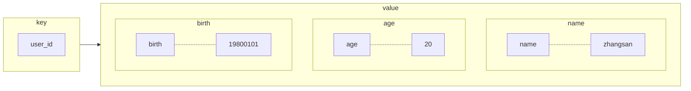

# Redis 6 基础

## Redis 特点

- 单线程、多路 IO 复用
- 支持持久化
- 默认有 16 个库
- 常用数据类型：`String List Set Hash Zset`
- Redis6 新数据类型：`Bitmaps HyperLogLog Geospatial`

## Redis 常用命令与数据结构

### 连接

- 服务端：`redis-server`，后面可以跟配置文件路径，默认端口 `6379`
- 客户端：`redis-cli`
- 密码：
    - 设置 `config set requirepass xxx`
    - 获取 `config get requirepass`

### DB

- `select` 切换数据库（0-15）
- `dbsize` 查看当前数据库的 key 数量
- `flushdb` 清空当前库
- `flushall` 通杀全部库

### Key

- `keys *` 查看当前库所有 key，第二个参数实际是 `pattern`，可以用于正则匹配

- `exists key` 判断某个 key 是否存在

- `type key` 查看 key 对应的 value 的类型

- `del key` 删除指定 key

- `unlink key` 非阻塞删除 key

    > 先删除引用（从 keyspace 元数据中删除），空闲时真正删除（异步）

- `expire key` 为指定的 key 设置过期时间

- `ttl key` 查看 key 还有多少秒过期，`-1` 代表永不过期，`-2` 表示已过期

- `incr key` 将 key 中储存的**数字值**加 1，如果为空，则新增值为 1（原子操作）

    > 原子操作指不会被线程调度机制打断的操作

- `decr key` 将 key 中储存的**数字值**减 1，如果为空，则新增值为 -1（原子操作）

- `incrby / derby key step` 自定义增减值

### String

`String` 类型是**二进制安全**的，可以存储图片或序列化对象，一个 `String` 类型的 **Value 最多为 512M**。底层实现为**简单动态字符串（Simple Dynamic String, SDS）**，是可修改的字符串，类似于 Java 的 ArrayList，采用预分配冗余空间的方式来减少内存的频繁分配。

扩容（作为 Value 时）：当字符串长度小于 `1M` 时，**加倍**现有空间；否则，每次扩容只多扩 `1M` 空间

- `set key value` 设置键值对

    - `NX` key 不存在时添加
    - `XX` key 存在时添加
    - `EX` 超时秒数
    - `PX` 超时毫秒数

- `get key` 根据 key 取出对应的 value

- `setnx key value` 只有 key 不存在时设置

- `mset k1 v1 k2 v2 ...` 同时设置多个键值对

- `mget k1 k2 ...` 同时获取多个值

- `msetnx k1 v1 k2 v1 ...` **当且仅当给定的 key 都不存在时**，同时设置多个键值对（原子性，有一个失败则失败）

- `append key` 向 key 对应的 value 后追加字符串，并返回总长度

- `strlen key` 获得 key 对应值的长度

- `getrange key start end` 获取字符串范围的值 `[start, end]`

- `setrange key start value` 用 value 覆写 key 所储存的字符串值，从 start 位置开始（索引从 0 开始）

- `setex key time value` 设置键值对的同时，设置过期时间（秒）

- `getset key value` 设置新值同时获得旧值

### List

List 是简单的**字符串列表（单键多值）**，底层是**双向链表**，按照插入顺序排序，可以高效地在两端增删，通过下标访问中间节点性能较差。

底层数据结构：**在列表元素较少的情况下会使用一段连续的内存存储（压缩链表，ziplist）；当数据量比较大时，改用快速链表（quickList）**，因为快速链表的指针域比较浪费空间。具体实现是**将多个压缩链表组成一个快速链表**：


- `lpush / rpush k1 v1 v2 ...` 左插 / 右插一个或多个值，并返回总元素个数
- `lpop / rpop key` 左 / 右弹出一个值，**如果取出后列表为空，则 key 失效**
- `rpoplpush k1 k2` 从 k1 列表右边弹出一个值，插入 k2 列表左边
- `lrange key start end` 从左至右按下标依次获得 `[start, end]` 中的元素，允许负下标
- `lindex key index` 按照索引下标获得元素（下标是从左至右）
- `llen key` 获得列表长度
- `linsert key before / after value newvalue` 在 value 左 / 右边插入 newvalue，并返回总元素个数
- `lrem key n value` 从左至右依次删除 n 个值为 value 的元素，并返回删除的元素个数
- `lset key index value` 将下标为 index 的值替换为 value

### Set

Set 功能与 List 相似，但它是**无序**的，另外还提供了**去重**的功能。

底层数据结构：value 为 null 的 hash 表，添加、删除、查找的复杂度都是 $O(1)$

- `sadd k1 v1 v2 ...` 添加一个或多个值，重复值被忽略
- `srem k1 v1 v2 ...` 删除一个或多个值
- `smembers key` 取出该集合的所有值
- `sismember key value` 判断该集合是否含有 value
- `scard key` 返回该集合的元素个数
- `spop key` 从该集合中**随机弹出**一个值，**如果取出后列表为空，则 key 失效**
- `srandmember key n` 从该集合中**随机抽取** n 个值（不会从集合中删除）
- `smove source destination value` 把集合中的 value 移动到另一个集合
- `sinter k1 k2` 返回两个集合的交集
- `sunion k1 k2` 返回两个集合的并集
- `sdiff k1 k2` 返回两个集合的差集（包含 k1 中的、但不包含 k2 中的）

### Hash

Hash 是一个**键值对集合**，它的值是一个 **field（String 类型） 与 value 的映射表**（`map[string]interface{}`），适合存储对象



底层数据结构：**ziplist（压缩列表）和 hashtable（哈希表），当 field-value 长度较短且个数较少时，使用 ziplist，否则使用 hashtable**

- `hset key filed value` 为 key 对应 hash 的 field 赋值 value
- `hget key filed` 从 key 对应 hash 的 field 取出 value
- `hmset k1 f1 v1 f2 v2 ...` 批量向 key 对应 hash 中插入映射
- `hexists key field` 查询 key 对应 hash 是否存在 field
- `hkeys key` 列出 key 对应 hash 的所有 field
- `hvals key` 列出 key 对应 hash 的所有 value
- `hincrby key field increment` 使 key 对应 hash 的 field 的值加上相应的值
- `hsetnx key field value` 为 key 对应 hash 的 field 赋值 value（仅当 field 不存在）

### Zset（Sorted Set）

与 Set 不同之处在于，Zset 为集合中的每个成员都关联了**评分**（score），这个评分用来**按照从最低分到最高分的方式排序集合中的成员**。集合的成员是唯一的，但是评分可以重复。

因为元素是有序的，所以很快地**根据评分（score）或者次序（position）来获取一个范围内的元素**。

访问有序集合的中间元素也是非常快的，因此可以将有序集合视作一个没有重复成员的排序列表。

底层数据结构：类似于 C++ 的 `map<value, score>`，不过是按 `score` 进行排序的。实际上底层使用了两个数据结构：

1. **hash**，用于关联 value 和 score，保证 value 的唯一性，且能够通过 value 找到对应的 score，但哈希表对范围查找支持很差
2. **跳表（skiplist）**，用于给 value 排序，根据 score 的**范围**获取元素列表

> 给定列表 [1, 11, 21, 31, 41, 51, 61]，查找节点 51
>
> - 有序链表 $O(N)$
>
>     ```mermaid
>     graph LR
>     1-->11-->21-->31-->41-->51-->61-->NULL
>     ```
>
> - 跳表 $O(\log N)$ 每层有点像二分，效率类似红黑树，但结构简单
>
>     ```mermaid
>     graph LR
>     subgraph level-0
>     G((1))-->H((11))-->I((21))-->J((31))-->K((41))-->L((51))-->M((61))-->Z3(NULL)
>     end
>     subgraph level-1
>     C((1))-->D((21))-->E((41))-->F((61))-->Z2[NULL]
>     end
>     subgraph level-2
>     A((1))-->B((21))-->Z1[NULL]
>     end
>     G-.-C-.-A
>     B-.-D-.-I
>     E-.-K
>     F-.-M
>     ```
>
>     查找步骤：
>
>     1. 从第 2 层开始，1 < 51，向右走，21 < 51，检查右边为 NULL，从 21 向下到第一层
>     2. 在第 1 层，从 21 向右走，41 < 51，检查右边 61 > 51，从 41 向下到第 0 层
>     3. 在第 0 层，检查 41 右边，51 == 51，查找成功
>
>     不采用 B+ 树的原因：Redis 数据在内存中，而 B+ 树的设计是为了降低磁盘的 IO（叶子节点大小设置为页大小，便于磁盘预读）
>
>     不采用平衡树的原因：需要支持范围查找，对于平衡树来说，要通过中序遍历，不方便
>
>     跳表可以通过随机层数来避开节点平衡问题，以达到统计意义上的算法性能，因而能绕开并发难点；并且其对范围查找更友好

- `add key s1 v1 s2 v2` 将一个或多个 value 及其 score 加入 key 对应的有序集合中
- `zrange key start end [withscores]` 返回 key 对应的有序集合中，下标在 [start, end] 之间的元素，`withscores` 可以让 score 和 value 一起返回
- `zrangebyscore key min max [withscores] [limit offset count]` 返回 key 对应的有序集合中，所有 score 介于 min 和 max 之间的成员，limit 参数表示从第 offset 个成员起，返回 count 个成员
- `zrevrangebyscore key max min [withscores] [limit offset count]` 同上，逆序
- `zincrby key increment value` 为 value 对应的 score 加上增量
- `zrem key value` 删除 key 对应的有序集合中，值为 value 的元素
- `zcount key min max` 统计 key 对应的有序集合中，分数在 [min, max] 区间的元素个数
- `zrank key value` 返回 value 在 key 对应的集合中的排名（从 0 开始）

### Bitmaps

Bitmaps 本身不是一种数据类型，是可以进行位操作的字符串，能够有效提高内存使用率和开发效率（可以理解成 char[]，每个元素都是 0/1）

第一次初始化时，如果 offset 特别大，那么整个初始化过程执行会比较慢，可能会造成 redis 的阻塞

> 与 Set 的比较：
>
> 1. 如果用户总量、活跃量都很大，Bitmaps 更节省内存
> 2. 如果用户总量很大，但是活跃量很少（大量僵尸用户），Set 更好，因为此时 Bitmaps 大部分位都是 0

- `setbit key offset value` 给第 offset 位置 0 或 1
- `getbit key offset` 获取第 offset 位的值
- `bitcount key [start end]` 获取**字节**在 [start, end] 范围内的 bit 为 1 的数量（注意这里是操作的 byte）
- `bitop and|or|xor|not destkey sourcekey1 sourcekey2 ...` 将多个 Bitmaps 的集合操作结果存储于目的 Bitmaps

### HyperLogLog

用于解决基数问题（例如统计独立 IP 访问次数、搜索记录数等去重和计数问题），利用 hash、set、bitmaps，或者 MySQL 都能精确地解决，但是会占用很多空间。而 HyperLogLog 采用基数统计的方法，通过降低一定的精度来平衡存储空间；在输入元素的数量很大时，计算基数所需的空间总是固定、很小的。

每个 HyperLogLog 键只需要 12KB 内存，可以计算接近 $2^{64}$ 个不同元素的基数；但是 HyperLogLog 只能根据输入元素来计算基数，并不储存基数本身，所以不能像 Set 那样，返回输入的各个元素。

- `pfadd key element1 element2 ...` 添加指定元素，并返回是否成功添加（重复则返回 0）
- `pfcount key` 统计总数的近似数
- `pfmerge destkey sourcekey1 sourcekey2 ...` 将一个或多个 HLL 合并后的结果存储在另一个 HLL 中

### Geospatial

用于地理位置的存储，存储的是一个二维坐标（经纬度）。

- `geoadd key longitude latitude member ...`

    有效精度为 [-180, 180]，有效纬度为 [-85.05112878, 85.05112878]

- `geopos key member ...` 取出地理坐标

- `geodist key member1 member2 ... [m|km|ft|mi]` 获取两个位置之间的直线距离

- `georadius key longitude latitude radius m|km|ft|mi` 以给定的经纬度为中心，找出指定半径内 key 中存储的元素

## 配置文件

- 单位定义

- include

- module

- 网络相关配置

    - bind

    - protected-mode 保护模式，开启后只能本地连接

    - port

    - tcp-backlog 连接队列，保存了**正在进行三次握手和已完成三次握手**的客户端，在高并发下需要一个高 backlog 值来避免慢客户端连接问题

        > Linux 内核会将这个值减小到 /proc/sys/net/core/somaxconn，需要增大 /proc/sys/net/core/somaxconn 和 /proc/sys/net/ipv4/tcp_max_syn_backlog 来达到想要的效果

    - timeout 空闲连接断开的时间

    - tcp-keepalive 心跳检测时间周期，检测连接是否还存活

- general

    - daemonize 后台启动
    - pidfile 进程号存储文件
    - loglevel 日志级别
    - logfile 日志输出文件路径
    - database 数据库数量（默认 16）

- snapshotting RDB 持久化相关

    - save RDB 备份规则
    - dbfilename 备份文件名
    - dir 备份文件所在路径
    
- append only mode AOF 持久化相关，AOF 文件所在路径和 RDB 一样

    - appendonly 是否开启 AOF
    - appendfilename AOF 文件
    - appendfsync AOF 持久化策略
    - no-appendfsync-on-rewrite 是否开启 rewrite
    
- security

- limits

    - maxclients 同时可以和多少客户端连接
    
        
    
    - maxmemory-policy 移除连接的相关规则（volatile-lru、allkeys-lru、volatile-random、allkeys-random、volatile-ttl、noeviction）
    
    - maxmemory-samples 样本数量，LRU 算法和最小 ttl 算法并非都是精确的算法，而是估算值，通过设置样本的大小，redis 默认会检查这么多个 key 并选择其中 LRU 的那个
    
        一般设置 3-7，数值越小样本越不准确，但性能消耗最小

## 发布和订阅

发布订阅（pub/sub）是一种消息通信模式：发送者（pub）发送消息，订阅者（sub）接收消息。客户端可以订阅任意数量的**频道（Channel）**，发送者向频道发送消息。

发布的消息没有持久化，客户端只能收到订阅后发布的消息

- `subscribe channel` 订阅 channel
- `publish channel xxx` 向 channel 发布

## 事务

Redis 事务是一个单独的隔离操作：事务中所有命令都会序列化、按顺序地执行。事务在执行的过程中，不会被其他客户端发送来的命令请求所打断。

主要作用就是串联多个命令，防止别的命令插队。（有点类似 MySQL 的串行化？）

- `multi` 启动事务，之后输入的命令都会依次加入命令队列中，但不会执行

    > 在 multi 之后输入了错误的命令，那么整个队列中的命令都不会执行成功。

- `exec` 提交事务，将队列中的命令依次执行

    > 在 exec 之后执行过程中产生了 error，那么只有产生 error 的那条命令会失败，其他命令会正常执行

- `discard` 放弃执行 Multi 之后所有的命令并退出事务

### Redis 事务三特性

- **单独的隔离级别**：事务中所有命令都是序列化、按顺序执行，事务在执行过程中不会被其他命令打断
- **没有隔离级别的概念**：队列中的命令在提交之前都不会实际执行，即事务提交前任何指令都不会被实际执行
- **不保证原子性**：事务中如果有一条命令执行失败，其他命令都会正常执行，不会回滚

### 事务冲突

- 悲观锁：每次操作之前都上锁（类似行锁、表锁、读锁、写锁），缺点是效率比较低

    > Redis 内部是单线程的，这里指的是例如外部应用程序多线程调用 Redis 实例

- 乐观锁：每次操作之前不上锁，但是在更新的时候会检查在此期间其他人是否已经更新过该数据。乐观锁适用于**多读**的应用类型。

    > Redis 中的实现方式是 CAS（check-and-set）：更改数据之后会更改其版本号，其他人在更新数据之前会检查读取的数据的版本号与此刻数据库中的版本号是否一致（读取和更新是两个操作）

    - `watch key1 key2 ...` 在执行 `multi` 之前，先执行该命令，用于监视一个或多个 key，如果在事务执行之前这些 key 被其他命令所改动，再使用 `exec` 则所有命令都会执行失败
    
        > 高并发访问、修改共享变量监视的一个简单处理流程：
        >
        > ```go
        > watch key
        > val := get(key)
        > if valid(val) {
        > 		multi
        > 		decr key
        >     res := exec
        > 		if valid(res) {
        > 				// success...
        > 		} else {
        > 				// fail...
        > 		}
        > } else {
        > 		// fail...
        > }
        > ```
    
    缺点是乐观锁容易造成类似“库存遗留”的问题：一个人购买后，即使还有库存，其他人可能会因为版本号改变而失败。
    
    > 解决方式：lua 脚本
    >
    > lua 脚本可以将复杂的或者多步的 redis 操作，写为一个脚本，一次提交给 redis 执行，减少反复连接 redis 的次数，提升性能。lua 脚本类似 redis 事务操作（悲观锁），有一定的**原子性**，不会被其他命令打断，可以完成一些事务性的操作。
    >
    > 通过 lua 脚本解决“争抢”问题，实际上是 redis 利用其单线程的特性，用任务队列的方式解决多任务并发问题。
    
    - `unwatch` 取消监视
    
        > 如果在执行 `watch` 之后，`exec / discard` 先被执行了，那么就不需要再执行 `unwatch` 了

## 持久化

官方推荐 RDB 和 AOF 都启用。如果对数据不敏感，可以单独使用 RDB；不建议单独使用 AOF，可能会出现 bug；如果只是做纯内存缓存，可以都不使用。

### RDB（Redis Database）

在指定的**时间间隔**内将内存中的数据集**快照**写入磁盘（**全量保存**），恢复时将快照文件直接读到内存。

流程：

1. Redis 会单独 **fork** 一个**子进程**来进行持久化
2. 子进程先将数据写入到一个**临时快照文件**中
3. 待上次持久化结束，**对原有文件进行原子替换**

整个过程中，主进程是不进行任何 IO 操作的，这样可以确保极高的性能。如果需要进行大规模数据的恢复，且**对于数据恢复的完整性不是很敏感**，RDB 方式比 AOF 方式更加高效。

> fork 的作用是复制一个与当前进程一样的进程，新进程的所有数据（变量、环境变量、程序计数器等）都与原进程一致，不过是一个全新的进程，作为原进程的子进程
>
> 在 Linux 中，fork 会产生一个和父进程完全相同的子进程，但子进程在此后多会进行 `exec` 系统调用，出于效率考虑，Linux 引入了**写时复制技术**
>
> 一般父进程和子进程会共用一段物理内存，只有进程空间的各段的内容要发生变化时，才会将父进程的内容复制给子进程，子进程用该内容进行持久化

- 优点
    - 适合大规模的数据恢复
    - 节省磁盘空间
    - 恢复速度快
- 缺点
    - fork 时内存中的数据被拷贝了一份到临时文件中，可能耗费 2 倍空间
    - 数据庞大时即使采用写时复制，也比较消耗性能
    - 因为是一定时间间隔内进行备份，可能会丢失最后一次快照后的所有修改

备份：启动 `redis-server` 时，会根据备份文件（`dump.db`）自动恢复

### AOF（Append Only File）

以日志的形式来记录每个写操作**指令**（**增量保存**），不保存读操作记录，**只许追加文件但不可以改写文件**。Redis 启动之初会读取该文件重新构建数据（根据日志文件的内容将写指令从前到后执行一遍来完成数据的恢复工作）

> AOF 默认不开启，如果 AOF 和 RDB 同时开启，系统默认读取 AOF 的数据（数据不会丢失）

流程：

1. 客户端的写命令请求会被追加到 AOF **缓冲区**内
2. AOF 缓冲区根据 AOF 持久化策略（always/everysec/no）将操作 sync 同步到磁盘的 AOF 文件中
3. AOF 文件大小超过重写策略或手动重写时，会对 AOF 文件进行重写，压缩 AOF 文件容量

异常恢复：如遇到 AOF 文件损坏，通过 `redis-check-aof --fix appendonly.aof` 进行恢复

AOF 同步频率设置（持久化策略）

- always：始终同步，每次 Redis 的写入都会立刻记入日志；性能较差但数据完整性比较好
- everysec：每秒同步，最后一秒数据可能会丢失
- no：不主动同步，**把同步时机交给操作系统**

重写（Rewrite）

- 当 AOF 文件大小超过设定的阈值时，Redis 就会启动 AOF 文件的内容压缩，只保留可以恢复数据的最小指令集，可以使用命令 `bgrewriteaof`

- 原理：AOF 文件持续增长而过大时，会 fork 出一个新进程来将文件重写（也是先写到临时文件中后 rename）

    > Redis 4.0 版本后的重写，就是把 RDB 的快照，以二进制的形式附在新的 AOF 文件头部，作为已有的历史数据，替换掉原来的流水账指令操作

- Redis 会记录上次重写时 AOF 文件的大小，默认配置是当 AOF 文件大小是上次重写后大小的**两倍**，且文件大于 64M 时触发

- 重写虽然可以节约大量磁盘空间，减少恢复时间，但是每次重写仍有一定负担，所以 Redis 只在满足条件下进行重写

- 流程：

    1. 主进程 fork 子进程执行重写
    2. 子进程遍历 Redis 内存中数据到临时文件，客户端此时的写请求同时写入 `aof_buf` 缓冲区和 `aof_rewrite_buf` 重写缓冲区，保证原 AOF 文件完整以及新 AOF 文件生成期间的新的数据修改不会丢失
    3. 子进程写完新的 AOF 文件后，向主进程发送信号，父进程更新统计信息；主进程把 `aof_rewrite_buf` 中的数据写入到新的 AOF 文件中
    4. 使用新的 AOF 文件覆盖旧的 AOF 文件，完成 AOF 重写

优点

- 备份机制更加稳健，丢失数据概率更低
- AOF 日志文件可读，可以处理误操作

缺点

- 比 RDB 占用更多的磁盘空间（记录数据 + 指令）
- 恢复备份速度更慢
- 每次读写都要同步的话，有一定的性能压力
- 存在个别 bug，造成恢复不能

